# LaundryPro UAE

> **Professional Laundry Management Platform for the UAE Market**

LaundryPro UAE is a full-stack, offline-capable point-of-sale and business management platform built for laundry operations across the UAE. It combines a Flutter desktop application with a self-hosted PHP REST API backend, delivering real-time POS, multi-branch synchronisation, HR, delivery tracking, financial reporting, and storefront management — all running on-premise via XAMPP.

---

## Table of Contents

- [Value Proposition](#value-proposition)
- [Tech Stack](#tech-stack)
- [Architecture](#architecture)
- [Features & Modules](#features--modules)
- [Widget Library](#widget-library)
- [Prerequisites](#prerequisites)
- [Installation](#installation)
- [Environment Configuration](#environment-configuration)
- [Build & Packaging](#build--packaging)
- [XAMPP Setup](#xampp-setup)
- [API Quick Start](#api-quick-start)
- [Security Posture](#security-posture)
- [Deployment Paths](#deployment-paths)
- [Contributor Guidelines](#contributor-guidelines)

---

## Value Proposition

| Challenge | LaundryPro Solution |
|---|---|
| No internet connectivity | Fully offline-capable with sync-outbox queue and exponential backoff |
| Multi-branch operations | Centralised API with per-branch data isolation and terminal management |
| UAE compliance | Arabic / English bilingual UI, VAT-aware pricing, invoice generation |
| Financial accuracy | `bcmath` fixed-point arithmetic (scale=2) throughout all monetary calculations |
| IT staff scarcity | One-click MSIX installer, XAMPP-based self-hosted backend, wizard-driven setup |
| Staff accountability | RBAC with granular permissions, audit log, attendance, leave, and payroll |

---

## Tech Stack

| Layer | Technology | Version / Notes |
|---|---|---|
| **Frontend** | Flutter (Windows desktop) | SDK ≥ 3.3.0 < 4.0.0 |
| **State Management** | Provider + Riverpod | `^6.1.2` / `^2.6.1` |
| **Routing** | go_router | `^14.6.2` |
| **HTTP Client** | http | `^1.2.2` |
| **Secure Storage** | flutter_secure_storage | `^9.2.4` |
| **PDF Generation** | pdf | `^3.11.1` |
| **Local DB (FFI)** | sqflite_common_ffi | `^2.3.6` |
| **Internationalisation** | intl | `^0.20.2` |
| **Cryptography** | crypto | `^3.0.7` |
| **UUID Generation** | uuid | `^4.5.1` |
| **Concurrency** | synchronized | `^3.4.0` |
| **File Picker** | file_picker | `^11.0.3` |
| **MySQL Client** | mysql1 | `^0.20.0` |
| **Backend** | PHP 8.2 (custom micro-framework) | No external Composer dependencies |
| **Database** | MariaDB (via XAMPP) | DECIMAL(18,2) monetary columns |
| **Web Server** | Apache (XAMPP) | API base: `/laundrypro-api/public` |
| **Packaging** | MSIX | `^3.16.8` (Windows Store / sideload) |

---

## Architecture

LaundryPro follows **Clean Architecture** principles. The Flutter client enforces strict separation between Views, Services (use-case layer), and the remote API. The PHP backend mirrors this with a Controller → Repository pattern backed by a custom DI container.

```mermaid
flowchart TD
    subgraph Flutter["Flutter Desktop App"]
        V["Views\n(lib/views/)"]
        W["Widgets\n(lib/widgets/)"]
        SVC["Services\n(lib/services/)"]
        LS["Local Store\nsqflite_common_ffi"]
        SEC["Secure Storage\nflutter_secure_storage"]
        V --> W
        V --> SVC
        SVC --> LS
        SVC --> SEC
    end

    subgraph API["PHP Backend  /laundrypro-api/public"]
        RT["Router"]
        MW["Middleware Chain\nCORS → RateLimit → Auth"]
        CTRL["Controllers"]
        REPO["Repositories"]
        PSVC["PHP Services\nLicense · Sync · Backup · Auth"]
        RT --> MW --> CTRL --> REPO
        CTRL --> PSVC
    end

    subgraph Infra["Infrastructure  (XAMPP)"]
        DB[("MariaDB")]
        FS["File System\nC:/LaundryPro/"]
        APACHE["Apache 2.4"]
    end

    SVC -->|"JWT Bearer  HTTPS"| RT
    REPO --> DB
    PSVC --> FS
    APACHE --> RT
```



### Layer Responsibilities

| Layer | Responsibility |
|---|---|
| **Views** | UI rendering, user input, navigation via go_router |
| **Services (Flutter)** | Business logic, orchestration, local caching, sync queue |
| **Controllers (PHP)** | HTTP request/response, input validation, permission checks |
| **Repositories (PHP)** | All SQL queries, prepared statements, result mapping |
| **PHP Services** | Cross-cutting concerns: auth, licensing, backup, sync, migrations |
| **Middleware** | CORS, JWT authentication, IP-based rate limiting |

---

## Features & Modules

### Point of Sale

| Screen | File | Description |
|---|---|---|
| POS | `pos_screen.dart` | Full-featured cashier interface with barcode/service lookup, cart management, discount application, and receipt printing |
| Pending Invoices | `pending_invoices_screen.dart` | List and resume held/unpaid orders |
| Challan | `challan_screen.dart` | Batch transfer document generation for multi-branch garment movement |

### Catalog & Inventory

| Screen | File | Description |
|---|---|---|
| Catalog | `catalog_screen.dart` | Service and product catalogue management with category, pricing, and tax configuration |
| Purchasing | `purchasing_screen.dart` | Purchase order creation, receipt, and vendor invoice reconciliation |
| Vendors | `vendors_screen.dart` | Supplier directory with contact and payment terms |

### Customer Management

| Screen | File | Description |
|---|---|---|
| Customers | `customers_screen.dart` | Customer CRM: profiles, order history, loyalty points, and portal access |
| Storefront | `storefront_screen.dart` | Customer-facing self-service portal configuration |
| Delivery | `delivery_screen.dart` | Delivery task scheduling, assignment, and status tracking |

### Human Resources

| Screen | File | Description |
|---|---|---|
| Employees | `employees_screen.dart` | Staff profiles, roles, and credentials |
| Leave | `leave_screen.dart` | Leave request submission, approval workflow |
| Payroll | `payroll_screen.dart` | Monthly payroll run with allowances, deductions, and payslip PDF export |
| Salary Advances | `salary_advances_screen.dart` | Advance disbursement requests and repayment tracking |

### Finance & Reporting

| Screen | File | Description |
|---|---|---|
| Reports | `reports_screen.dart` | Sales summary, AR aging, payment breakdown, and operational P&L |
| Expenses | `expenses_screen.dart` | Operational expense logging by category and branch |

### Operations & Configuration

| Screen | File | Description |
|---|---|---|
| Dashboard | `dashboard_screen.dart` | KPI overview: revenue, orders, outstanding, and branch performance |
| Production | `production_screen.dart` | Order production stage tracking (washing, pressing, ready) |
| Notifications | `notifications_screen.dart` | In-app and SMS notification centre |
| Terminals | `terminals_screen.dart` | POS terminal registration and session management |
| Peripherals | `peripherals_screen.dart` | Thermal printer, cash drawer, and barcode scanner configuration |

### System & Administration

| Screen | File | Description |
|---|---|---|
| Settings | `settings_screen.dart` | Global application settings |
| Global Config | `global_config_screen.dart` | System-wide parameters shared across branches |
| Branches | *(via services)* | Branch creation and per-branch configuration |
| Role Editor | `role_editor_screen.dart` | Fine-grained RBAC permission editor |
| Localization | `localization_screen.dart` | Language and regional format preferences |
| Sync Settings | `sync_settings_screen.dart` | Multi-branch sync configuration and outbox monitoring |
| License | `license_screen.dart` | License key activation and status |
| Setup Wizard | `setup_wizard_screen.dart` | First-run guided installation wizard |
| Splash / Login | `splash_screen.dart` / `login_screen.dart` | App entry, credential validation, JWT retrieval |
| App Shell | `app_shell.dart` | Navigation shell, drawer, and session management |

---

## Widget Library

Reusable UI components live in `lib/widgets/` and are used across all screens.

| Widget | File | Description |
|---|---|---|
| `AppDataTable` | `app_data_table.dart` | Paginated, sortable, and filterable data table with column configuration |
| `AppFormDialog` | `app_form_dialog.dart` | Standardised modal dialog for create/edit forms with validation |
| `EmptyState` | `empty_state.dart` | Illustrated empty-state placeholder with optional action button |
| `StatusBadge` | `status_badge.dart` | Colour-coded badge for order, delivery, sync, and payment statuses |

---

## Prerequisites

| Requirement | Version | Notes |
|---|---|---|
| Flutter | ≥ 3.3.0 | Run `flutter doctor` to verify setup |
| Dart | Bundled with Flutter | — |
| XAMPP | 8.2.x | PHP 8.2 + MariaDB + Apache |
| Windows | 10 / 11 (64-bit) | Desktop target only |
| Visual Studio Build Tools | 2022 | Required for Flutter Windows build |

---

## Installation

### 1. Clone the Repository

```powershell
git clone https://github.com/TheBestDeveloperTeam/UAE-Laundry-Pro.git
cd UAE-Laundry-Pro
```

### 2. Install Flutter Dependencies

```powershell
flutter pub get
```

### 3. Configure Environment

Copy the example environment file and fill in your values (see [Environment Configuration](#environment-configuration)):

```powershell
Copy-Item .env.example .env
```

### 4. Set Up XAMPP Backend

Follow the [XAMPP Setup](#xampp-setup) section to deploy the PHP API.

### 5. Run in Debug Mode

```powershell
flutter run -d windows
```

---

## Environment Configuration

Create a `.env` file at the project root. The following keys are recognised:

```dotenv
# ── API ─────────────────────────────────────────────────────────────
API_BASE_URL=http://localhost/laundrypro-api/public
API_VERSION=v1

# ── Database (PHP backend reads these) ──────────────────────────────
DB_HOST=127.0.0.1
DB_PORT=3306
DB_NAME=laundrypro
DB_USER=root
DB_PASSWORD=

# ── JWT ─────────────────────────────────────────────────────────────
JWT_SECRET=change_me_to_a_long_random_string
JWT_ACCESS_TTL=900          # seconds (15 min)
JWT_REFRESH_TTL=604800      # seconds (7 days)

# ── File System ─────────────────────────────────────────────────────
BACKUP_PATH=C:/LaundryPro/backups/
INVOICE_PATH=C:/LaundryPro/invoices/
LOG_PATH=C:/LaundryPro/logs/

# ── Rate Limiting ────────────────────────────────────────────────────
RATE_LIMIT_ATTEMPTS=5
RATE_LIMIT_WINDOW=60        # seconds

# ── Licensing ───────────────────────────────────────────────────────
LICENSE_SERVER_URL=https://licenses.laundrypro.ae

# ── SMS (optional) ──────────────────────────────────────────────────
TWILIO_ACCOUNT_SID=
TWILIO_AUTH_TOKEN=
TWILIO_FROM_NUMBER=
```

---

## Build & Packaging

### Debug Build

```powershell
flutter run -d windows
```

### Release Build (Windows EXE)

```powershell
# build_windows.ps1
flutter build windows --release
```

The compiled output lands at:

```
build\windows\x64\runner\Release\laundrypro_uae.exe
```

### MSIX Package (Windows Store / Sideload)

The `msix` dev dependency (`^3.16.8`) is configured in `pubspec.yaml`. To produce an installable MSIX:

```powershell
flutter pub run msix:create
```

Configuration keys (add to `pubspec.yaml` under `msix_config:`):

```yaml
msix_config:
  display_name: LaundryPro UAE
  publisher_display_name: LaundryPro
  identity_name: com.laundrypro.uae
  msix_version: 1.2.1.0
  logo_path: assets/images/logo.png
  capabilities: internetClient, privateNetworkClientServer
```

---

## XAMPP Setup

### 1. Deploy the API

Create a Windows directory junction to map the API source into XAMPP's `htdocs`:

```powershell
# Run as Administrator
New-Item -ItemType Junction `
  -Path "C:\xampp\htdocs\laundrypro-api" `
  -Target "E:\Projects\Flutter\UAE-Laundry-Pro\api"
```

### 2. Configure Apache Virtual Host

Add to `C:\xampp\apache\conf\extra\httpd-vhosts.conf`:

```apache
<VirtualHost *:80>
    DocumentRoot "C:/xampp/htdocs/laundrypro-api/public"
    ServerName localhost

    <Directory "C:/xampp/htdocs/laundrypro-api/public">
        Options -Indexes +FollowSymLinks
        AllowOverride All
        Require all granted
    </Directory>
</VirtualHost>
```

Enable `mod_rewrite` in `httpd.conf`:

```apache
LoadModule rewrite_module modules/mod_rewrite.so
```

### 3. Create the Database

```sql
CREATE DATABASE laundrypro CHARACTER SET utf8mb4 COLLATE utf8mb4_unicode_ci;
CREATE USER 'laundrypro'@'localhost' IDENTIFIED BY 'strong_password';
GRANT ALL PRIVILEGES ON laundrypro.* TO 'laundrypro'@'localhost';
FLUSH PRIVILEGES;
```

### 4. Run Migrations via API

Once Apache is running, trigger the database bootstrap:

```powershell
# Check health first
Invoke-RestMethod http://localhost/laundrypro-api/public/api/v1/health

# Run migrations
Invoke-RestMethod -Method POST http://localhost/laundrypro-api/public/api/v1/install/migrate

# Seed initial data
Invoke-RestMethod -Method POST http://localhost/laundrypro-api/public/api/v1/install/seed

# Mark installation complete
Invoke-RestMethod -Method POST http://localhost/laundrypro-api/public/api/v1/install/complete
```

Alternatively, use the in-app **Setup Wizard** (`setup_wizard_screen.dart`) which guides through these steps with a UI.

### 5. Create Required Directories

```powershell
New-Item -ItemType Directory -Force -Path @(
    "C:\LaundryPro\backups",
    "C:\LaundryPro\invoices",
    "C:\LaundryPro\logs"
)
```

---

## API Quick Start

| Item | Value |
|---|---|
| Base URL | `http://localhost/laundrypro-api/public` |
| Health endpoint | `GET /api/v1/health` |
| Swagger UI | `http://localhost/laundrypro-api/public/docs/` |
| Default admin user | `admin` (set during seed) |
| Default admin password | `Admin@1234` (**change immediately after first login**) |

### Obtain a Token

```powershell
$body = @{ username = "admin"; password = "Admin@1234" } | ConvertTo-Json
$resp = Invoke-RestMethod -Method POST `
  -Uri "http://localhost/laundrypro-api/public/api/v1/auth/login" `
  -ContentType "application/json" `
  -Body $body

$token = $resp.data.access_token
```

### Authenticated Request Example

```powershell
Invoke-RestMethod `
  -Uri "http://localhost/laundrypro-api/public/api/v1/sales" `
  -Headers @{ Authorization = "Bearer $token" }
```

---

## Security Posture

| Control | Implementation |
|---|---|
| **Authentication** | JWT access + refresh token pair; tokens stored in `flutter_secure_storage` on the client |
| **Authorisation** | Role-Based Access Control (RBAC) with granular per-endpoint permissions |
| **Transport** | HTTPS recommended for production; all tokens transmitted in `Authorization` header |
| **SQL Injection** | 100% prepared statements in all PHP Repositories; no string-interpolated queries |
| **Rate Limiting** | IP-based on `/auth/*` routes: 5 attempts per 60-second window, stored in `settings` table |
| **Financial Precision** | PHP `bcmath` (`bcadd`, `bcmul`, `bcsub`, scale=2) for all monetary arithmetic |
| **Backup Integrity** | SHA-256 manifest embedded in every ZIP archive; validated on restore |
| **Audit Logging** | `AuditLogRepository` records all mutating operations with actor, timestamp, and diff |
| **Credentials** | Passwords hashed with `password_hash()` (bcrypt); never stored or logged in plain text |
| **CORS** | Configured via `CorsMiddleware`; restrict `allowed_origins` in production |

---

## Deployment Paths

| Purpose | Path |
|---|---|
| Backup archives | `C:\LaundryPro\backups\` |
| Generated invoices (PDF) | `C:\LaundryPro\invoices\` |
| Application logs | `C:\LaundryPro\logs\` |
| XAMPP htdocs junction | `C:\xampp\htdocs\laundrypro-api` |
| MSIX output | `build\windows\x64\runner\Release\` |

---

## Contributor Guidelines

1. **Branch naming**: `feature/<ticket>-short-description`, `fix/<ticket>-short-description`
2. **Commits**: Follow [Conventional Commits](https://www.conventionalcommits.org/) (`feat:`, `fix:`, `docs:`, `chore:`)
3. **Code style**: Dart — `flutter_lints ^4.0.0` enforced; PHP — PSR-12 coding standard
4. **Pull requests**: All PRs require at least one review; include a description of testing performed
5. **Financial code**: Any change touching monetary calculation **must** use `bcmath` (PHP) or equivalent fixed-point handling (Dart); floating-point arithmetic is strictly prohibited in financial paths
6. **Secrets**: Never commit `.env`, API keys, or credentials; they are `.gitignore`d
7. **Database changes**: Provide a forward migration script in `api/src/Migrations/`; no direct schema edits to production
8. **Documentation**: Update `README.md` and `API_DOCS.md` for any new endpoint, screen, or configuration key

---

*LaundryPro UAE — version 1.2.1 · Built with Flutter 3 & PHP 8.2*

