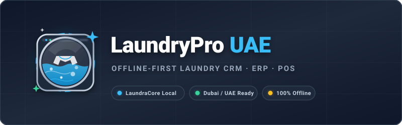
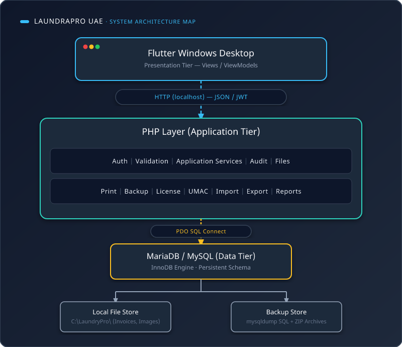

# 🧺 LaundryPro UAE — Local Laundry Services Management System

<p align="center"></p>

---

> **Codename / Product Family Reference:** `LaundryPro Local`
> **Developed & Maintained By:** Magnificent Solution
> **Client Profile:** UAE Local Laundry Service MSME Vendor
> **Initial Deployment Area:** Dubai, UAE — expandable to all UAE Emirates (Abu Dhabi, Sharjah, Ajman, Umm Al Quwain, Fujairah, Ras Al Khaimah) and KSA-ready
> **Primary Platform:** Flutter (Dart) — Windows Desktop Standalone Application
> **Local Database:** MySQL / MariaDB (via XAMPP)
> **Local API Layer:** PHP 8.x REST API (Slim Framework / Laravel Lumen)
> **Architecture:** MVVM + Modular/Microservice-Oriented Local Components + Repository Pattern
> **Authentication:** OAuth 2.0 concepts + JWT session/access-token model
> **API Documentation:** Swagger / OpenAPI
> **Internet Dependency:** None for core business operations (Offline-First)
> **Payment Gateway:** Not required
> **Primary Currency:** AED (with Fils sub-unit) — extendable to INR/Paise, USD/Cent, SAR/Halala
> **Primary Locale:** en-AE (LTR) — **Secondary Locale:** ar-AE (RTL)
> **License Model:** Duration-based + Physical Address Binding + UMAC (Unique Machine Access Code)

---

## 📑 Table of Contents

1. [Project Title & Logo](#-laundrypro-uae--local-laundry-services-management-system)
2. [Project Overview](#1-project-overview)
3. [Key Differentiators](#2-key-differentiators)
4. [Target Users / Actors](#3-target-users--actors)
5. [Features](#4-features)
6. [Technology Stack](#5-technology-stack)
7. [System Architecture](#6-system-architecture)
8. [Database Design Summary](#7-database-design-summary)
9. [Prerequisites](#8-prerequisites)
10. [Installation & Setup](#9-installation--setup)
11. [Configuration](#10-configuration)
12. [Database Setup, Backup & Restore Scripts](#11-database-setup-backup--restore-scripts)
13. [API Documentation](#12-api-documentation)
14. [Hardware Integration](#13-hardware-integration)
15. [Usage Guide / Core Workflows](#14-usage-guide--core-workflows)
16. [Backup & Disaster Recovery](#15-backup--disaster-recovery)
17. [License Management & UMAC](#16-license-management--umac)
18. [Algorithms & Business Logic Reference](#17-algorithms--business-logic-reference)
19. [Localization & RTL Support](#18-localization--rtl-support)
20. [Reporting & Analytics](#19-reporting--analytics)
21. [Security](#20-security)
22. [Coding Guidelines](#21-coding-guidelines)
23. [Testing Strategy](#22-testing-strategy)
24. [Troubleshooting](#23-troubleshooting)
25. [Repository Structure](#24-repository-structure)
26. [.ai/ — AI Context & Knowledge Directory](#25-ai--ai-context--knowledge-directory)
27. [Feature Flags & Sales Flavors](#26-feature-flags--sales-flavors)
28. [Future Enhancements / Roadmap](#27-future-enhancements--roadmap)
29. [Glossary](#28-glossary)
30. [Contributing](#29-contributing)
31. [License (Legal)](#30-license-legal)
32. [Contact & Support](#31-contact--support)
33. [Appendices](#32-appendices)

---

## 1. Project Overview

**LaundryPro UAE** (internal architecture codename **LaundryPro Local**) is a **standalone, offline-first Windows desktop application** purpose-built for local laundry service MSMEs (Micro, Small & Medium Enterprises) in the United Arab Emirates. It is **not a generic website or a browser-dashboard imitation** — it is a dedicated desktop operator workstation designed to look, feel, and behave like a professional Point-of-Sale/Operations terminal.

The application manages the **complete end-to-end operational lifecycle** of a laundry business:

- Customer & Vendor relationship management (local CRM)
- Service and Product catalog management with unlimited hierarchical nesting
- Instant Sales / Point-of-Sale (POS) with barcode scanning
- Order/service lifecycle tracking (Received → Processing → Ready → Delivered)
- Inventory management (stock receiving, adjustments, purchase orders)
- Human Resources (attendance, leave, payroll, salary advances)
- Expense tracking and vendor payments
- Multilingual, multi-directional UI (English LTR / Arabic RTL)
- Multi-currency support (starting with AED + Fils)
- Hardware integration (barcode scanners, thermal/inkjet/dot-matrix printers, cash drawers, touch screens)
- Robust local backup and disaster recovery
- License enforcement tied to a physical machine via **UMAC (Unique Machine Access Code)**

The system runs **entirely offline** using a local MySQL/MariaDB database accessed through a local PHP REST API layer running under XAMPP/Apache — ensuring **full data privacy, data sovereignty, and zero dependency on internet connectivity** for any business-critical operation.

### 1.1 Business Problem Addressed

Typical local laundries commonly operate with fragmented notebooks, spreadsheets, standalone billing software, messaging apps, printed slips, manually tracked pending payments, and informal production-status communication. This fragmentation creates:

- Duplicated customer records
- Unclear order status
- Forgotten collection/delivery dates
- Weak pending-payment tracking
- Service-rate inconsistency
- Stock leakage
- Difficulty reconciling cash and credit
- Weak employee accountability
- Manual, error-prone payroll calculation
- Difficult vendor purchase tracking
- Inconsistent invoice printing
- No controlled backup/restoration path
- Poor auditability
- Dependence on a single operator's memory

**LaundryPro UAE** solves this by unifying every operational concern into **one single transactional platform** operating on the client's local machine.

### 1.2 Vision

Provide a fast, dependable, bilingual, offline-first business platform that allows a laundry owner to run daily operations from customer intake through service processing, inventory movement, payment collection, delivery/collection, payroll, expense control, and reporting — without ever depending on the internet for core operations.

### 1.3 Business Goals

| Goal | Description |
|---|---|
| **G1 — Fast Counter Operation** | A trained cashier can create a normal laundry order without opening multiple unrelated screens. |
| **G2 — Accurate Commercial Calculation** | Every line preserves quantity, rate, discount/modifier impacts, gross amount, net amount, payment allocation, and final balance with deterministic decimal arithmetic. |
| **G3 — Traceable Item Lifecycle** | Laundry items/services move through clearly defined statuses. |
| **G4 — Stock Accountability** | Product receipts, issues, adjustments, transfers, and closing balances are traceable. |
| **G5 — Employee Accountability** | Employee attendance, leave, salary, advances, and operational responsibility are controlled. |
| **G6 — Offline Reliability** | No business-critical transaction is blocked merely because the internet is unavailable. |
| **G7 — Bilingual Usability** | Static labels and validations are JSON-controlled, rendered in English or Arabic with dynamic LTR/RTL UI direction. |
| **G8 — Deployment Control** | The solution enforces license duration, unique physical address binding, and UMAC controls without weakening local business operation after legitimate license validation. |
| **G9 — Disaster Recovery** | A non-technical operator can restore the system from a verified backup package. |
| **G10 — Maintainable Architecture** | Magnificent Solution can add modules without rewriting the sales engine or database foundation. |

---

## 2. Key Differentiators

- **Custom Operator UI** (not a generic website) — optimized for touch screens, keyboard shortcuts, and barcode scanner workflows.
- **Flavors Configuration** — customizable sales workflows per business type (Walk-In Laundry, Corporate Account Laundry, Pickup & Delivery Laundry, Premium Garment Care).
- **License tied to physical machine via UMAC** — Unique Machine Access Code combined with physical-address lock prevents unauthorized use.
- **Multilingual** (English LTR, Arabic RTL) with fully JSON-controlled labels and validation text — zero hardcoded UI strings.
- **Multi-currency support** — AED with Fils initially; architecture supports INR/Paise, USD/Cent, SAR/Halala without redesigning the monetary engine.
- **Hardware integration** — scanners, thermal printers (ESC/POS), inkjet/dot-matrix printers, and cash drawers, all behind adapter interfaces.
- **Robust backup/disaster recovery** — automatic scheduled backups, manual backup, verified restore with pre-restore safety snapshot.
- **Offline-first** — fully functional without internet; local API and database ensure data sovereignty.
- **Scalable** — architecture supports multiple branches/terminals in the future without requiring a schema redesign.
- **Append-only financial/inventory ledger** — historical sales, payments, and stock movements are immutable; corrections use reversal/adjustment transactions, never in-place edits.
- **UAE-first, KSA-ready localization** — country-profile driven currency, timezone, and address schema so Saudi Arabia expansion does not require rewriting the monetary or localization engine.

---

## 3. Target Users / Actors

| Actor | Primary Need | Authority Level |
|---|---|---|
| **Owner/Manager** | Revenue, profit, control, full reports and settings | Highest |
| **Branch Manager** | Daily operation oversight | High |
| **Front-Desk / Cashier** | Fast order creation and payment collection | Medium |
| **Production Supervisor/Staff** | Service processing and status updates | Medium/High |
| **Storekeeper** | Inventory accuracy, goods receipt, adjustments | Medium |
| **Accountant/HR / Payroll Operator** | Payroll, expenses, vendor payments, staff administration | Medium |
| **Employee** | Attendance/leave visibility | Low/Scoped |
| **Auditor/Reviewer** | Read-only traceability | Read-only |
| **System Administrator** | Configuration, security, backup, license activation | Highest technical |
| **Magnificent Solution (Vendor)** | Development, maintenance, licensing | Controlled support |

---

## 4. Features

### 4.1 Core Platform Features

- [x] Windows Desktop application (Flutter)
- [x] Offline-first operation
- [x] Local PHP REST API layer
- [x] Local MySQL/MariaDB database
- [x] MVVM architectural pattern
- [x] Modular, microservice-oriented local architecture (domain-separated controllers/services, not distributed network services)
- [x] OAuth2.0 concepts + JWT authentication boundary
- [x] Swagger/OpenAPI documentation
- [x] Full audit trail (`audit_logs`)
- [x] Central configuration engine (System Default → Business → Branch → Terminal override precedence)
- [x] Feature flag engine
- [x] Import/Export (CSV/JSON/PDF/XLSX)
- [x] Backup and disaster recovery
- [x] Local file management for invoices, images, documents
- [x] License management
- [x] UMAC (Unique Machine Access Code)
- [x] Physical-address binding

### 4.2 Localization Features

- [x] English (LTR)
- [x] Arabic (RTL)
- [x] JSON-controlled UI labels (`en.json`, `ar.json`)
- [x] JSON-controlled validation messages
- [x] Dynamic RTL/LTR layout flip via `Directionality`
- [x] UAE locale defaults (`en-AE` / `ar-AE`)
- [x] KSA extension path (future SAR/Halala, `Asia/Riyadh` timezone)

### 4.3 CRM Features

- [x] Customer master (personal, professional, and location profiles)
- [x] Vendor master (mirrors customer detail with procurement-specific fields)
- [x] Customer/vendor transaction, invoice, and payment history
- [x] Credit limits and outstanding balance tracking
- [x] Customer merge (duplicate resolution) with preserved audit/financial history

### 4.4 Catalog Features

- [x] Service master with Nth-level hierarchical categories
- [x] Product master with Nth-level hierarchical categories
- [x] Grouped/bundled services (e.g., "Premium Garment Care" = Wash + Steam Iron + Packaging)
- [x] Grouped/bundled products (e.g., "Family Linen Pack" = 2 Pillow Covers + 1 Bed Sheet + 1 Table Cloth)
- [x] Many-to-many Service ↔ Product relationships (`service_product_map`)
- [x] Modifiers (extra starch, fragrance, express service, delicate handling, stain treatment, hanger packaging, home delivery, heavy soil surcharge, etc.)
- [x] Unit of Measure (UOM) support: PCS, PAIR, KG, GRAM, METER, SET, BUNDLE, LITER, BOX, PACK, DOZEN, with explicit conversions
- [x] Barcode/QR generation and printing
- [x] Product/service images
- [x] Price profiles (Standard, Corporate, Premium, Walk-In, Seasonal, Customer-Specific)

### 4.5 Point-of-Sale / Sales Features

- [x] Instant Sale / New Order screen (primary counter workflow)
- [x] Cash / Credit Memo, Debit Memo, Adjustment Memo
- [x] Cash, credit/pending, debit, and cheque payment methods
- [x] Partial payments and payment allocation
- [x] Order hold and recall
- [x] Reprint of invoices/receipts
- [x] Order-level and line-level discounts (permission-controlled)
- [x] Rate override (permission-controlled)
- [x] Order status workflow (see §14)
- [x] Delivery and Collection tracking
- [x] Challans (delivery challan, service receipt challan, stock transfer challan, vendor return challan)
- [x] Customer reminders (payment due, ready for collection, delivery scheduled)
- [x] Quick favorites/recent customers/recent services for fast counter operation
- [x] Keyboard-first design with configurable shortcuts

### 4.6 Inventory Features

- [x] Movement-driven inventory ledger (Opening, Purchase Receipt, Purchase Return, Sale Issue, Sale Return, Adjustment In/Out, Transfer In/Out, Damage, Loss, Found, Bundle Explode/Assemble, Manual Correction)
- [x] Goods receipt against vendor purchase orders
- [x] Stock adjustments with mandatory reason codes
- [x] Real-time stock levels with low-stock alerts (`low_stock_threshold`)
- [x] Negative stock policy (configurable: allow or block)
- [x] Purchase order → Goods Receipt → Vendor Invoice/Memo → Stock Receipt → Vendor Payable → Payment procurement flow

### 4.7 HR Features

- [x] Employee master
- [x] Attendance tracking (present, absent, late, half-day, leave, holiday, overtime, off day, correction request)
- [x] Leave management (types, entitlement, carry-forward, approval workflow)
- [x] Payroll generation (configurable calculation, not tied to one legal regime)
- [x] Salary advances with linked recovery tracking (`REQUESTED → APPROVED → PAID → PARTIALLY_RECOVERED → RECOVERED`)

### 4.8 Expense Features

- [x] Configurable expense categories (electricity, water, rent, maintenance, transport, office, IT, cleaning supplies, packaging, marketing, and more)
- [x] Expense entries with attachments and approval workflow

### 4.9 Document & Printing Features

- [x] Data-driven, template-based print engine (not hardcoded per screen)
- [x] Thermal receipt (80mm / 58mm)
- [x] A4 and A5 invoice formats
- [x] Compact memo
- [x] Challan, payment receipt, customer statement, vendor statement
- [x] Inventory, payroll, and expense reports
- [x] Social-share-ready receipt assets (square/portrait receipt image or PDF)

### 4.10 Hardware Features

- [x] Barcode scanner support (HID keyboard-wedge, USB, Bluetooth, serial)
- [x] Thermal printer (ESC/POS) support with cash-drawer kick command
- [x] Inkjet/dot-matrix printer support via Windows print dialog
- [x] Cash drawer trigger (via printer RJ11 or dedicated serial port)
- [x] Touch-screen optimized UI (min. 48×48px touch targets)

### 4.11 Platform / Governance Features

- [x] Role-Based Access Control (RBAC) with JSON permission sets
- [x] Audit logging on all write operations
- [x] Reconciliation engine (detects invoice/line mismatches, orphaned payments, stock discrepancies, duplicate document numbers, etc.)
- [x] Idempotency keys for retry-safe write APIs
- [x] Document numbering with atomic, server-side sequential generation (`INV-2026-000001`, `REC-...`, `CHL-...`, `GRN-...`)
- [x] Draft recovery (autosave for unfinished transactions)
- [x] Data quality / duplicate-detection rules (normalized phone/email matching)

---

## 5. Technology Stack

| Layer | Technology |
|---|---|
| **Frontend** | Flutter (Dart) — Windows Desktop |
| **Backend / API** | PHP 8.x (Slim Framework or Laravel Lumen) |
| **Database** | MySQL / MariaDB (InnoDB engine, `utf8mb4` charset) |
| **Web/Local Server** | Apache (via XAMPP) |
| **Authentication** | OAuth 2.0 (password grant) + JWT (access + refresh tokens) |
| **API Documentation** | Swagger / OpenAPI |
| **PDF Generation** | Flutter `pdf` package / PHP `dompdf` or `TCPDF` |
| **Hardware Communication** | ESC/POS commands, Windows native printing, serial port communication |
| **Localization** | JSON resource files (`en.json`, `ar.json`) |
| **Backup Engine** | PHP script (`mysqldump` + ZipArchive) triggered by Windows Task Scheduler |
| **State Management (Flutter)** | Provider / Riverpod |
| **Navigation (Flutter)** | `go_router` |
| **Hardware Packages (Flutter)** | `esc_pos_printer`, `printing`, `flutter_barcode_scanner`, `flutter_serial_port`, `usb` |
| **Database Access (PHP)** | PDO with prepared statements (optionally Eloquent under Lumen) |
| **Dependency Management** | Composer (PHP), Flutter/Dart package manager (pub) |

---

## 6. System Architecture

### 6.1 Three-Tier Local Architecture

LaundryPro UAE follows a **three-tier architecture** contained entirely within a single Windows machine (with future local-network multi-terminal extension capability):

<p align="center"></p>

1. **Presentation Tier** — Flutter desktop application (Windows), implementing MVVM.
2. **Application Tier** — PHP REST API running on Apache (via XAMPP), organized into domain microservice-style modules.
3. **Data Tier** — MySQL/MariaDB database.

**Communication:** The Flutter app communicates with the PHP API via HTTP requests to `localhost`. The API uses OAuth2.0 concepts for authentication and returns structured JSON. JWT tokens manage sessions (access token + refresh token).

### 6.2 MVVM Pattern (Flutter)

| Layer | Responsibility |
|---|---|
| **Model** | Data classes with JSON serialization (`Customer`, `Invoice`, `Service`, etc.) |
| **View** | Flutter widgets/screens that observe ViewModels — rendering, event binding, navigation, accessibility |
| **ViewModel** | Business logic, API calls, and state management (`ChangeNotifier` via Provider, or Riverpod) — owns screen state, user intent, loading/error state, command availability, validation mapping |
| **Domain/Application Layer** | Business orchestration, calculations, workflow transitions, authorization checks, transaction boundaries |
| **Repository** | Persistence access only — no UI logic |

### 6.3 Microservice-Oriented Local Components

"Microservices" in this project mean **separable service modules within the local API/runtime**, not mandatory network-deployed distributed services. Endpoints are grouped by domain with separate controllers:

```
IdentityService        ConfigurationService     LocalizationService
CustomerService         VendorService            CatalogService
SalesService            PaymentService           OrderWorkflowService
InventoryService        ProcurementService       HRService
PayrollService          ExpenseService           DocumentService
PrintingService         NotificationService      FileService
BackupService           RestoreService           AuditService
LicenseService          UMACService              ReportingService
ImportExportService
```

This keeps the system modular while avoiding distributed-system complexity in a single-machine deployment.

### 6.4 Local File Management

**Root Folder:** `C:\LaundryPro\` (configurable during installation)

```
C:\LaundryPro\
  ├── invoices/     — PDF receipts named by invoice number
  ├── images/       — product/service images
  ├── backups/      — database dumps and file backups
  ├── logs/         — application and API logs
  └── exports/      — CSV/Excel exports
```

Extended (LaundryPro) file convention under application-owned root:

```
<AppData>/LaundryPro/
  config/
  data/
  files/
    customers/  vendors/  products/  services/  sales/  expenses/  payroll/
  documents/
  reports/
  backups/
  logs/
  temp/
```

Every file asset stores metadata: `id`, `uuid`, `original_name`, `stored_name`, `mime_type`, `size_bytes`, `sha256`, `relative_path`, `entity_type`, `entity_id`, `created_at` — enabling backup/restore integrity verification via hash comparison.

### 6.5 Architectural Principles (Non-Negotiable)

```
UI is replaceable.
API is replaceable.
Printer is replaceable.
Database adapter is replaceable.
Cloud integration is optional.
Business rules and transaction history are the core.
```

The product must avoid accidental coupling between: widget and SQL; print output and sales commit; internet and business-transaction validity; current master price and historical invoices; machine identity and sensitive customer information; localization text and domain logic.

---

## 7. Database Design Summary

**Database name:** `laundrypro` (LaundryPro naming standard: snake_case tables)
**Engine:** InnoDB
**Charset:** `utf8mb4` (required for Arabic support)

### 7.1 Core Table Summary

| Table Name | Description |
|---|---|
| `users` | System users with roles |
| `roles` | User roles and permissions (JSON) |
| `employees` | Employee master data |
| `customers` | Customer master data |
| `vendors` | Vendor master data |
| `services` | Service catalog with pricing, categories |
| `products` | Product catalog with stock, barcode |
| `categories` | Hierarchical categories for services/products |
| `service_product_map` | Many-to-many service–product relationships |
| `invoices` | Sales invoices with totals, status |
| `invoice_items` | Line items for invoices (polymorphic) |
| `payments` | Payments against invoices |
| `purchase_orders` | Purchase orders to vendors |
| `purchase_order_items` | Line items for purchase orders |
| `stock_adjustments` | Manual stock in/out adjustments |
| `expenses` | Business expenses |
| `attendance` | Employee attendance records |
| `leaves` | Employee leave requests |
| `payroll` | Monthly payroll records |
| `advances` | Employee salary advances |
| `settings` | Key-value settings (JSON values) |
| `license` | License key, UMAC, expiry |
| `audit_logs` | User ID, timestamp, action, and endpoint of every write operation |

### 7.2 Extended Entity Blueprint (LaundryPro Naming)

For teams adopting the fuller LaundryPro domain model, the following entity groups apply, each carrying `id`, `uuid`, `created_at/by`, `updated_at/by`, `is_active`, and `version_no` where relevant:

```
business, branch, terminal, app_user, role, permission, role_permission, user_role
customer, customer_phone, customer_email, customer_address, customer_contact
vendor, vendor_phone, vendor_email, vendor_address
employee, employee_document

service, service_translation, service_category, service_modifier,
service_bundle, service_bundle_line, service_product_map, service_process_step

product, product_translation, product_category, product_barcode,
product_modifier, product_bundle, product_bundle_line, unit_of_measure, unit_conversion

sales_order, sales_order_line, sales_order_line_modifier, sales_order_payment,
payment_method, payment_transaction, credit_memo, credit_memo_line,
debit_memo, debit_memo_line, order_status_history,
challan, challan_line, delivery_task, collection_task

inventory_location, inventory_item, inventory_movement, inventory_balance,
stock_adjustment, stock_adjustment_line, goods_receipt, goods_receipt_line,
purchase_document, purchase_document_line

attendance, attendance_adjustment, leave_type, leave_policy, leave_request,
payroll_period, payroll_run, payroll_line, salary_advance, salary_advance_recovery

expense_category, expense, expense_attachment, expense_approval

system_setting, localization_key, localization_translation, document_template,
document_print_log, notification, notification_read, file_asset, file_link,
audit_log, backup_job, backup_manifest, import_job, export_job,
license, license_activation, installation_identity, umac_policy, hardware_identity
```

### 7.3 Key Relationships

- `users` → `roles` (Many-to-One)
- `users` → `employees` (One-to-One, optional)
- `services` → `categories` (Many-to-One), self-join for grouping (`parent_group_id`)
- `products` → `categories` (Many-to-One), self-join for grouping (`parent_group_id`)
- `service_product_map` — Many-to-Many between `services` and `products`
- `invoices` → `customers` (Many-to-One, nullable for walk-ins)
- `invoice_items` → `invoices` (Many-to-One); polymorphic to `services`/`products` via `item_type` + `item_id`
- `payments` → `invoices` (Many-to-One)
- `purchase_orders` → `vendors` (Many-to-One); `purchase_order_items` → `purchase_orders` and `products`
- `stock_adjustments` → `products` (Many-to-One)
- `expenses` → `vendors` (nullable)
- `attendance`, `leaves`, `payroll`, `advances` → `employees` (Many-to-One)
- `settings` and `license` are effectively singleton/configuration tables

### 7.4 Soft Deletes

Many tables include an `active` (or `record_status`/`is_active`) flag to preserve historical data (services, products, customers, employees). **Deactivation is used instead of hard deletion.** A parent with active children shall never be physically deleted.

### 7.5 Recommended Indexes

```
customer(phone), customer(customer_code), customer(name)
vendor(vendor_code)
service(parent_id, is_active)
product(parent_id, is_active)
product_barcode(barcode)
sales_order(order_no), sales_order(customer_id, created_at), sales_order(status, promised_date)
sales_order_payment(order_id)
payment_transaction(reference_no)
inventory_movement(product_id, movement_date), inventory_movement(reference_type, reference_id)
attendance(employee_id, attendance_date)
leave_request(employee_id, start_date, end_date)
payroll_line(payroll_run_id, employee_id)
audit_log(entity_type, entity_id, created_at)
notification(user_id, is_read, created_at)
```

Unique constraints apply only to natural identifiers where business rules require uniqueness (e.g., invoice number, product barcode).

---

## 8. Prerequisites

Before installing LaundryPro UAE, ensure the target machine has:

- **Operating System:** Windows 10 or Windows 11 (64-bit recommended)
- **Local Server Stack:** XAMPP with PHP 8.x and MySQL/MariaDB
- **Flutter SDK:** installed and configured for Windows desktop builds
- **Composer:** for PHP dependency management
- **Git** (optional but recommended for source control / cloning the repository)
- **Hardware peripherals (optional but supported):**
  - USB or Bluetooth barcode scanner (HID/keyboard-wedge mode)
  - ESC/POS-compatible thermal printer (80mm or 58mm — e.g., Epson TM-T20, Xprinter)
  - Inkjet or dot-matrix printer (standard Windows driver)
  - Cash drawer (RJ11 to thermal printer, or serial port trigger)
  - Touch-screen monitor (standard Windows touch hardware; no proprietary software required)
- **Disk space:** sufficient free space for database growth, invoice/image storage, and rolling backups (monitor via the built-in disk-space warnings: `<20%` warning, `<10%` critical)

---

## 9. Installation & Setup

### 9.1 Step-by-Step Installation

**Step 1 — Install XAMPP and start services**

```bash
# Download and install XAMPP for Windows (PHP 8.x bundled)
# Launch the XAMPP Control Panel and start:
#   - Apache
#   - MySQL
```

**Step 2 — Clone / place the API code**

```bash
# Clone the repository (or copy source) into the XAMPP htdocs directory
git clone https://github.com/your-org/laundrypro-uae.git C:\xampp\htdocs\laundrypro-api
```

**Step 3 — Install PHP dependencies**

```bash
cd C:\xampp\htdocs\laundrypro-api
composer install
```

**Step 4 — Configure environment**

```bash
copy .env.example .env
```

Edit `.env` and set:

```env
DB_HOST=localhost
DB_PORT=3306
DB_DATABASE=laundrypro
DB_USERNAME=root
DB_PASSWORD=secret

JWT_SECRET=change_this_to_a_long_random_secret
JWT_ACCESS_TOKEN_TTL=28800   # 8 hours
JWT_REFRESH_TOKEN_TTL=2592000 # 30 days

BACKUP_PATH=C:/LaundryPro/backups/
INVOICE_PATH=C:/LaundryPro/invoices/
IMAGE_PATH=C:/LaundryPro/images/
LOG_PATH=C:/LaundryPro/logs/
EXPORT_PATH=C:/LaundryPro/exports/
```

**Step 5 — Import the database schema**

```bash
# Using phpMyAdmin, or via CLI:
mysql -u root -p laundrypro < schema.sql
```

**Step 6 — Build and run the Flutter Windows application**

```bash
flutter pub get
flutter build windows
```

The compiled application will connect to the local API at:

```
http://localhost/laundrypro-api/
```

(or the equivalent local base URL configured in `lib/core/constants.dart` / `config.dart`.)

**Step 7 — Launch the app and complete first-run setup**

On first launch, complete the system initialization wizard:

- Business legal/trading name, logo, contact details, physical address
- City/Emirate, country
- Default language and default currency
- Opening date
- Document number prefix configuration
- Administrator account creation
- Backup location
- Printer defaults
- Terminal identity

This generates a unique `installation_id` used later for license binding.

**Step 8 — Activate the license**

Enter the license key provided by **Magnificent Solution**. See [§16 License Management & UMAC](#16-license-management--umac) for full detail.

### 9.2 Configuration Files Reference

| File | Purpose |
|---|---|
| `api/.env` | DB connection, JWT secret, OAuth keys, backup/file paths |
| `lib/core/constants.dart` / `config.dart` | API base URL, default language, terminal settings |
| `assets/lang/en.json` | English UI labels |
| `assets/lang/ar.json` | Arabic UI labels |

---

## 10. Configuration

### 10.1 Settings Table

Application settings are stored in the `settings` table as JSON key-value pairs, accessible via the `/settings` API endpoints. Settings are resolved with the following precedence:

```
System Default  <  Business Override  <  Branch Override  <  Terminal Override
```

Only permitted keys may be overridden at each scope.

### 10.2 Flavors Configuration

A **Flavor** defines UI and workflow preferences for a given business type. Example:

```json
{
  "flavor": "full_service",
  "pos_layout": "full",
  "show_product_images": true,
  "quick_buttons": ["Wash & Iron", "Dry Clean", "Iron Only"],
  "currency_symbol": "AED",
  "currency_position": "after",
  "tax_rate": 5,
  "invoice_theme": "modern",
  "default_language": "en",
  "thermal_printer_width": 80
}
```

The Flutter application reads flavor configuration and dynamically adjusts the UI accordingly (see also [§26 Feature Flags & Sales Flavors](#26-feature-flags--sales-flavors)).

### 10.3 Language Files

```
assets/lang/en.json   — English labels
assets/lang/ar.json   — Arabic labels
```

Format:

```json
{ "app_name": "LaundryPro UAE", "new_sale": "New Sale", "customer": "Customer" }
```

Every visible string **must** be retrieved from the localization file — no hardcoded UI strings are permitted.

### 10.4 Currency Setup

Initial configuration:

```
major_unit = AED
minor_unit_name = Fils
minor_digits = 2
```

The monetary engine uses fixed-precision `DECIMAL(18,2)` values — **never floating-point** for persisted currency. Quantity precision (e.g., kilograms, liters) is configured independently via `quantity_scale`. Live foreign-exchange rate functionality is explicitly **not required**.

### 10.5 Printer Settings

- Thermal printer width (58mm / 80mm), characters per line
- Invoice template: logo path, font size, footer text
- Print engine renders the same logical document as A4, A5, thermal 58mm, thermal 80mm, or compact memo

### 10.6 Backup Schedule Settings

- Time of day for automatic backup (default: **2:00 AM**)
- Backup storage location (default: `C:\LaundryPro\backups\`)
- Retention policy (default: keep last 30 backups; extended policy example: 14 daily / 8 weekly / 12 monthly, configurable)

---

## 11. Database Setup, Backup & Restore Scripts

### 11.1 Creating the Database

```sql
CREATE DATABASE laundrypro CHARACTER SET utf8mb4 COLLATE utf8mb4_unicode_ci;
```

### 11.2 Importing Schema

```bash
mysql -u root -p laundrypro < schema.sql
```

Use migrations (e.g., Phinx or an equivalent PHP migration tool) for all subsequent schema changes — **never manually alter production schema without a recorded migration.** Maintain a `schema_version` value in the database.

### 11.3 Manual Backup

An administrator can trigger a manual backup from the Settings screen, or directly via CLI:

```bash
php backup.php
```

### 11.4 Automatic Backup Script (PHP)

```php
<?php
// backup.php
$timestamp = date('Ymd_His');
$dbName = 'laundrypro';
$backupDir = 'C:/LaundryPro/backups/';
$backupFile = $backupDir . "db_{$timestamp}.sql";
$command = "mysqldump -u root -psecret {$dbName} > {$backupFile}";
exec($command);

$zip = new ZipArchive();
$zipFile = $backupDir . "db_{$timestamp}.zip";
if ($zip->open($zipFile, ZipArchive::CREATE) === TRUE) {
    $zip->addFile($backupFile, basename($backupFile));
    $zip->close();
    unlink($backupFile);
}

// Cleanup old backups — keep last 30
$backups = glob($backupDir . "db_*.zip");
if (count($backups) > 30) {
    usort($backups, function($a, $b) { return filemtime($a) - filemtime($b); });
    for ($i = 0; $i < count($backups) - 30; $i++) {
        unlink($backups[$i]);
    }
}
```

This script is executed daily at **2:00 AM** via **Windows Task Scheduler**, performing a `mysqldump` of the `laundrypro` database, zipping the result together with the `invoices/` and `images/` folders, and storing the archive at:

```
C:\LaundryPro\backups\db_YYYYMMDD_HHMMSS.zip
```

Backups older than the retention window are deleted automatically.

### 11.5 Restore Procedure

```text
1. Select a backup archive.
2. Verify package integrity (SHA-256 hash comparison against manifest).
3. Validate schema compatibility.
4. Create a pre-restore SAFETY SNAPSHOT of the current database (never skip this step).
5. Restore the database to a staging area.
6. Verify critical tables and document references.
7. Reconcile record counts/hashes.
8. Switch the restored dataset into the active state.
9. Restart local services.
10. Run smoke tests.
11. Write a recovery audit record.
```

> ⚠️ **Golden Rule:** The backup engine must never overwrite the only known-good backup, and a restore must never proceed without first creating a safety snapshot of the current (pre-restore) state.

### 11.6 Disaster Recovery (Automatic)

On API startup:

1. Check the database connection.
2. If the connection fails, locate the latest valid backup archive.
3. Extract the SQL dump and restore the database automatically.
4. Display an in-app notification describing the recovery event.

### 11.7 Zero Data Loss Strategy

- Use InnoDB transactions for all critical, multi-table operations (invoice save + stock deduction + payment posting, etc.).
- Regular scheduled backups minimize the potential data-loss window.
- Consider enabling MySQL binary logs for point-in-time recovery (recommended, not mandatory in the initial release).
- All financial and inventory records are **append-only** — sales documents, payment transactions, and inventory movements are immutable once posted; corrections are represented as linked reversal/adjustment transactions.

---

## 12. API Documentation

**Base URL:** `http://localhost/api/`
**Extended Base Route (LaundryPro convention):** `/api/v1`

All endpoints require `Authorization: Bearer <token>` **except** `/auth/token` (or `/auth/login`) and `/auth/refresh`. Full interactive documentation is available via **Swagger/OpenAPI** once the API service is running (see the `/docs` or `/swagger` route exposed by the API layer).

### 12.1 Standard Response Envelope

```json
{
  "success": true,
  "data": {},
  "message": ""
}
```

Extended contract (LaundryPro convention, recommended for new endpoints):

```json
{
  "success": true,
  "code": "SALE_CREATED",
  "message_key": "sales.created",
  "data": {},
  "errors": [],
  "meta": {
    "request_id": "...",
    "server_time": "...",
    "version": "v1"
  }
}
```

Validation error example:

```json
{
  "success": false,
  "code": "VALIDATION_ERROR",
  "message_key": "common.validation_failed",
  "errors": [
    { "field": "customer_id", "code": "REQUIRED", "message_key": "customer.required" }
  ],
  "meta": { "request_id": "..." }
}
```

The UI translates `message_key` values — the API never assumes English is the final presentation language.

### 12.2 Authentication

| Method | Endpoint | Description |
|---|---|---|
| POST | `/auth/token` (or `/auth/login`) | Get OAuth2 token (password grant) |
| POST | `/auth/refresh` | Refresh access token |
| POST | `/auth/logout` | Invalidate session |
| GET | `/auth/me` | Get current authenticated user |

### 12.3 Customers

| Method | Endpoint | Description |
|---|---|---|
| GET | `/customers` | List customers (paginated, search) |
| POST | `/customers` | Create customer |
| GET | `/customers/{id}` | Get customer details |
| PUT | `/customers/{id}` | Update customer |
| DELETE | `/customers/{id}` | Deactivate customer |
| POST | `/customers/{id}/merge` | Merge duplicate customer records |
| POST | `/customers/{id}/deactivate` | Deactivate a customer |

Similar CRUD patterns apply to **vendors, services, products, and categories**.

### 12.4 Services & Products

| Method | Endpoint | Description |
|---|---|---|
| GET | `/services/tree` | List hierarchical service tree |
| POST | `/services` | Create service |
| GET | `/services/{id}` | Get service details |
| PUT | `/services/{id}` | Update service |
| POST | `/services/{id}/children` | Add child service |
| POST | `/services/{id}/modifiers` | Attach modifier to service |
| GET | `/products/tree` | List hierarchical product tree |
| GET | `/products/barcode/{code}` | Look up product by barcode |
| POST | `/products` | Create product |
| PUT | `/products/{id}` | Update product |
| POST | `/products/{id}/bundle` | Configure product bundle/group |

### 12.5 Sales / Invoices

| Method | Endpoint | Description |
|---|---|---|
| GET | `/invoices` | List invoices with filters |
| POST | `/invoices` | Create invoice with items |
| GET | `/invoices/{id}` | Get invoice details |
| PUT | `/invoices/{id}/status` | Update invoice status (void, close) |
| POST | `/invoices/{id}/payments` | Add payment to invoice |
| POST | `/sales/quote` | Create a quote |
| POST | `/sales/draft` | Save a draft sale |
| POST | `/sales/confirm` | Confirm a sale |
| POST | `/sales/{id}/status` | Update order status |
| POST | `/sales/{id}/cancel` | Cancel an order |
| POST | `/sales/{id}/reprint` | Reprint documents for an order |

### 12.6 Inventory

| Method | Endpoint | Description |
|---|---|---|
| GET | `/inventory/stock` | Get current stock levels |
| POST | `/inventory/adjust` | Adjust stock |
| POST | `/inventory/goods-receipt` | Post goods receipt |
| GET | `/inventory/movements` | List inventory movements |
| POST | `/inventory/reconcile` | Run stock reconciliation |
| POST | `/purchase-orders` | Create purchase order |
| GET | `/purchase-orders` | List purchase orders |

### 12.7 HR

| Method | Endpoint | Description |
|---|---|---|
| GET | `/employees` | List employees |
| POST | `/employees` | Create employee |
| POST | `/attendance` | Record attendance |
| GET | `/attendance` | Get attendance records |
| POST | `/leaves` / `/leave-requests` | Apply for leave |
| POST | `/payroll/generate` / `/payroll/run` | Generate payroll for period |
| POST | `/salary-advances` | Record a salary advance |

### 12.8 Reports

| Method | Endpoint | Description |
|---|---|---|
| GET | `/reports/sales` | Sales report |
| GET | `/reports/inventory` | Inventory report |
| GET | `/reports/customers` | Customer aging report |
| GET | `/reports/payroll` | Payroll report |

### 12.9 Backup & License

| Method | Endpoint | Description |
|---|---|---|
| POST | `/backup` / `/backup/run` | Trigger manual backup |
| GET | `/backup/history` | View backup history |
| POST | `/backup/verify` | Verify a backup package |
| POST | `/backup/restore/validate` | Validate a backup before restore |
| POST | `/backup/restore/execute` | Execute a restore |
| GET | `/license/status` | Get license info |
| POST | `/license/activate` | Activate license key |

### 12.10 Idempotency

Write APIs that may be retried should accept an idempotency key:

```
X-Idempotency-Key: terminal_uuid + transaction_uuid
```

A duplicate confirmation request returns the original successful result rather than creating a second invoice.

---

## 13. Hardware Integration

Hardware-specific implementation is isolated behind adapter interfaces — application code calls generic interfaces such as `scanService.read()`, `printerService.print(document)`, and `cashDrawerService.open()`, never manufacturer-specific SDK methods directly.

### 13.1 Barcode Scanner

- Most USB scanners act as **keyboard input (HID)** — no special driver is needed.
- The Flutter app listens for rapid key events ending with Enter/CR.
- **Configuration:** set the scanner suffix to Enter; prefix may be disabled.
- Bluetooth scanners pair as a keyboard or via serial interface (`flutter_serial_port` when needed).
- Support configurable suffix/terminator, barcode debounce, scanned-text validation, and a manual-search fallback. No single brand is assumed.

### 13.2 Thermal Printer (ESC/POS)

- Supports **80mm and 58mm** printers (Epson, Xprinter, and similar ESC/POS-compatible models).
- Uses the Flutter `esc_pos_printer` package.
- **Connection options:** USB (via the `usb` package), Bluetooth, or Network.
- **Supported commands:** print text, print barcode, cut paper, open cash drawer (pin 2).
- Invoice template (width, font, logo) is stored in `settings` and fully customizable.

### 13.3 Inkjet / Dot-Matrix Printers

- Uses the Flutter `printing` package to generate a PDF, then routes it to the standard **Windows print dialog**.
- Best suited for A4 reports and formal invoices.

### 13.4 Cash Drawer

- Typically connected to the thermal printer via **RJ11**; the printer issues the drawer-kick command.
- Alternative: direct serial-port trigger using `flutter_serial_port`.
- Manual drawer opening (when hardware cannot report status) must be **auditable**.

### 13.5 Touch Screen

- UI designed with large buttons — minimum **48×48 px** touch targets.
- Support for multi-touch and swipe gestures where appropriate.
- Works on ordinary Windows touch hardware — **no proprietary touchscreen software required**.

### 13.6 Hardware Troubleshooting

| Issue | Possible Cause | Solution |
|---|---|---|
| Scanner not inputting | Scanner not in HID mode | Configure scanner as a keyboard wedge |
| Thermal printer not printing | Wrong driver or port | Install correct driver; verify port configuration |
| Cash drawer not opening | Cable/pin mismatch | Verify RJ11 connection to printer or serial trigger configuration |
| Touch input unresponsive | Driver/calibration issue | Recalibrate via Windows touch settings |

---

## 14. Usage Guide / Core Workflows

### 14.1 Sales Workflow (Point of Sale)

```text
1. Cashier taps "New Sale" (or presses Ctrl+N).
2. Search/select an existing customer, or create a walk-in customer.
3. Add items:
     - Scan barcode to add a product
     - Search/select a service or product from the catalog
     - Optionally choose a grouped/bundled item (expands to multiple lines)
     - Set quantity and modifiers
4. Review invoice lines; apply line-level and/or order-level discounts.
5. Select payment method (cash / credit / debit / cheque); process payment
   (full, partial, or hold as pending/credit).
6. Save the invoice — the API atomically deducts inventory and updates balances.
7. Print and/or share the invoice (thermal, A4, or social-share receipt asset).
8. If credit, the invoice remains pending; later payments are recorded against it.
```

### 14.2 Service Fulfillment / Order Status Workflow

Standard lifecycle (LaundryPro UAE core):

```
RECEIVED → IN_PROCESS → READY → DELIVERED
```

Extended lifecycle (LaundryPro full model):

```
DRAFT → CONFIRMED → RECEIVED → SORTING → PROCESSING → QUALITY_CHECK
      → PACKED → READY_FOR_COLLECTION → OUT_FOR_DELIVERY → DELIVERED → CLOSED
```

Exception states: `ON_HOLD`, `REWORK_REQUIRED`, `PARTIALLY_READY`, `LOST_DAMAGED_REVIEW`, `CANCELLED`.

Quality-failure loop:

```
QUALITY_CHECK → REWORK_REQUIRED → PROCESSING → QUALITY_CHECK
```

All status transitions are **permission-controlled and audit-logged**; no status may be changed by a direct table update from the UI.

### 14.3 Collection & Delivery Workflow

```text
READY_FOR_COLLECTION
 → identify customer/order
 → verify amount/payment status
 → collect remaining amount if applicable
 → issue collection receipt
 → mark CLOSED
```

```text
READY_FOR_COLLECTION
 → schedule delivery
 → assign responsible staff
 → OUT_FOR_DELIVERY
 → customer confirmation
 → DELIVERED
 → close if financial conditions satisfied
```

### 14.4 Inventory Receiving Workflow

```text
1. Create a purchase order with products and quantities.
2. Receive shipment; verify against the purchase order.
3. Update stock quantities (add).
4. Record vendor payment if applicable, or track as accounts payable.
```

### 14.5 Payroll Processing Workflow

```text
1. At month end, HR/Accountant runs payroll generation.
2. System calculates net pay from basic salary, attendance, and advances.
3. Review and adjust if needed.
4. Mark as paid; record the payment date.
5. Advance recovery is automatically deducted; remaining balance updates.
```

### 14.6 License Activation Workflow

```text
1. Install the application and XAMPP.
2. Launch the app and enter the license key.
3. The API validates the key, computing UMAC and checking expiry.
4. If valid, the license is stored and features unlock.
5. On expiry, the app enters restricted mode.
```

### 14.7 Daily Closing Workflow

```text
Start Closing
 → validate no unfinished critical transaction
 → summarize cash
 → summarize payments
 → summarize outstanding
 → summarize cancellations/adjustments
 → operator confirms
 → closing snapshot generated
 → backup check
 → close shift
```

### 14.8 Keyboard Shortcuts (Suggested)

| Shortcut | Action |
|---|---|
| `Ctrl+N` | New Transaction |
| `Ctrl+S` | Save Draft |
| `Ctrl+Enter` | Confirm Transaction |
| `Ctrl+P` | Print |
| `Ctrl+Shift+P` | Payment |
| `Ctrl+F` | Search |
| `F2` | Edit Selected Line |
| `F4` | Customer Search |
| `F6` | Product/Service Search |
| `F8` | Hold Order |
| `F9` | Collect Payment |
| `F12` | Quick Save + Print |
| `Esc` | Close Panel / Cancel Current Action |

Shortcuts are configurable and context-safe.

---

## 15. Backup & Disaster Recovery

*(See also §11.3–11.7 for scripts and step-by-step CLI procedures.)*

### 15.1 Backup Types

- **Automatic scheduled backup** — daily via Windows Task Scheduler at 2:00 AM; rolling retention; optional secondary/removable-drive copy.
- **Full package backup** — may include the database dump, configuration, localization files, document templates, file metadata, referenced user files, license metadata required for restore validation, and a backup manifest.
- **Manual backup** — triggered from the Settings screen or command line at any time.

### 15.2 Backup Manifest Example

```json
{
  "product": "LaundryPro UAE",
  "schema_version": "1.x",
  "created_at": "...",
  "business_uuid": "...",
  "installation_id": "...",
  "database_hash": "...",
  "file_manifest_hash": "...",
  "record_counts": {},
  "backup_type": "FULL"
}
```

### 15.3 File Locations

```
C:\LaundryPro\backups\db_YYYYMMDD_HHMMSS.zip
C:\LaundryPro\invoices\
C:\LaundryPro\images\
C:\LaundryPro\logs\
C:\LaundryPro\exports\
```

### 15.4 Zero Data Loss Principles

- InnoDB transactions wrap all critical multi-table operations.
- Regular scheduled backups minimize the data-loss window.
- File integrity is verified via SHA-256 hashing during backup/restore; mismatches are flagged.
- The backup engine never deletes the most recent known-good backup merely because a newer backup attempt failed.
- Financial and inventory ledgers are append-only, so even in a partial-recovery scenario, historical truth is preserved and reconcilable.

---

## 16. License Management & UMAC

### 16.1 Purpose

The product supports controlled commercial deployment **without making the customer's operational data hostage to internet connectivity.** License enforcement is fully offline-capable.

### 16.2 UMAC (Unique Machine Access Code)

**UMAC** = Unique Machine Access Code — a controlled machine/installation authorization mechanism.

**Basic Generation Algorithm:**

```text
function generateUmac():
    mac   = getMacAddress()          # MAC address of primary network adapter
    cpu   = getCpuSerial()           # CPU serial number
    board = getBoardSerial()         # Motherboard serial
    raw   = mac + cpu + board
    hash  = sha256(raw)
    return hash.substring(0, 32)
```

**Hardened / recommended conceptual model (privacy-conscious):**

```text
Conceptual fingerprint input:
  installation_guid
  + normalized_business_address
  + terminal_id
  + machine_identity_components
  + license_salt

Derived value:
  UMAC = HMAC-SHA256(secret_or_license_bound_key, canonical_payload)
```

Raw unhashed concatenation must never be used as the sole license control token in production deployments.

### 16.3 License Activation Flow

```text
1. User enters the license key (provided by Magnificent Solution).
2. Flutter sends the key to the /license/activate endpoint.
3. The API decrypts/verifies the key using an embedded public key (signature verification).
4. The payload is extracted, containing the allowed UMAC/physical address, expiry date, and metadata.
5. The current machine UMAC is computed and compared against the allowed value.
6. If matched and not expired → license is stored in the `license` table, `active = 1`.
7. If mismatched or expired → an error is returned and the app enters restricted
   (view-only, no new invoices) mode.
```

Pseudocode (LaundryPro reference):

```text
function validateLicense(key):
    data = decryptAndVerify(key, publicKey)
    if data.expiry < now:
        return false, "License expired"
    currentUmac = generateUmac()
    if data.umac != currentUmac:
        return false, "Machine mismatch"
    return true, data
```

### 16.4 Startup Validation

- On every launch, the app queries `/license/status`.
- If the license is missing, expired, or the UMAC mismatches, a renewal screen is shown.

### 16.5 Physical Address Binding

A licensed deployment is associated with **one approved physical business location**. Controlled relocation requires license re-authorization. Address data is not exposed in plaintext within the license key — only a canonical representation and a derived verification hash are stored.

### 16.6 Expiry Behavior

| Time to Expiry | Behavior |
|---|---|
| 30 days | Warning notice |
| 14 days | Warning notice |
| 7 days | Critical warning |
| 1 day | Final warning |
| Expired | Controlled restricted state |

Expired behavior preserves read-only history access (where commercially approved), export ability where policy permits, recovery/backup capability, and support diagnostics — **the system never destroys or fully blocks access to business records solely due to license expiry.**

### 16.7 Renewal

A new license key can be activated to extend the expiry date. The old license record remains for historical reference.

---

## 17. Algorithms & Business Logic Reference

### 17.1 UMAC Generation

See §16.2 above.

### 17.2 Price / Invoice Calculation Engine

```text
for each item in invoice_items:
    basePrice = (item_type == 'service') ? service.price : product.price
    if item is group:
        basePrice = sum(child prices) * groupDiscount
    modifierAdd = sum(modifier extra)
    lineTotal = (basePrice + modifierAdd) * quantity - lineDiscount

subtotal            = sum(lineTotal)
discountedSubtotal  = subtotal - invoiceDiscount
tax                 = discountedSubtotal * taxRate / 100
grandTotal          = discountedSubtotal + tax
balanceDue          = grandTotal - amountPaid
```

**Canonical calculation order (LaundryPro reference):**

```text
Line Gross          = Quantity × Effective Rate
Line Modifier Total  = Sum(Fixed + PerUnit + Percentage effects)
Line Discount        = configured line discount
Line Net             = Line Gross + Modifier Total - Line Discount
Order Subtotal       = Sum(Line Net)
Order Discount       = configured order-level discount
Other Charges        = configured non-tax charges, if enabled
Grand Total          = Order Subtotal - Order Discount + Other Charges
Balance              = Grand Total - Posted Payments
```

No calculation path may use a different rounding sequence without explicit configuration. One canonical rounding policy (e.g., half-up at the currency scale) is applied consistently.

### 17.3 Inventory Deduction

```text
On invoice save (status not void):
    - For product items, decrement stock by quantity.
    - If stock would go negative, warn or block (configurable via ALLOW_NEGATIVE_STOCK).

On invoice void:
    - Increment stock back.
```

### 17.4 Payroll Calculation

```text
basicSalary      = employee.basic_salary
allowances       = employee.allowances
daysAbsent       = count(attendance.status = 'absent')
workingDays      = totalWorkingDays(month)
deduction        = (daysAbsent / workingDays) * basicSalary
advanceRecovery  = sum(advances.due_this_month)
netPay           = basicSalary + allowances - deduction - advanceRecovery - otherDeductions
```

### 17.5 Backup Rotation

```text
Keep last 30 backups.
Delete older backups automatically.
```

(Extended configurable policy: 14 daily / 8 weekly / 12 monthly retention — see §10.6.)

### 17.6 Nth-Level Hierarchy — Create Child

```text
validate parent exists
validate parent active
set child.parent_id = parent.id
set child.level_no  = parent.level_no + 1
set child.root_id   = parent.root_id or parent.id
commit
```

### 17.7 Nth-Level Hierarchy — Re-parent Item

```text
reject if new_parent = current_item
reject if new_parent is a descendant of current_item
validate permission
recalculate level for the entire subtree
write audit record
```

### 17.8 Grouped Service/Product Algorithm

```text
User selects group
  → Load active components
  → Validate each component
  → Resolve component rate/override
  → Create parent sellable line
      → create component references as hidden/expanded detail
  → Calculate consolidated price
  → Store bundle snapshot (historical sales must NOT be rewritten by future master changes)
```

### 17.9 Payment Allocation Algorithm

```text
balance = OrderTotal - PostedPayments

payment_sum = SUM(all posted allocations)
assert payment_sum <= allowed_settlement_limit

Reversal:
    original payment stays immutable
    new reversal transaction references the original
    balance recalculated from effective transactions
```

### 17.10 Customer Merge Algorithm

```text
select primary customer
select duplicate customer
preview impacted orders / balances / addresses
confirm merge
repoint non-conflicting references
preserve original IDs in merge history
mark duplicate as MERGED
write audit record
```

Financial history is never deleted during a merge.

### 17.11 Stock-on-Hand & Adjustment

```text
stock_on_hand(product_id) = SUM(all valid signed inventory movements)

Count Qty - System Qty = Adjustment Qty
    Adjustment Qty > 0 → ADJUSTMENT_IN
    Adjustment Qty < 0 → ADJUSTMENT_OUT

Reason is mandatory for every adjustment.
```

### 17.12 Cash Reconciliation (Daily Closing)

```text
Expected Cash = Opening Float + Cash Receipts - Cash Refunds +/- Cash Adjustments
Physical Cash = entered by operator at closing
Difference    = Physical Cash - Expected Cash
```

A difference above the configured threshold requires an explanation/approval.

---

## 18. Localization & RTL Support

### 18.1 Language Files

```
assets/lang/en.json
assets/lang/ar.json
```

Format: `{ "key": "value" }`. Example:

```json
{
  "app_name": "LaundryPro UAE",
  "login": "Login",
  "username": "Username",
  "password": "Password",
  "new_sale": "New Sale",
  "customers": "Customers",
  "services": "Services",
  "reports": "Reports"
}
```

Arabic (`ar.json`):

```json
{
  "app_name": "لوندري برو الإمارات",
  "login": "تسجيل الدخول",
  "username": "اسم المستخدم",
  "password": "كلمة المرور",
  "new_sale": "بيع جديد",
  "customers": "العملاء",
  "services": "الخدمات",
  "reports": "التقارير"
}
```

Extended locale metadata format (LaundryPro reference):

```json
{
  "locale": "en-AE",
  "direction": "ltr",
  "currency": "AED",
  "labels": { "sales.new_order": "New Order", "sales.customer": "Customer", "sales.total": "Total" },
  "validations": { "required": "This field is required", "invalid_phone": "Enter a valid phone number" }
}
```

### 18.2 Flutter Implementation

- Uses the `intl` package or a custom JSON loader.
- Sets `MaterialApp`'s `locale` and `supportedLocales`.
- For RTL, sets `Directionality` based on locale (`TextDirection.rtl` for Arabic).
- All UI widgets automatically respect `Directionality`.
- Numbers remain Western digits by default (configurable).

### 18.3 RTL Layout Rules

When Arabic is selected:

- Horizontal alignment changes; start/end semantics replace left/right assumptions.
- Icon placement mirrors where semantically appropriate.
- Forms reorder visual alignment correctly.
- Table numeric columns may remain visually numeric-oriented rather than blindly mirrored.
- Invoice paper layout follows a document-specific template direction.
- LTR content (phone numbers, invoice numbers, codes, email, URLs) remains readable regardless of overall direction.

### 18.4 Governance

Every user-visible text **must** have a localization key. Hardcoded operator-facing English strings are prohibited except for controlled developer diagnostics.

### 18.5 UAE-First, KSA-Ready Design

The architecture avoids hardcoded assumptions about emirate-only operation, UAE-only postal conventions, AED-only currency, or Arabic-dialect-specific labels. A country profile defines:

```
country_code, currency, currency_fraction, timezone, default_locale, region_label, address_schema
```

This allows a future KSA package (SAR/Halala, `Asia/Riyadh` timezone, Saudi address fields) without rewriting the monetary or localization engine.

---

## 19. Reporting & Analytics

### 19.1 Operational Reports

Daily Sales · Sales by Service · Sales by Product · Sales by Customer · Pending Invoices · Payment Summary · Cashier Summary · Order Status Aging · Ready for Collection · Delivered Orders · Cancelled Orders · Rework/Damage Review · Daily Closing Summary

### 19.2 Inventory Reports

Stock on Hand · Stock Valuation · Stock Movement · Low Stock · Negative Stock · Adjustments · Purchase Summary · Vendor Purchase History · Slow Moving Items

### 19.3 HR Reports

Employee List · Attendance Summary · Absence Report · Leave Balance · Leave History · Payroll Register · Salary Advance · Advance Recovery

### 19.4 Expense Reports

Expense Summary · Category-wise Expense · Monthly Expense · Vendor/Payee Expense

### 19.5 Financial-Operational Reports

Gross Sales · Discounts · Collections · Outstanding · Daily Cash Summary · Revenue by Service Category · Revenue by Product Category · Expense vs Revenue operational view

> These reports are **operational** and do not constitute a full statutory accounting package unless a future accounting-integration module is implemented.

### 19.6 Dashboard KPI Definitions (Centralized — must not diverge across screens)

```text
Today's Sales      = SUM(confirmed sales net totals for business date)
Today's Collection = SUM(posted payment transactions on business date)
Outstanding        = SUM(invoice total - effective payments)
Ready Orders       = COUNT(orders with READY_FOR_COLLECTION)
```

### 19.7 Report Filter Standard

Every report exposes a consistent filter set (as applicable): Date From, Date To, Branch, Terminal, User, Customer, Vendor, Status, Category, Service, Product, Payment Method.

### 19.8 Report Snapshot Principle

Reports requiring historical commercial values use **posted transaction snapshots**, not current master data. Example: if a service rate changes from AED 10 to AED 12, historical invoices remain correctly at AED 10.

---

## 20. Security

### 20.1 Authentication

- **OAuth 2.0** password grant flow: Flutter sends `POST /auth/token` with `username`, `password`, `grant_type=password`.
- Server validates credentials and returns an `access_token` (JWT) and `refresh_token`.
- Access tokens expire after **8 hours**; refresh tokens obtain a new access token.
- JWT contains user ID, role, and permissions, and is signed with a secret key stored in the API `.env` file.
- Account lockout / rate limiting for repeated login failures; session revocation supported.

### 20.2 Password Hashing

Passwords are hashed with **bcrypt (cost factor 10)**. No plaintext storage anywhere in the system.

### 20.3 Role-Based Access Control (RBAC)

Roles are stored in the `roles` table with permissions as a JSON array. Middleware enforces the required permission for every endpoint. Example action-oriented permission keys:

```
sales.create, sales.edit_draft, sales.override_rate, sales.discount_line,
sales.discount_order, sales.cancel, sales.reprint, sales.receive_payment,
inventory.adjust, inventory.reconcile, hr.payroll.run, expense.approve,
backup.restore, license.manage, system.settings
```

### 20.4 Starter Role/Permission Matrix

| Permission | Admin | Manager | Cashier | Storekeeper | HR | Auditor |
|---|---:|---:|---:|---:|---:|---:|
| Sales Create | Y | Y | Y | N | N | N |
| Sales Discount | Y | Y | Limited | N | N | N |
| Rate Override | Y | Y | Limited | N | N | N |
| Payment Receive | Y | Y | Y | N | N | N |
| Inventory Adjust | Y | Y | N | Y | N | N |
| Purchase Receive | Y | Y | N | Y | N | N |
| Payroll Run | Y | Limited | N | N | Y | R |
| Expense Approve | Y | Y | N | N | Limited | R |
| Backup | Y | Limited | N | N | N | N |
| Restore | Y | N | N | N | N | N |
| License Manage | Y | N | N | N | N | N |
| Reports | Y | Y | Limited | Limited | Limited | R |

*(`Limited` should be further decomposed into explicit granular permissions in production deployments; `R` = Read-only.)*

### 20.5 Audit Logs

All write operations (`POST`, `PUT`, `DELETE`) are logged in the `audit_logs`/`audit_log` table with: `request_id`, `actor_id`, `terminal_id`, `entity_type`, `entity_id`, `action`, `old/new value delta`, `reason`, `created_at`. **Passwords, JWT secrets, and raw sensitive authentication material must never appear in the audit log.**

### 20.6 Data Protection & Encryption

- Database connections use local sockets; passwords are always stored hashed.
- HTTPS (even self-signed certificate) is recommended for the local API.
- The JWT secret is kept in the environment file, never in source code.
- File uploads are restricted by type and size.
- Output is escaped in PDF generation to prevent injection.
- CSRF protection is implemented even though the API is local.

### 20.7 Local Security Boundary

By default, the local API listens **only on `localhost`**. It is never exposed to the public internet by default. If future LAN multi-terminal support is enabled, this requires controlled private LAN binding, firewall guidance, and terminal authentication.

### 20.8 License Time-Tampering Resistance

License validation must be robust against system clock tampering — using system time with an optional NTP check where feasible.

---

## 21. Coding Guidelines

### 21.1 General Principles

- **SOLID** — single responsibility, open-closed, Liskov substitution, interface segregation, dependency inversion.
- **DRY** — avoid duplication; use helper functions, base classes, traits.
- **KISS** — keep it simple; avoid over-engineering.
- **YAGNI** — do not add features not required.
- Use meaningful, self-documenting names; comment where logic is non-obvious.

### 21.2 Flutter Best Practices

- Use `const` constructors wherever possible.
- Strictly separate UI (widgets) from business logic (ViewModels).
- Use `Provider` or `Riverpod` for state management and dependency injection.
- Handle asynchronous operations with `FutureBuilder`/`StreamBuilder`.
- Dispose controllers and subscriptions properly.
- Use `ThemeData` for consistent styling.
- Use `ListView.builder` for large lists; avoid `setState` in deeply nested widget trees.
- Localize using the `intl` package with JSON/ARB resources; wrap the app with `MaterialApp` and appropriate `localizationsDelegates`.
- Use `MediaQuery`/`LayoutBuilder` for responsive design.
- Write widget tests with `flutter_test`.

### 21.3 PHP API Best Practices

- Use PDO **prepared statements** for every database query — never raw string concatenation.
- Validate **all** input; never trust client-supplied data.
- Return proper HTTP status codes (`200, 201, 400, 401, 403, 404, 500`).
- Use the consistent JSON response structure described in §12.1.
- Handle exceptions globally and log to `logs/app.log` with timestamps.
- Use Composer for dependency management.
- Organize code into Controllers, Middleware, Models, Helpers, Config.
- Secure endpoints with OAuth2 middleware; rate-limit sensitive endpoints (login, token refresh).
- Keep the API stateless (JWT in header).
- Document every endpoint with Swagger annotations.

### 21.4 Database Best Practices

- Use migrations for all schema changes.
- Normalize data; denormalize selectively for performance (e.g., store invoice totals for fast reporting).
- Wrap multi-table operations in transactions (invoice save, stock update, payment posting).
- Index foreign keys and search columns.
- Use `utf8mb4` charset for full Arabic support.
- Store timestamps in UTC (`TIMESTAMP`) and convert to local time in the application layer.

### 21.5 Critical Anti-Patterns (Prohibited)

1. Storing monetary totals as floating-point.
2. Updating posted invoices in place to "correct" them.
3. Deleting inventory movement records.
4. Hardcoding service/product hierarchy depth.
5. Hardcoding English UI text anywhere in a widget.
6. Client-only authorization checks.
7. Putting raw SQL directly into widgets/views.
8. Embedding manufacturer-specific hardware logic inside business services.
9. Coupling print-success to transaction-commit success.
10. Making cloud connectivity mandatory for local sales.
11. Using raw machine serial values directly in visible license strings.
12. Restoring backups without first creating a safety snapshot.
13. Duplicating calculation formulas across multiple screens.
14. Using current master price to display historical invoice prices.
15. Wrapping every feature in an independent modal dialog.

### 21.6 DTO Rules

Use separate DTOs for: create, update, response, filter/query, and print view model. Raw database rows must never be exposed as public API contracts.

### 21.7 Error Code Standard

```
AUTH_INVALID_CREDENTIALS   AUTH_SESSION_EXPIRED       VALIDATION_ERROR
CUSTOMER_DUPLICATE          SERVICE_PARENT_CYCLE       PRODUCT_PARENT_CYCLE
SALE_EMPTY                  SALE_TOTAL_MISMATCH        PAYMENT_EXCEEDS_BALANCE
STOCK_INSUFFICIENT          STATUS_TRANSITION_INVALID  LICENSE_EXPIRED
UMAC_MISMATCH                BACKUP_VERIFICATION_FAILED RESTORE_VALIDATION_FAILED
PRINTER_UNAVAILABLE
```

### 21.8 Definition of Done

A feature is considered **Done** only when:

```
Requirement implemented + business rules implemented + permission enforced
+ API implemented + persistence implemented + audit implemented where applicable
+ localization implemented + RTL verified where applicable + validation implemented
+ unit/integration tests passed + print/report impact reviewed
+ backup/restore impact reviewed + documentation updated
```

---

## 22. Testing Strategy

| Test Layer | Tooling / Scope |
|---|---|
| **Unit Tests** | ViewModels, models, algorithms (`flutter_test`) |
| **API Tests** | Postman/Newman or PHPUnit for endpoint testing |
| **Integration Tests** | Database interaction validation |
| **UI/Widget Tests** | Flutter integration tests for critical flows (POS, login) |
| **Application Service Tests** | Business orchestration and calculation validation |
| **Repository Tests** | Persistence-layer correctness |
| **Database Constraint Tests** | Foreign key, uniqueness, and cycle-prevention checks |
| **Workflow Tests** | Order status transition rules |
| **Print Snapshot Tests** | Cross-format (A4/A5/thermal) document consistency |
| **Localization / RTL Tests** | English, Arabic, mixed numeric/RTL rendering, PDF/thermal direction |
| **Backup/Restore Tests** | Corrupt backup, incomplete backup, incompatible schema, rollback on restore failure |
| **Security Tests** | Auth, authorization boundary, injection resistance |
| **Hardware Adapter Tests** | Scanner, thermal/inkjet/dot-matrix printer, cash drawer |
| **User Acceptance Testing (UAT)** | Full workflow validation with sample data |

### 22.1 Critical Test Categories — Sales

Empty cart · zero quantity · decimal quantity · rate override · discount permission · mixed payment · overpayment · cancellation · reprint · partially-ready order.

### 22.2 Critical Test Categories — Inventory

Stock receipt · stock issue · adjustment · concurrent terminal entry · negative-stock policy · bundle explosion.

### 22.3 Acceptance Criteria Highlights

- **AC-001 Offline Sale:** With the internet disconnected, a cashier can create, confirm, print, and retrieve a sale.
- **AC-002 Payment Integrity:** Posting a payment updates the balance without modifying original invoice values.
- **AC-003 Hierarchy Integrity:** Circular service/product parent relationships are rejected.
- **AC-004 Bundle Snapshot:** Changing a group composition after a sale does not alter the historical sale snapshot.
- **AC-005 Stock Integrity:** A confirmed stock-out transaction creates the correct inventory movement and cannot exceed stock when negative stock is disabled.
- **AC-006 Arabic RTL:** Switching to Arabic changes application direction and localized labels across all supported screens.
- **AC-007 Document Consistency:** The same invoice data renders consistently across A4 and thermal formats.
- **AC-008/009 Backup & Restore Verification:** A successful backup produces a manifest and verification result; a verified backup can be restored into a staging environment with integrity checks.
- **AC-010 Permission Control:** Unauthorized users cannot perform restricted actions (rate override, discount, stock adjustment, payroll finalization, restore) through direct API calls.
- **AC-011 License Expiry:** License policy is enforced locally per configured expiry behavior without corrupting existing business data.
- **AC-012 Audit:** Critical changes identify who, when, what entity, what action, and why (where reason is required).

---

## 23. Troubleshooting

| Issue | Possible Cause | Solution |
|---|---|---|
| API connection refused | Apache not running | Start XAMPP Apache |
| Database connection failure | Wrong credentials in `.env` | Check `.env` settings |
| License mismatch | Hardware changed or key wrong | Re-activate with the correct key |
| Scanner not inputting | Scanner not in HID mode | Configure scanner as a keyboard wedge |
| Thermal printer not printing | Wrong driver or port | Install the correct driver; check the port |
| RTL not working | Locale not set properly | Ensure `Directionality` is set correctly |
| Backup not running | Task Scheduler not configured | Set up the scheduled task |
| Printer offline during sale | Hardware disconnected/powered off | Transaction still saves — retry printing; transaction/document success are intentionally decoupled |
| Database unavailable at startup | Corruption, service not running, disk issue | Application blocks new writes and attempts automatic recovery from the latest backup (see §15) |

---

## 24. Repository Structure

### 24.1 Flutter Frontend

```
lib/
├── main.dart
├── app.dart
├── core/
│   ├── constants.dart
│   ├── theme.dart
│   ├── utils.dart
│   └── localization.dart
├── models/
│   ├── customer.dart
│   ├── invoice.dart
│   ├── service.dart
│   └── ...
├── services/
│   ├── api_client.dart
│   ├── auth_service.dart
│   ├── customer_service.dart
│   └── ...
├── viewmodels/
│   ├── login_viewmodel.dart
│   ├── pos_viewmodel.dart
│   ├── customer_viewmodel.dart
│   └── ...
├── views/
│   ├── login_screen.dart
│   ├── dashboard_screen.dart
│   ├── pos_screen.dart
│   ├── customer_list_screen.dart
│   ├── ...
│   └── widgets/
│       ├── custom_button.dart
│       ├── barcode_input.dart
│       └── ...
```

Extended recommended feature-first structure (LaundryPro reference):

```
lib/
  app/            (app.dart, router/, theme/, localization/)
  core/           (errors/, result/, utils/, constants/, security/)
  features/
    auth/  dashboard/  customers/  vendors/  services/  products/
    sales/ orders/ inventory/ purchasing/ hr/ payroll/ expenses/
    reports/ settings/
  shared/
    widgets/ models/ services/
```

### 24.2 PHP Backend

```
api/
├── public/
│   └── index.php
├── src/
│   ├── Controllers/
│   │   ├── AuthController.php
│   │   ├── CustomerController.php
│   │   └── ...
│   ├── Middleware/
│   │   ├── AuthMiddleware.php
│   │   ├── RoleMiddleware.php
│   │   └── ...
│   ├── Models/
│   │   ├── Customer.php
│   │   ├── Invoice.php
│   │   └── ...
│   ├── Helpers/
│   │   ├── Response.php
│   │   ├── Validator.php
│   │   └── ...
│   └── Config/
│       ├── database.php
│       ├── oauth.php
│       └── ...
├── storage/
│   ├── logs/
│   └── backups/
└── .env
```

Extended recommended structure (LaundryPro reference):

```
api/
  public/  routes/  middleware/  controllers/  services/  domain/
  repositories/  validators/  policies/  serializers/  database/
  jobs/  reports/  printing/  backup/  licensing/  umac/
```

---

## 25. `.ai/` — AI Context & Knowledge Directory

To support AI-assisted development, code review, and onboarding, this repository maintains a dedicated `.ai/` directory at the project root. This directory is the **single source of truth for AI assistants and human contributors alike** and should be kept in sync with the actual codebase at all times.

```
.ai/
├── .ai-brain/               # Master reasoning context for AI assistants
│   ├── project-summary.md          # Condensed project overview (this README, summarized)
│   ├── architecture-map.md         # Three-tier / MVVM / microservice map
│   ├── domain-glossary.md          # Canonical business terminology (see §28 Glossary)
│   └── decision-log-index.md       # Index into .ai-decision/
│
├── .ai-knowledge/            # Structured, queryable domain knowledge
│   ├── database-schema.md          # Full ER model reference (see §7)
│   ├── api-contract.md             # Full endpoint reference (see §12)
│   ├── algorithms.md               # UMAC, pricing, payroll, inventory, hierarchy (see §17)
│   ├── workflows.md                # Sales, service, inventory, payroll, license workflows (see §14)
│   ├── localization-keys.md        # Canonical list of all en.json / ar.json keys
│   └── hardware-profiles.md        # Scanner / printer / cash drawer adapter reference (see §13)
│
├── .ai-skills/                # Reusable task recipes for AI-assisted contributions
│   ├── add-new-service-endpoint.md
│   ├── add-new-localization-key.md
│   ├── add-new-report.md
│   ├── implement-print-template.md
│   ├── add-inventory-movement-type.md
│   └── write-backup-restore-test.md
│
├── .ai-dependency/             # Dependency and integration map
│   ├── flutter-packages.md         # Provider/Riverpod, go_router, esc_pos_printer, printing, pdf, etc.
│   ├── php-packages.md             # Slim/Lumen, PDO, dompdf/TCPDF, JWT libraries
│   ├── external-services.md        # None required for core operation (offline-first) — documents optional future integrations
│   └── hardware-dependencies.md    # ESC/POS device classes, HID scanner requirements
│
├── .ai-decision/               # Architectural Decision Records (ADR-style)
│   ├── 0001-offline-first-architecture.md
│   ├── 0002-mvvm-over-mvc.md
│   ├── 0003-umac-license-binding.md
│   ├── 0004-append-only-financial-ledger.md
│   ├── 0005-json-localization-over-arb.md
│   └── 0006-decimal-currency-no-float.md
│
├── .ai-context/                # Session/task context snapshots for AI-assisted work
│   └── (auto-generated per contribution session)
│
├── .ai-changelog/              # AI-assisted change history, cross-referenced with git log
│   └── (auto-generated per merged contribution)
│
└── README.md                   # Explains the purpose and update policy of the .ai/ directory itself
```

### 25.1 Purpose of Each Sub-Directory

| Directory | Purpose |
|---|---|
| `.ai-brain/` | High-level reasoning context — what the project is, why it exists, and how its major pieces fit together. The starting point for any AI assistant onboarding onto this codebase. |
| `.ai-knowledge/` | Detailed, structured domain knowledge extracted from this README and the source RFP/BRD/SOW/ER documentation — kept machine-readable for retrieval-augmented assistance. |
| `.ai-skills/` | Step-by-step task recipes so that both AI assistants and new developers can perform common, recurring tasks (adding an endpoint, a report, a localization key, a hardware adapter) consistently and correctly. |
| `.ai-dependency/` | A living map of every external package, library, and hardware dependency, with justification and version notes — prevents silent dependency drift. |
| `.ai-decision/` | Architectural Decision Records (ADRs) — the **"why"** behind foundational choices (offline-first, MVVM, UMAC licensing, append-only ledger, decimal currency, JSON localization). Required reading before proposing an architectural change. |
| `.ai-context/` | Ephemeral, per-session context snapshots generated during AI-assisted development sessions, to preserve continuity across multi-step tasks. |
| `.ai-changelog/` | A structured, AI-readable changelog cross-referenced to Git history, distinct from the human-facing `CHANGELOG.md`. |

### 25.2 Update Policy

- Any pull request that changes the database schema, API contract, algorithms, workflows, or localization keys **must** update the corresponding file in `.ai-knowledge/`.
- Any pull request that introduces a new architectural pattern or reverses a prior pattern **must** add a new numbered file to `.ai-decision/`.
- The `.ai/` directory is reviewed as part of the **Definition of Done** (see §21.8) for any structurally significant change.

---

## 26. Feature Flags & Sales Flavors

### 26.1 Feature Flag Engine

Feature flags are **never** scattered as hardcoded booleans inside widgets. All flags are resolved through a centralized service:

```dart
FeatureFlagService.isEnabled("sales.delivery")
```

Flags are categorized as:

```
CORE          — always-on foundational features
BUSINESS      — business-configurable features
TERMINAL      — per-terminal features
LICENSE       — license-tier-gated features
EXPERIMENTAL  — in-development features
```

Critical controls fail **closed** by default (i.e., disabled unless explicitly enabled).

### 26.2 Sales Flavors

The product supports configurable **sales flavors** so individual laundry vendors can customize their workflow without forking the codebase.

| Flavor | Description |
|---|---|
| **Flavor A — Walk-In Laundry** | Customer phone optional; quick catalog; immediate receipt; promised date; payment at intake. |
| **Flavor B — Corporate Account Laundry** | Mandatory customer company; purchase/reference number; credit terms; monthly statement; invoice aging. |
| **Flavor C — Pickup & Delivery Laundry** | Pickup address; delivery address; scheduled window; route status; driver/employee assignment; delivery proof. |
| **Flavor D — Premium Garment Care** | Inspection checklist; stain notes; special handling modifier; quality check; damage review. |

### 26.3 Flavor Configuration Schema

```json
{
  "sales_flavor": "PICKUP_DELIVERY",
  "features": {
    "show_company_fields": true,
    "require_customer_phone": true,
    "require_promised_date": true,
    "allow_credit": true,
    "allow_partial_payment": true,
    "allow_delivery": true,
    "inspection_checklist": true,
    "quality_check": true
  }
}
```

The UI dynamically activates configured fields while preserving a **single, stable underlying domain model** — flavors change presentation and required fields, never the core transaction schema.

---

## 27. Future Enhancements / Roadmap

The following are explicitly **out of scope for the initial release** but preserved as extension points in the architecture:

- Cloud synchronization for multi-branch operation
- Mobile app for customers (order tracking)
- SMS/WhatsApp notifications
- Integration with external accounting software
- Real-time foreign exchange rates for multi-currency
- Barcode label printing module
- Advanced analytics with interactive charts
- Payment gateway integration
- Public customer-facing website / online marketplace
- Biometric device vendor-specific SDK integration
- Bank API integration

### 27.1 Product Family Roadmap

```
LaundryPro Local  — offline/local desktop edition (current release — LaundryPro UAE)
LaundryPro Pro    — multi-terminal / local-network edition
LaundryPro Cloud  — future cloud edition
LaundryPro UAE    — UAE localization package
LaundryPro KSA    — future Saudi Arabia localization package
```

### 27.2 Phased Delivery Plan

| Phase | Scope |
|---|---|
| **Phase 0 — Discovery & Foundation** | Requirements baseline, solution architecture, ER model, role/permission matrix, navigation map, localization schema, license/UMAC spec, print-document catalog, backup/recovery policy, acceptance criteria. |
| **Phase 1 — Core Operational MVP** | Installation/bootstrap, business setup, users/roles, customer/vendor master, service/product master, hierarchy, groups, modifiers, service-product relationships, instant sale, payment, pending invoices, printing, basic order status, stock receipt/adjustment, basic reports, backup/export/import, English/Arabic UI. |
| **Phase 2 — Operational Control Expansion** | Full production workflow, delivery/collection, challans, advanced inventory, purchasing, employee master, attendance, leave, payroll, salary advances, expenses, advanced reporting, print designer options, alert center, social/share-ready assets. |
| **Phase 3 — Scale & Extension** | Multi-terminal hardening, branch support, optional local-network service node, optional cloud sync framework, KSA localization package, accounting integration adapter, SMS/WhatsApp adapters, online storefront adapter, optional customer app, analytics layer. |

---

## 28. Glossary

| Term | Definition |
|---|---|
| **UMAC** | Unique Machine Access Code — a license-binding fingerprint derived from hardware/installation identity. |
| **POS** | Point of Sale. |
| **RTL** | Right-to-left text direction (Arabic). |
| **LTR** | Left-to-right text direction (English). |
| **ESC/POS** | Epson Standard Code for Point of Sale printers — the command language used by most thermal receipt printers. |
| **JWT** | JSON Web Token — used for stateless session/access-token authentication. |
| **OAuth 2.0** | Authorization framework used conceptually for the local API's password-grant authentication flow. |
| **Flavor** | A predefined configuration set that governs UI fields and workflow behavior for a specific business type. |
| **Soft Delete** | Deactivation via an `active`/`is_active` flag instead of physical row deletion. |
| **MVVM** | Model-View-ViewModel — the architectural pattern used throughout the Flutter frontend. |
| **Bundle / Group** | A sellable combination of multiple services or products, historically snapshotted at time of sale. |
| **Modifier** | An optional add-on to a service or product (e.g., express service, fragrance, stain treatment) with fixed, per-unit, or percentage pricing. |
| **Challan** | A non-financial or operational document representing a movement or hand-over (e.g., delivery challan, stock transfer challan). |
| **UOM** | Unit of Measure (PCS, KG, LITER, DOZEN, etc.), with explicit, non-implicit conversions. |
| **Idempotency Key** | A client-supplied key ensuring a retried write request does not create a duplicate transaction. |

---

## 29. Contributing

While LaundryPro UAE is developed and maintained as a proprietary solution by **Magnificent Solution**, contributions from authorized development partners follow this workflow:

### 29.1 Source Control Strategy

```
main
  └── develop
        ├── feature/sales-instant-sale
        ├── feature/catalog-services
        ├── feature/catalog-products
        ├── feature/inventory
        ├── feature/hr
        └── feature/backup
```

### 29.2 Commit Message Convention (Semantic Commits)

```
feat(sales): add mixed payment allocation
fix(inventory): prevent negative stock race
refactor(print): introduce document renderer interface
```

### 29.3 Contribution Checklist

Before opening a pull request, ensure:

- [ ] The change satisfies the [Definition of Done](#21-coding-guidelines) (§21.8).
- [ ] No [Critical Anti-Pattern](#21-coding-guidelines) (§21.5) has been introduced.
- [ ] Relevant `.ai/` knowledge files are updated (see §25.2).
- [ ] Localization keys are added to **both** `en.json` and `ar.json` — no hardcoded UI strings.
- [ ] Database changes are accompanied by a migration script and `schema_version` bump.
- [ ] New/changed endpoints are documented in Swagger/OpenAPI and reflected in §12 of this README.
- [ ] Relevant unit/integration/widget tests are included and passing.
- [ ] Print/report impact and backup/restore impact have been reviewed.

### 29.4 Change Request Classification

Any new requirement after baseline approval must be classified as one of:

```
BUG | CLARIFICATION | SMALL CHANGE | NEW FEATURE | ARCHITECTURAL CHANGE
```

A change request must document: rationale, impacted modules, database impact, UI impact, test impact, delivery impact, and backward compatibility. **A phrase such as "and many more" never becomes automatic scope** — new items must be added as explicit, tracked feature records.

### 29.5 Release Versioning

Semantic versioning applies:

```
MAJOR.MINOR.PATCH

1.0.0  Initial production release
1.1.0  New business feature
1.1.1  Bug fix
2.0.0  Breaking architectural/product change
```

Database schema versioning is tracked independently but related.

---

## 30. License (Legal)

**LaundryPro UAE** (and its underlying `LaundryPro Local` architecture) is **proprietary software** developed and maintained by **Magnificent Solution**.

- All source code, documentation, database schema, print templates, and associated intellectual property are the property of **Magnificent Solution** unless otherwise licensed in writing.
- Use of this software by any deployed business (client) is governed by the **License Key + UMAC + Physical Address Binding** mechanism described in [§16](#16-license-management--umac).
- Redistribution, resale, reverse engineering, or unauthorized deployment of this software outside the terms of a valid commercial agreement with Magnificent Solution is prohibited.
- This is **not** an open-source project unless explicitly stated otherwise in a separate `LICENSE` file at the repository root for a specific distribution channel.

---

## 31. Contact & Support

**Developed and Maintained by: Magnificent Solution**

| Channel | Detail |
|---|---|
| **Support Email** | `support@magnificentsolution.example` *(placeholder — update with production contact)* |
| **Sales / Licensing Email** | `sales@magnificentsolution.example` *(placeholder — update with production contact)* |
| **Website** | `https://www.magnificentsolution.example` *(placeholder — update with production URL)* |
| **Support Hours** | Business hours, Dubai / Asia-Dubai timezone (`Asia/Dubai`) |

For:

- **Bug reports / technical issues** — open an issue in the internal tracker referencing the affected module, version, and reproduction steps.
- **License activation or renewal** — contact the Sales/Licensing channel with your `installation_id` and business details.
- **Feature requests** — submit via the Change Request process described in [§29.4](#29-contributing).
- **Emergency data recovery assistance** — contact Support with your latest backup manifest (`backup_manifest.json`) and installation identity.

---

## 32. Appendices

### 32.1 Sample Invoice JSON

```json
{
  "invoice_number": "INV-000123",
  "customer_id": 5,
  "invoice_date": "2025-01-15",
  "items": [
    {
      "item_type": "service",
      "item_id": 10,
      "description": "Dry Clean",
      "quantity": 2,
      "rate": 15.00,
      "amount": 30.00,
      "modifiers": { "starch": true }
    },
    {
      "item_type": "product",
      "item_id": 3,
      "description": "Shirt",
      "quantity": 2,
      "rate": 5.00,
      "amount": 10.00
    }
  ],
  "subtotal": 40.00,
  "discount": 5.00,
  "tax": 1.75,
  "grand_total": 36.75,
  "amount_paid": 20.00,
  "balance_due": 16.75,
  "payment_status": "partial"
}
```

### 32.2 Sample Document Numbering

```
INV-2026-000001    (Invoice)
REC-2026-000001    (Receipt)
CHL-2026-000001    (Challan)
CM-2026-000001     (Credit Memo)
DM-2026-000001     (Debit Memo)
GRN-2026-000001    (Goods Receipt Note)
```

Numbering is generated **server-side** and committed atomically. Timestamps are never used as invoice numbers.

### 32.3 Sample Service Hierarchy

```text
Laundry
├── Wash
│   ├── Normal Wash
│   ├── Steam Wash
│   └── Premium Wash
├── Dry Clean
│   ├── Standard Dry Clean
│   └── Delicate Dry Clean
└── Iron
    ├── Normal Iron
    ├── Steam Iron
    └── Premium Press
```

### 32.4 Sample Product Hierarchy

```text
Garments
├── Upper Wear
│   ├── Shirt
│   ├── T-Shirt
│   ├── Jacket
│   └── Pullover
├── Lower Wear
│   ├── Trouser
│   ├── Pant
│   ├── Shalwar
│   └── Skirt
└── Home Textile
    ├── Blanket
    │   ├── Big Blanket
    │   └── Small Blanket
    ├── Bed Sheet
    │   ├── Single
    │   ├── Double
    │   ├── Queen
    │   └── King
    └── Curtain
```

### 32.5 Instant Sale Screen Layout Reference

```text
+--------------------------------------------------------------------+
| CUSTOMER | ORDER # | STATUS | DATE | LANG | TERMINAL              |
+----------------------+---------------------------------------------+
| CUSTOMER SEARCH      | SELLABLE CATALOG / FAVORITES               |
| WALK-IN              |                                             |
| PHONE                | [SERVICE] [PRODUCT] [GROUP] [MODIFIER]    |
+----------------------+---------------------------------------------+
| CART / ITEM LINES                                                 |
| Sr | Description | Qty | Rate | Disc | Modifier | Amount        |
+------------------------------------------------------------------+
| NOTES | PICKUP | DELIVERY | DUE DATE | STATUS                    |
+------------------------------------------------------------------+
| SUBTOTAL | DISCOUNT | OTHER | NET TOTAL | PAID | BALANCE          |
+------------------------------------------------------------------+
| SAVE | SAVE+PRINT | PAYMENT | HOLD | CANCEL | REPRINT | DELIVER    |
+------------------------------------------------------------------+
```

### 32.6 Application Shell Reference

```text
+--------------------------------------------------------------------------------+
| Brand | Branch | Terminal | User | Date/Time | License | Language | Alerts     |
+--------------------------------------------------------------------------------+
| NAV | Main Work Area                                               | Quick     |
|     |                                                               | Context   |
| Home|                                                               | Panel     |
| Sales | Orders | Customers | Services | Products | Inventory |     |           |
| Purchasing | HR | Expenses | Reports | Setup                       |           |
+--------------------------------------------------------------------------------+
| Status | DB Connected | Backup OK | Printer | Scanner | Version | Support     |
+--------------------------------------------------------------------------------+
```

### 32.7 Backup Retention Example

```
Daily local backups:   14 days
Weekly backups:         8 weeks
Monthly backups:       12 months
```

### 32.8 Data Volume Readiness (Engineering Targets)

```
Customers:            100,000+
Orders:              1,000,000+
Order lines:         5,000,000+
Inventory movements: 5,000,000+
Audit records:      10,000,000+
```

### 32.9 Performance Acceptance Targets (Engineering Targets, Not Guarantees)

```
Local login response:          typically < 1 second
Common customer search:        typically < 500 ms
Add cart item:                 typically < 200 ms UI response
Open recent orders:            typically < 1 second for paged result
Confirm ordinary sale:         typically < 2 seconds (excluding printer hardware latency)
Dashboard load:                typically < 2 seconds under normal local dataset size
```

Targets are measured against realistic datasets, not synthetic empty databases.

### 32.10 Final Quality Gate (Pre-Production Checklist)

```text
[ ] BRD approved
[ ] Scope baseline approved
[ ] ERD reviewed
[ ] Database migration tested
[ ] API Swagger complete
[ ] Auth/permission tests passed
[ ] Sales end-to-end passed
[ ] Payment end-to-end passed
[ ] Inventory reconciliation passed
[ ] Order status tests passed
[ ] Arabic RTL tests passed
[ ] Print templates passed
[ ] Scanner test passed
[ ] Thermal printer test passed
[ ] Inkjet printer test passed
[ ] Dot matrix test passed
[ ] Cash drawer test passed where supported
[ ] Backup verified
[ ] Restore verified
[ ] License activation verified
[ ] UMAC verification verified
[ ] Disk-space warnings tested
[ ] App restart recovery tested
[ ] Data migration tested
[ ] Support diagnostic export tested
[ ] Acceptance test sign-off completed
```

### 32.11 Sign-Off Baseline

```text
PROJECT: LaundryPro UAE (LaundryPro Local)
DEVELOPER/MAINTAINER: Magnificent Solution
CLIENT PROFILE: UAE Laundry Service MSME
INITIAL MARKET: Dubai
PRIMARY CURRENCY: AED + Fils
PRIMARY LOCALE: en-AE
SECONDARY LOCALE: ar-AE
PRIMARY PLATFORM: Flutter Windows Desktop
LOCAL DATA: MariaDB/MySQL
LOCAL API: PHP under XAMPP
ARCHITECTURE: MVVM + Modular Local Service Components
AUTH: OAuth2 Concepts + JWT Session Model
DOCS: Swagger/OpenAPI
CORE MODE: Offline
PAYMENT GATEWAY: Not Required
FX LIVE RATE: Not Required
LICENSE: Duration + Physical Address + UMAC
```

### 32.12 Change Log Template

```text
Version | Date | Change | Author | Approved By
--------|------|--------|--------|------------
0.1.0   |      | Initial master baseline | Magnificent Solution |
```

---

<p align="center">
<strong>LaundryPro UAE</strong> — a transaction-first, offline-first, modular desktop ERP/CRM/CMS platform for local laundry businesses.<br/>
Built and maintained by <strong>Magnificent Solution</strong>.
</p>

---

**End of README.md**
