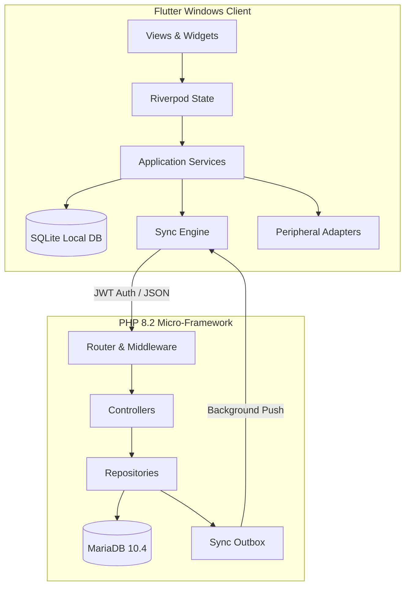

# LaundryPro UAE - Desktop POS & ERP

LaundryPro UAE is a comprehensive, offline-first Windows desktop POS and ERP system tailored for garment care, dry cleaning, and specialized laundry operations in the UAE market. It combines a robust Flutter desktop client with a high-performance PHP 8.2 micro-framework backend and MariaDB, ensuring extreme reliability, seamless hardware integration, and zero-data-loss synchronization.

## Architecture

LaundryPro UAE is built on a **Clean Architecture** model, ensuring strict separation of concerns, high testability, and offline-first resilience.



### Core Tenets
- **Zero Float Rule**: All monetary values are handled using `DECIMAL(18,2)` in MariaDB and `bcmath` in PHP to guarantee absolute financial precision.
- **Offline-First Resilience**: The Flutter app operates seamlessly offline, reading from and writing to a local SQLite database. A robust background sync engine with exponential backoff pushes outbox events to the server when connectivity is restored.
- **Immutable Financials**: Posted invoices are immutable. Any corrections require generating standardized Correction Memos.
- **Strict Role-Based Access Control (RBAC)**: Authorization is governed exclusively by the server via JWT scopes, backed by comprehensive audit logging.
- **Hardware Agnosticism**: Printers, scanners, scales, and cash drawers are interfaced via abstracted adapter layers, never coupled directly to business logic.

## Tech Stack

| Component | Technology | Version | Description |
| :--- | :--- | :--- | :--- |
| **Frontend** | Flutter | >=3.3.0 | Windows Desktop compiled application |
| **State Mgt** | Riverpod | ^2.6.1 | Reactive state management |
| **Local DB** | SQLite | ^2.3.6 | `sqflite_common_ffi` for Windows |
| **Backend** | PHP | 8.2 | Custom dependency-free micro-framework |
| **Database** | MariaDB | 10.4 | Relational data store |
| **Packaging** | MSIX | ^3.16.8 | Windows Store compatible installer |

## Key Features

- **Advanced Point of Sale**: Streamlined cashier interface, multi-tender payments, offline draft support, and automated challan generation.
- **Advanced Garment Care**: Detailed inspection tracking, stain identification, specialized processing cycles, and quality control holds.
- **Inventory & Purchasing**: Real-time stock tracking, vendor management, automated reorder alerts, and purchase order lifecycle management.
- **Human Resources & Payroll**: Employee attendance tracking, leave management, automated salary advance deductions, and comprehensive payroll processing.
- **Peripheral Integration**: Native support for ESC/POS receipt printers, barcode scanners, weight scales, and payment terminals.
- **Localization**: Full Arabic & English support (UI and receipts) with regional UAE/KSA tax compliance.
- **Data Integrity**: SHA-256 validated encrypted ZIP backups and immutable audit trails.

## Quick Start (Development)

### Prerequisites
- Windows 10/11
- Flutter SDK (>= 3.3.0)
- XAMPP (PHP 8.2, MariaDB)
- Visual Studio (C++ Desktop Development workload)

### Backend Setup
1. Clone the repository and navigate to the project root.
2. Link the backend to XAMPP:
   ```powershell
   New-Item -ItemType Junction -Path "C:\xampp\htdocs\laundrypro-api" -Target ".\api"
   ```
3. Create a MariaDB database named `laundrypro`.
4. Copy `api/.env.example` to `api/.env` and update the database credentials.
5. Run migrations and seed data:
   ```powershell
   curl -X POST -H "X-Install-Token: dev_local_install_secret_change_in_production" http://localhost/laundrypro-api/public/api/v1/install/migrate
   curl -X POST -H "X-Install-Token: dev_local_install_secret_change_in_production" http://localhost/laundrypro-api/public/api/v1/install/seed
   ```
6. The default credentials are `admin` / `admin123`.

### Frontend Setup
1. Fetch dependencies:
   ```powershell
   flutter pub get
   ```
2. Run the application:
   ```powershell
   flutter run -d windows
   ```

## Production Deployment

The application is deployed to standard locations on the host machine:
- Backups: `C:/LaundryPro/backups/`
- Invoices: `C:/LaundryPro/invoices/`
- Logs: `C:/LaundryPro/logs/`

To build the MSIX package for distribution:
```powershell
flutter pub run msix:create
```

## Contributor Guidelines
- Adhere strictly to the Clean Architecture boundaries.
- Ensure all business logic is covered by API integration tests (`dev.ps1 gate`).
- UI text must be externalized to `assets/lang/en.json` and `assets/lang/ar.json`.
- Never bypass the `SyncOutboxRepository` for entity mutations.
