# Operational Use Cases & Workflow Blueprints

**Product:** LaundryPro UAE / LaundraCore Local  
**Standard:** Enterprise POS/ERP Operational Standard  
**Version:** 1.2.1+4 · PHP 8.2 · MariaDB  

---

## 1. Primary Use-Case Index

| Use Case ID | Name | Primary Actor | Success Criteria |
|---|---|---|---|
| **UC-01** | Splash Screen Self-Healing Boot | Workstation / Cashier | Environment checked, migrations auto-applied, login ready |
| **UC-02** | Walk-In Instant Sale & Payment | Front-Desk Cashier | Customer billed, receipt printed, cash drawer opened, outbox queued |
| **UC-03** | Existing Customer Phone Search | Front-Desk Cashier | History and balances retrieved under 300 ms |
| **UC-04** | Express Surcharge & Garment Modifiers | Front-Desk Cashier | Dynamic line calculation with 50% urgency premium |
| **UC-05** | Production Status Movement | Laundry Operator | Order transitions from Received ? Processing ? Ready |
| **UC-06** | Factory Challan Batch Transfer | Plant Dispatcher | Batch transfer slip printed with item count verification |
| **UC-07** | Driver Dispatch & Delivery Handover | Driver / Cashier | Task dispatched, cash on delivery collected, order marked Delivered |
| **UC-08** | Staff Shift Clock-In & WPS Payroll | Employee / HR | Shifts captured, monthly WPS statement generated with UAE Labour Law |
| **UC-09** | Hardware UMAC Anti-Tamper & Lockout | System Guard | Hardware mismatch or clock rollback immediately halted |
| **UC-10** | Offline-to-Cloud Delta Sync | Background Daemon | Delta outbox pushed to central cloud when connection is active |
| **UC-11** | Split Payment Workflow | Cashier | Process Cash + Card seamlessly |
| **UC-12** | Refund & Correction Memo | Manager | Immutable correction memo generated |
| **UC-13** | Daily Shift Close | Cashier | Z-Report printed and variance logged |
| **UC-14** | Low-Stock Reorder | System | Alert triggered and PO generated |
| **UC-15** | Client Onboarding Wizard | Admin | 8-step initialization completed |
| **UC-11** | Split Payment (Multi-Tender) | Front-Desk Cashier | Invoice settled across = 2 tender types, change calculated correctly, single receipt issued |
| **UC-12** | Refund / Correction Memo | Cashier / Manager | Credit memo raised against original invoice; original invoice never mutated; ledger balanced |
| **UC-13** | Shift Close / Cash Reconciliation | Shift Supervisor | Declared cash vs. system cash variance logged; Z-Report printed; drawer sealed |
| **UC-14** | Inventory Low-Stock Reorder | Store Manager / System | Consumable stock falls below threshold; PO draft auto-generated; supplier notified |
| **UC-15** | 8-Step Onboarding Wizard | Super-Admin / New Tenant | New branch node fully configured: business profile, hardware, license, services, and first test order |

---

## 2. Detailed Workflow Diagrams & Logic Sequences

### UC-01: Splash Screen Self-Healing Boot Sequence

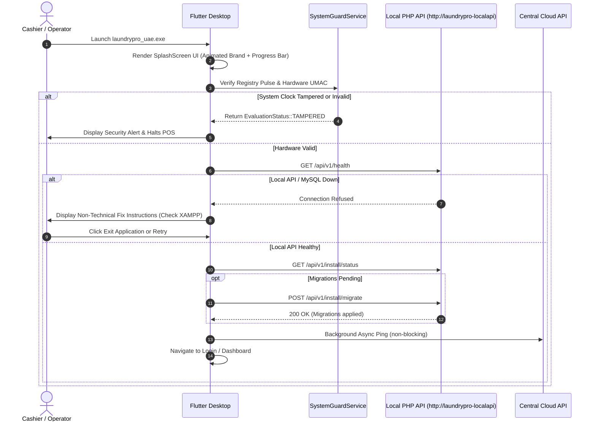

**Business Rules**

- Hardware UMAC check runs before any network call; a mismatch blocks all POS operations.
- Clock rollback of > 5 minutes triggers `EvaluationStatus::TAMPERED` and halts login.
- Migration script is idempotent; running it on an up-to-date schema is a no-op.

---

### UC-02: Walk-In Instant Sale & Payment Workflow

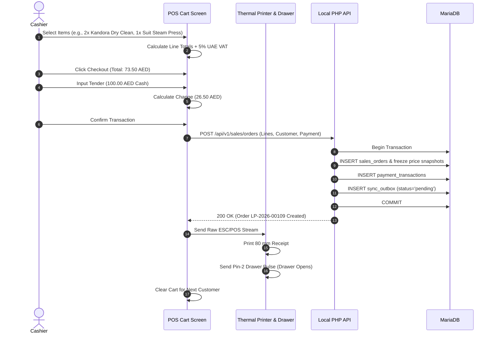

**Business Rules**

- Price snapshots are stored at order time; subsequent service price changes never retroactively alter historical invoices.
- VAT is calculated at 5% on the taxable subtotal using bcmath to avoid floating-point rounding errors.
- The sync_outbox record ensures cloud replication even when the network is unavailable at sale time.

---

### UC-03: Existing Customer Phone Search

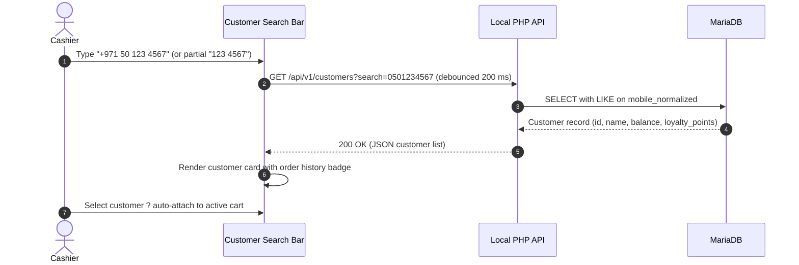

**Business Rules**

- Search is normalised (leading zeros, country prefix stripped) before querying.
- Response target: = 300 ms on local MariaDB; index on `mobile_normalized` column is mandatory.
- Walk-in customers use a system placeholder record (id = 1); no personal data stored.

---

### UC-04: Express Surcharge & Garment Modifiers

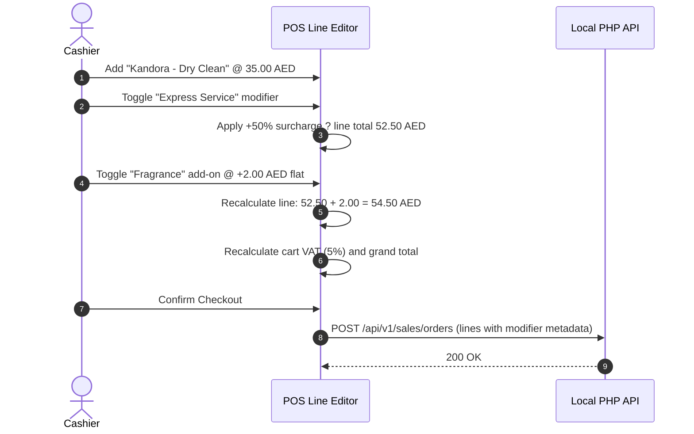

**Business Rules**

- Express surcharge is always 50% of the base service rate, never compounded on other modifiers.
- Flat add-on modifiers (Fragrance, Starch, Stain Treatment) are added after the percentage surcharge.
- All modifier choices are stored in `order_line_modifiers` for audit and reporting.

---

### UC-05: Production Status Movement

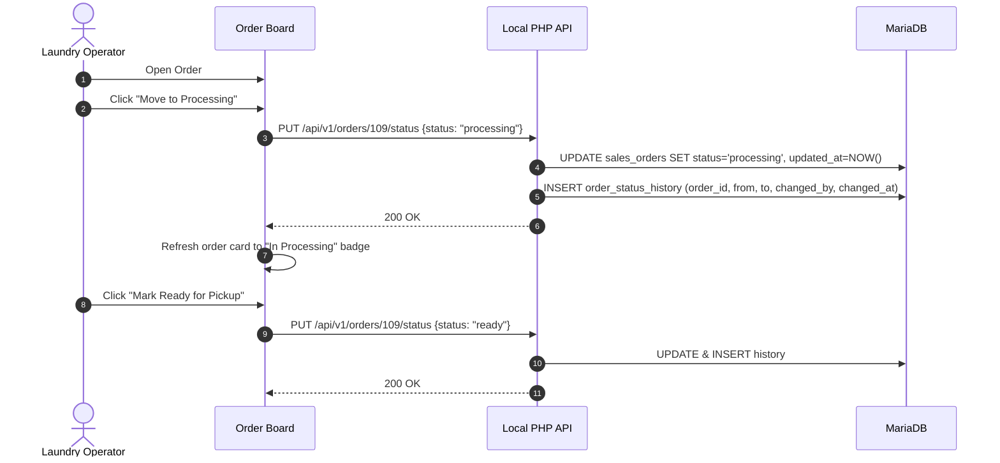

**Business Rules**

- Status transitions are enforced server-side: `received ? processing ? ready ? delivered`.
- Skipping a state (e.g., `received ? delivered`) is rejected with HTTP 422.
- Every transition is logged in `order_status_history` with operator identity and timestamp.

---

### UC-06: Factory Challan Batch Transfer

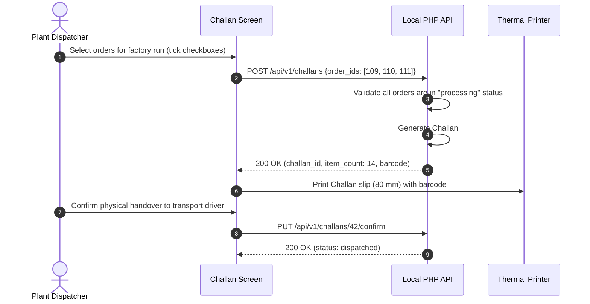

**Business Rules**

- A Challan can only include orders in `processing` status; mixing statuses is rejected.
- Item count on the printed slip must match the digital count; driver verifies and signs.
- Challans are immutable once confirmed; corrections require a new Challan with a note referencing the prior one.

---

### UC-07: Driver Dispatch & Delivery Handover Sequence

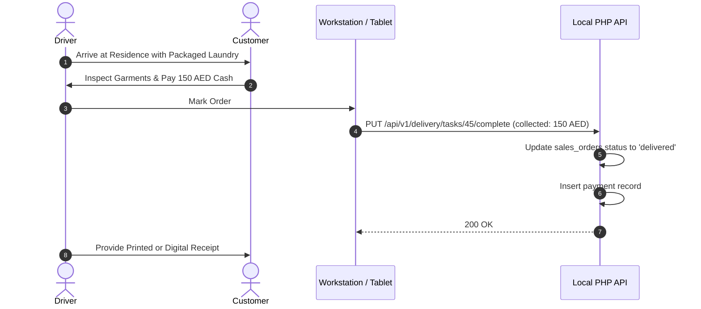

**Business Rules**

- Cash-on-delivery amount collected must equal the outstanding invoice balance; partial payments trigger a credit-note workflow (see UC-12).
- Delivery tasks are assigned to a named driver record; anonymous delivery is not permitted.
- GPS timestamp is recorded (if device location service is active) for proof of delivery.

---

### UC-08: Staff Shift Clock-In & WPS Payroll

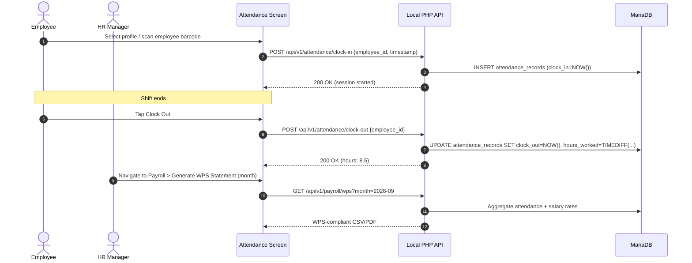

**Business Rules**

- Overtime (> 8 h/day) is calculated at 1.25× base rate per UAE Labour Law Article 67.
- WPS file format follows the UAE Central Bank SIF specification.
- Clock-in without a preceding clock-out on the same calendar day triggers an HR alert.

---

### UC-09: Hardware UMAC Anti-Tamper & Lockout

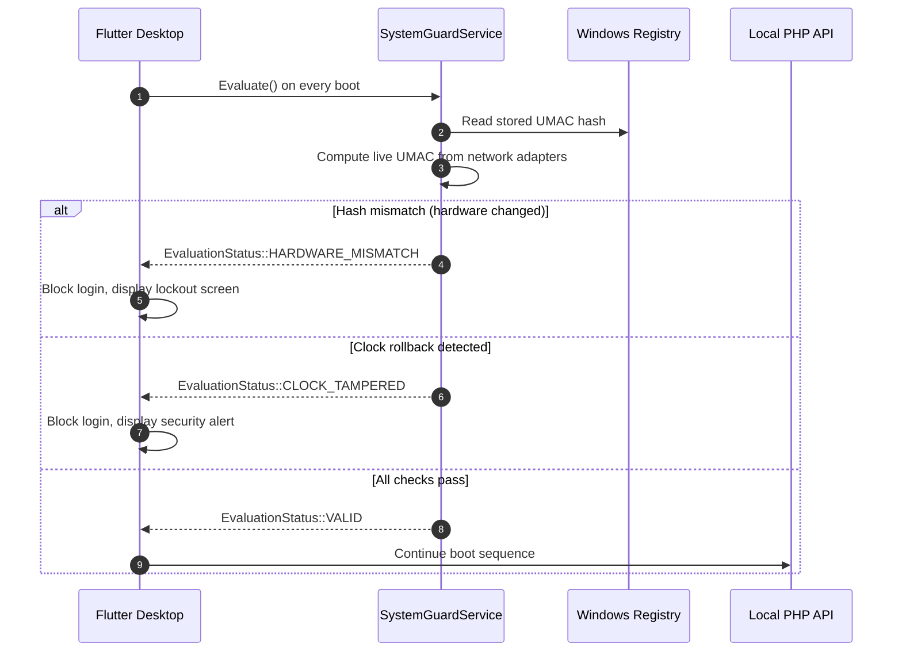

**Business Rules**

- UMAC is derived from the primary network adapter MAC + Windows machine GUID; both must match the stored hash.
- System clock must be within ±5 minutes of the last recorded timestamp stored in the Registry.
- After 3 consecutive lockout events, a flag is set in `system_events` and a cloud notification is sent to the super-admin.

---

### UC-10: Offline-to-Cloud Delta Sync Sequence

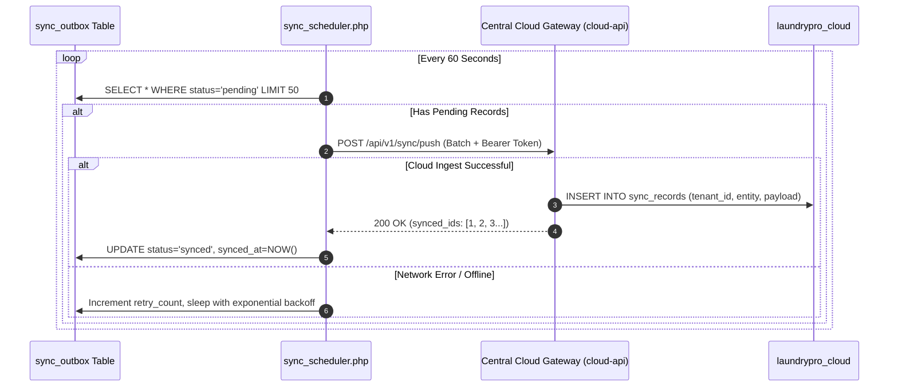

**Business Rules**

- Batch size is capped at 50 records per cycle to avoid cloud gateway timeouts.
- Exponential back-off starts at 60 s and caps at 30 minutes after 5 consecutive failures.
- Records that fail > 20 retries are flagged `status='dead_letter'` and trigger an admin alert.

---

### UC-11: Split Payment (Multi-Tender)

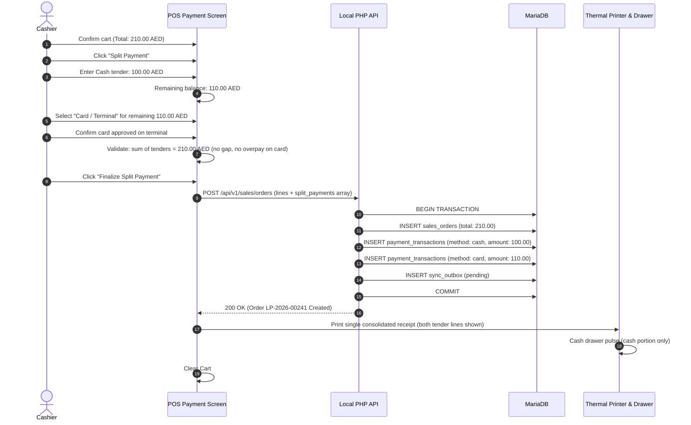

**Business Rules**

- The sum of all split tender amounts must equal the invoice total exactly; the API rejects any discrepancy with HTTP 422.
- Cash-over-tender (change) applies only to the cash leg; card amounts are exact.
- A single receipt is printed showing every payment leg; the receipt header reads "Split Payment – 2 Methods".
- Split tenders are stored as separate rows in `payment_transactions` all linked to the same `sales_order_id`.
- Credit (Account) can be one leg of a split; the credit limit check fires before the transaction is committed.

---

### UC-12: Refund / Correction Memo

> **Policy:** Original invoices are immutable. All corrections use a Credit Memo (negative invoice) that references the original order number.

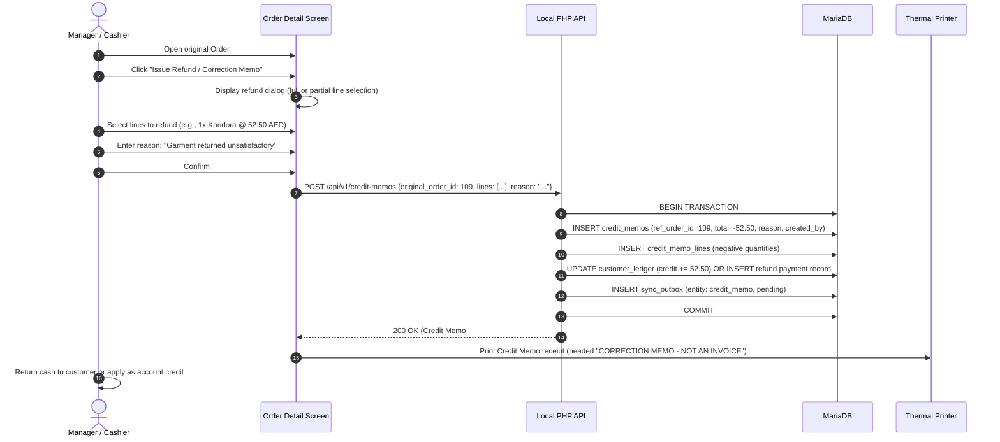

**Business Rules**

- `sales_orders` rows are never updated or deleted for correction purposes; the original record is the immutable source of truth.
- Credit memos carry a negative total and reference `ref_order_id`; financial reports net them against gross sales.
- A memo can be full (entire invoice) or partial (selected lines only); quantity refunded cannot exceed quantity originally sold.
- Refund method choices: **Cash Return**, **Account Credit**, or **Voucher**; method is stored on the memo record.
- Manager-level role (`role >= manager`) is required to issue a credit memo; cashier-only accounts are blocked.
- Every memo creation is logged in `audit_log` with operator ID, original order ID, and refund amount.

---

### UC-13: Shift Close / Cash Reconciliation

```mermaid
sequenceDiagram
    autonumber
    actor Supervisor as Shift Supervisor
    participant UI as Shift Close Screen
    participant API as Local PHP API
    participant DB as MariaDB
    participant Printer as Thermal Printer

    Supervisor->>UI: Navigate to Reports > Shift Close
    UI->>API: GET /api/v1/reports/shift-summary?shift_date=2026-09-10&cashier_id=7
    API->>DB: Aggregate cash transactions, opening float, card totals for shift
    API-->>UI: Summary (System Cash: 4,250.00 AED, Card: 1,800.00 AED)
    Supervisor->>UI: Enter physically counted cash: 4,220.00 AED
    UI->>UI: Compute variance: -30.00 AED (short)
    Supervisor->>UI: Enter variance reason: "Customer change error"
    Supervisor->>UI: Click "Close Shift & Print Z-Report"
    UI->>API: POST /api/v1/shifts/close {declared_cash, variance, reason, cashier_id}
    API->>DB: INSERT shift_closures (system_cash, declared_cash, variance, closed_by, closed_at)
    API->>DB: INSERT audit_log (action: shift_close, details)
    API->>DB: INSERT sync_outbox (entity: shift_closure, pending)
    API-->>UI: 200 OK (Shift #SC-2026-0087 closed)
    UI->>Printer: Print Z-Report (totals, variance, supervisor signature line)
    UI->>UI: Lock POS for current shift; prompt for new shift opening float
```

**Business Rules**

- A shift cannot be closed if any order remains in `pending_payment` status.
- Variance within ±5 AED auto-flags as "Minor"; variance > 50 AED requires a mandatory reason comment.
- Z-Report is the authoritative end-of-shift document; it cannot be reprinted or modified after closure.
- Opening float for the next shift must be declared before the first sale of the new shift can proceed.
- Shift closure record syncs to cloud so that franchise head office can monitor branch variances in real-time.

---

### UC-14: Inventory Low-Stock Reorder

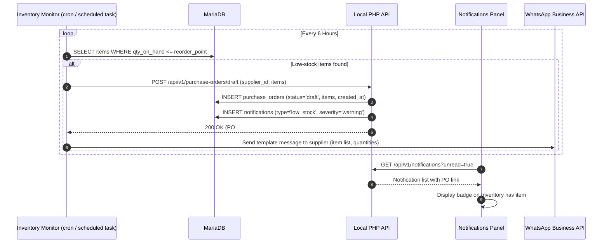

**Business Rules**

- Reorder point and reorder quantity are configurable per inventory item in the stock master.
- Draft POs require manager approval before converting to confirmed orders sent to suppliers.
- The WhatsApp notification is non-blocking; if the API call fails the PO draft is still created locally.
- Consumables tracked include: plastic bags, hangers, garment covers, detergents, dry-clean solvent (Perc).
- Stock quantities are decremented automatically when a sales order is confirmed (if item-to-service mapping exists).

---

### UC-15: 8-Step Onboarding Wizard

```mermaid
sequenceDiagram
    autonumber
    actor SA as Super-Admin
    actor Tenant as New Tenant Owner
    participant Wizard as Onboarding Wizard (Flutter)
    participant LocalAPI as Local PHP API
    participant CloudAPI as Central Cloud API

    SA->>CloudAPI: Create Tenant record (business name, trade license, contact)
    CloudAPI-->>SA: Tenant ID + Bearer token
    Tenant->>Wizard: Step 1 - Enter Bearer token (from SA)
    Wizard->>LocalAPI: POST /api/v1/setup/token-verify
    LocalAPI-->>Wizard: Token valid - proceed
    Tenant->>Wizard: Step 2 - Business Profile (name, address, TRN, logo upload)
    Tenant->>Wizard: Step 3 - Hardware Registration (UMAC auto-read)
    Wizard->>CloudAPI: POST /api/v1/licenses/request {umac, tenant_id}
    CloudAPI-->>Wizard: License key LP-XXXX-XXXX
    Wizard->>LocalAPI: POST /api/v1/setup/license-activate
    LocalAPI-->>Wizard: License active
    Tenant->>Wizard: Step 4 - Printer & Drawer Setup (test print)
    Tenant->>Wizard: Step 5 - Service Price Catalogue (import CSV or manual entry)
    Tenant->>Wizard: Step 6 - Staff & Role Creation (add at least 1 cashier)
    Tenant->>Wizard: Step 7 - Opening Float Declaration (cash in drawer)
    Tenant->>Wizard: Step 8 - Test Order (guided walk-through of first sale)
    Wizard->>LocalAPI: POST /api/v1/setup/complete
    LocalAPI-->>Wizard: Onboarding flag set; redirect to live Dashboard
```

**Business Rules**

- Steps must be completed in sequence; the wizard enforces linear progression with back-navigation allowed.
- Step 3 (Hardware Registration) auto-reads the UMAC from the local machine; manual entry is available for edge cases only.
- Step 5 supports bulk import via a CSV template (downloadable from the wizard); individual manual entry is capped at 200 services for wizard performance.
- Step 8 test order is flagged `is_test=true` and excluded from all financial reports; it can be voided without a credit memo.
- Wizard completion sets `onboarding_complete=1` in `system_settings`; subsequent boots skip the wizard entirely.
- Incomplete onboarding (steps 1-6 done, steps 7-8 not) allows limited read-only access; POS transactions are blocked until the wizard is fully completed.


