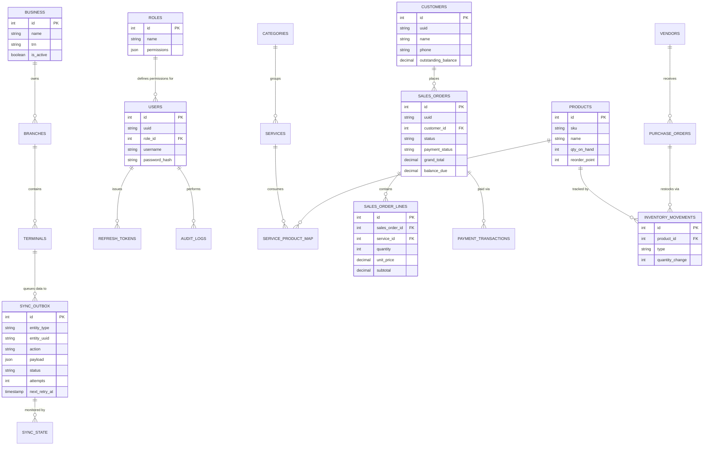

# LaundryPro UAE: Database Entity-Relationship (ER) Diagram

This document defines the core relational data model underpinning the LaundryPro UAE offline-first system.

## Core Schema

## Design Constraints
- All primary keys (`id`) are unsigned integers auto-incremented for local database speed.
- All replicated tables possess a `uuid` `CHAR(36)` used as the global primary key when synchronizing to the central cloud.
- Monetary values (`grand_total`, `subtotal`, etc.) are STRICTLY typed as `DECIMAL(18,2)`.
- The `sync_outbox` acts as an event-store for the offline-first replication engine.
