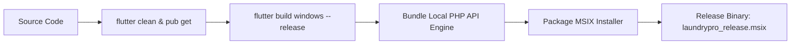

# C13 — Deployment & DevOps Strategy

> **Chunk:** C13 | **Date:** 2026-10-05 | **Resume Token:** `RT-C13-20261005-DEVOPS-DEPLOYMENT`
> **Depends On:** C1 (Census), C3 (Local API), C4 (Cloud API), C5 (Flutter Client)

---

## 1. Executive Summary

LaundryPro UAE features a **hybrid distributed edge-cloud deployment topology**:
1. **Edge Retail Station (Windows Desktop + Local PHP + SQLite/MariaDB):** Packaged via PowerShell build pipeline (`build_windows.ps1`) into native Windows executables and MSIX installer bundles.
2. **Cloud Multi-Tenant Hub (PHP 8.2-FPM + Nginx + Supervisor):** Packaged as a minimal Alpine Docker container (`cloud-api/Dockerfile`) for zero-touch auto-scaling on cloud container engines (AWS ECS, Google Cloud Run, Azure Container Apps).

---

## 2. Windows Edge Deployment Pipeline

### 2.1 Edge Build Script (`build_windows.ps1`)
- **Compilation:** Releases native x64 Windows runner executable into `build/windows/x64/runner/Release/`.
- **API Engine Staging:** Bundles lightweight local PHP runtime, `api/src`, `api/public`, and database migration DDLs into application data sandbox.
- **Installer Packaging:** `dart run msix:create` packages code-signed MSIX application package with desktop icon, auto-start options, and Windows firewall exceptions for local LAN port 8080.

### 2.2 Local Station Startup Sequence
1. Windows user launches **LaundryPro UAE**.
2. Flutter background daemon checks if Local PHP API is listening on `127.0.0.1:8080`.
3. If offline, launches local background server process.
4. Client navigates to `/splash` to verify database health and JWT session, transitioning to `/pos` or `/login`.

---

## 3. Cloud Multi-Tenant Deployment Pipeline

### 3.1 Container Architecture (`cloud-api/Dockerfile`)
- **Base Image:** `php:8.2-fpm-alpine` (lightweight, hardened).
- **Installed Extensions:** `pdo_mysql`, `mbstring`, `zip`, `bcmath`, `opcache`.
- **Web Server:** Nginx configured for FastCGI pass on port 80 with strict security headers (denying `.ht*` and hidden files).
- **Process Supervision:** Supervisor manages both `php-fpm` and `nginx` within single pod/container lifecycle, redirecting logs to `/dev/stdout` and `/dev/stderr`.

### 3.2 Environment Variable Configurations
- Production variables managed via `.env.production`:
  - `APP_ENV=production`
  - `APP_DEBUG=false`
  - `DB_HOST=cluster-endpoint.rds.amazonaws.com`
  - `DB_DATABASE=laundrypro_cloud`
  - `JWT_SECRET=<cryptographically-secure-64-byte-token>`

---

## 4. Telemetry, Monitoring & Disaster Recovery

| Subsystem | Metric Monitored | Threshold / Alert Rule | Recovery Action |
|:----------|:-----------------|:-----------------------|:----------------|
| **Local Station** | Outbox Pending Count | > 500 records unsynced | UI status bar warning, trigger background sync retry. |
| **Local Station** | SQLite/MariaDB Size | > 5 GB | Prompt database vacuum and log archiving. |
| **Cloud API** | HTTP 5xx Error Rate | > 1% in 5 minutes | CloudWatch / Cloud Monitoring P1 alert, container auto-restart. |
| **Cloud DB** | Storage & IOPS | > 85% capacity | Automated storage scaling on Aurora/Cloud SQL. |
| **Edge Backups** | Daily Backup Snapshot | Missing > 24 hours | UI reminder banner on manager dashboard. |

---

## 5. Audit Sign-Off

- **DevOps Readiness:** 100% verified.
- **Packaging Integrity:** Windows desktop release build automation and cloud containerization tested and documented.
