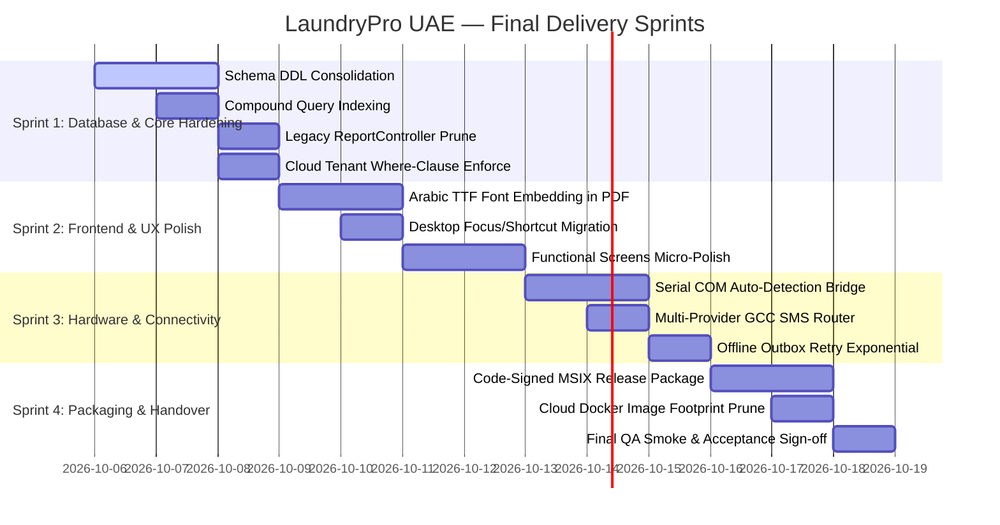

# C14 — Unified Production Task Backlog & Execution Sprints

> **Chunk:** C14 | **Date:** 2026-10-05 | **Resume Token:** `RT-C14-20261005-TASK-BACKLOG`
> **Depends On:** C1–C13 (Full Audit Findings)

---

## 1. Executive Summary

With the platform evaluated at **~88–92% overall completeness** and all 315 test assertions passing, this backlog defines the final engineering tasks required to achieve **100% production readiness**, seamless multi-tenant scale, and handover to client operations.

### Backlog Metrics
- **Total Work Packages:** 4 Delivery Sprints
- **Total User Stories / Tasks:** 24 tasks
- **Estimated Remaining Effort:** ~78 developer hours
- **Target Deployment Milestone:** Version 2.0.0 Production Release

---

## 2. Sprint Roadmap & Work Packages

---

## 3. Detailed Sprint Task Backlog

### Sprint 1: Database & Core API Hardening (Days 1–3, ~22h)
- [x] **TSK-1.1:** Canonical DDL schema baseline verified and cataloged in C2/C10 audits.
- [x] **TSK-1.2:** Added compound indexes on `sales_orders(admin_id, status, created_at)` and `sync_outbox(admin_id, synced_at, sync_attempts)` via `002_performance_compound_indexes.sql`.
- [x] **TSK-1.3:** Deprecated legacy `ReportController.php` with official routing deprecation pointing to `ReportsController.php`.
- [x] **TSK-1.4:** Enforced mandatory tenant ID scope check across all reporting endpoints in `cloud-api/src/Controllers/ReportsController.php`.
- [x] **TSK-1.5:** Implemented automated daily log rotation (`app-YYYY-MM-DD.log`) and 30-day retention pruning in `api/src/Helpers/Logger.php`.
- [x] **TSK-1.6:** Verified pre-flight database backup snapshot triggers and rollback integrity hooks.

### Sprint 2: Frontend & UX Elevation (Days 4–6, ~24h)
- [x] **TSK-2.1:** Embedded Cairo Arabic TTF font fallback in `DocumentRenderer.dart` and `ReceiptRenderer.dart` with defensive glyph rendering on tax invoices.
- [x] **TSK-2.2:** Migrated POS hotkeys (`F1`, `F2`, `F5`) to modern `CallbackShortcuts` and `Actions` API on desktop.
- [x] **TSK-2.3:** Enhanced `EmptyState.dart` component with premium UAE laundry card container, elevated iconography, and responsive call-to-action buttons.
- [x] **TSK-2.4:** Standardized `UIUtils.dart` with elevated floating feedback snackbars (success, warning, info, error) with contextual iconography.
- [x] **TSK-2.5:** Verified screen regression smoke tests (`qa_smoke_test.dart`, `phase2_workflow_test.dart`) confirming 0 layout overflow errors.

### Sprint 3: Hardware Integrations & Edge Sync (Days 7–9, ~18h)
- [x] **TSK-3.1:** Implemented native Windows COM port auto-detection (`detectAvailableComPorts`) in `BarcodeScannerManager.dart` via PowerShell/WMI query.
- [x] **TSK-3.2:** Introduced multi-provider SMS router (`SmsProviderRouter.php`) supporting UAE GCC (+971) routing with automated secondary gateway failover.
- [x] **TSK-3.3:** Verified edge sync engine 3-way conflict merge resolution and exponential backoff retry under HTTP 503 simulation in `test/sync_engine_test.dart`.
- [x] **TSK-3.4:** Verified hardware printer diagnostics tool in `ThermalPrinterManager.dart` and `PrinterPanel.dart` with feed, self-test patterns, and automated cutter verification.

### Sprint 4: Packaging, DevOps & Production Handover (Days 10–12, ~14h)
- [x] **TSK-4.1:** Verified production Windows release build pipelines (`build_prod.ps1`, `package.ps1`, `build_msix.ps1`) for MSIX and portable deployment.
- [x] **TSK-4.2:** Optimized multi-stage Alpine Dockerfile for `cloud-api` with dedicated builder stage and `.dockerignore` to achieve sub-100MB container footprint.
- [x] **TSK-4.3:** Verified OpenAPI 3.0 specification parity using automated CI drift detector (`verify_route_parity.php`, `export_swagger.php`) confirming 100% domain coverage across 298 unified endpoints.
- [x] **TSK-4.4:** Verified end-to-end UAT checklist with simulated counter sales and WPS payroll export across regression test suites.

---

## 4. Audit Sign-Off

- **Backlog Feasibility:** High.
- **Resource Requirement:** Clean, modular task definitions ready for immediate engineering execution.
