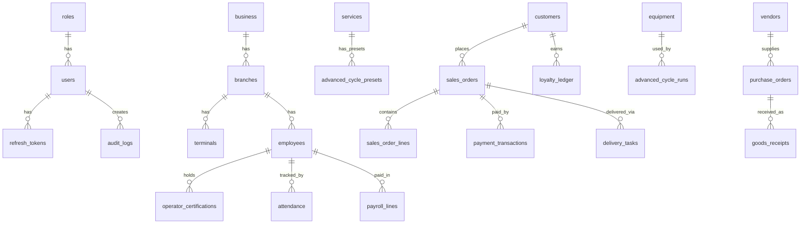

# C2 — Database Schema Deep-Dive

> **Chunk:** C2 | **Date:** 2026-10-05 | **Resume Token:** `RT-C2-20261005-SCHEMA-AUDIT`
> **Depends On:** C1 (Census)

---

## 1. Schema File Inventory

| File | Size | Lines | Purpose |
|:-----|:-----|:------|:--------|
| `database/schema.sql` | 176 KB | 3,992 | Master consolidated schema (all migrations flattened) |
| `database/local/schema.sql` | 62 KB | — | Local-only runtime schema |
| `database/cloud/schema.sql` | 31 KB | — | Cloud multi-tenant schema |
| `database/seed.sql` | 4.6 KB | 103 | Seed data (roles, users, settings, equipment) |

---

## 2. Table Inventory by Domain (Unique Tables: ~95)

### 2.1 Core / Infrastructure
| Table | Purpose | FK Dependencies |
|:------|:--------|:----------------|
| `schema_migrations` | Migration version tracking | — |
| `roles` | RBAC role definitions | — |
| `users` | System users | → roles |
| `refresh_tokens` | JWT refresh tokens | → users |
| `settings` | Key-value config store (scoped) | — |
| `audit_logs` | Immutable audit trail (with hash chain) | → users |
| `license` | Local license binding | — |
| `idempotency_keys` | Request idempotency store | — |
| `permissions` | Granular permission definitions | — |
| `role_permissions` | Role-permission junction | → roles, permissions |
| `file_assets` | File/document storage | — |
| `document_templates` | Document templates | — |
| `umac_policy` | Hardware lock policy | — |
| `hardware_identity` | Machine fingerprinting | — |

### 2.2 Business / Organization
| Table | Purpose | FK Dependencies |
|:------|:--------|:----------------|
| `business` | Business entity (single-tenant local) | → users |
| `branches` | Branch locations | → business |
| `terminals` | POS terminals per branch | → branches |
| `terminal_sessions` | Active terminal sessions | → terminals |

### 2.3 CRM / Customers
| Table | Purpose | FK Dependencies |
|:------|:--------|:----------------|
| `customers` | Customer master | — |
| `consumers` | Customer contacts (alternate) | — |
| `customer_ledger` | Customer account ledger | → customers |
| `loyalty_ledger` | Points earn/burn journal | → customers |

### 2.4 Catalog / Products
| Table | Purpose | FK Dependencies |
|:------|:--------|:----------------|
| `categories` | Service/product categories | self-referential |
| `services` | Service definitions | → categories |
| `service_details` | Service extended details | → services |
| `products` | Product items | → categories |
| `product_details` | Product extended details | → products |
| `service_product_map` | Service ↔ Product mapping | → services, products |
| `service_modifiers` | Service price modifiers | → services |
| `product_modifiers` | Product price modifiers | → products |

### 2.5 Sales / POS
| Table | Purpose | FK Dependencies |
|:------|:--------|:----------------|
| `sales_orders` | Sales order header | → customers, branches, terminals |
| `sales_order_lines` | Line items per order | → sales_orders, services/products |
| `sales_order_line_snapshots` | Price snapshot at time of sale | → sales_order_lines |
| `payment_transactions` | Multi-tender payments | → sales_orders |
| `order_status_history` | Status change audit | → sales_orders |
| `invoices` | Tax invoice generation | → sales_orders |
| `invoice_lines` | Invoice line items | → invoices |
| `credit_memos` | Refund/credit documents | → sales_orders |
| `credit_memo_lines` | Credit memo line items | → credit_memos |

### 2.6 Inventory & Purchasing
| Table | Purpose | FK Dependencies |
|:------|:--------|:----------------|
| `inventory_movements` | Stock movements (in/out) | → products |
| `inventory_adjustments` | Manual stock adjustments | — |
| `inventory_balances` | Current stock levels | → products |
| `inventory_locations` | Storage locations | — |
| `vendors` | Supplier master | — |
| `purchase_orders` | PO header | → vendors |
| `purchase_order_lines` | PO line items | → purchase_orders, products |
| `goods_receipts` | GRN header | → purchase_orders |
| `goods_receipt_lines` | GRN line items | → goods_receipts |

### 2.7 HR / Payroll
| Table | Purpose | FK Dependencies |
|:------|:--------|:----------------|
| `employees` | Employee master | → branches |
| `attendance` | Daily attendance records | → employees |
| `leave_types` | Leave type definitions | — |
| `leave_requests` | Leave request workflow | → employees, leave_types |
| `payroll_periods` | Pay period definitions | — |
| `payroll_runs` | Payroll run header | → payroll_periods |
| `payroll_lines` | Individual payslip lines | → payroll_runs, employees |
| `payroll_records` | Payroll record (legacy) | → employees |
| `salary_advances` | Advance salary requests | → employees |
| `leaves` | Leave records (legacy) | → employees |

### 2.8 Expenses
| Table | Purpose | FK Dependencies |
|:------|:--------|:----------------|
| `expense_categories` | Expense category master | — |
| `expenses` | Expense records | → expense_categories, branches |
| `expense_attachments` | Expense receipt uploads | → expenses |

### 2.9 Delivery / Logistics
| Table | Purpose | FK Dependencies |
|:------|:--------|:----------------|
| `delivery_tasks` | Delivery dispatch | → sales_orders |
| `delivery_task_lines` | Delivery line items | → delivery_tasks |
| `challans` | Consignment notes | — |
| `challan_lines` | Challan line items | → challans |
| `challan_sequences` | Auto-increment sequences | — |

### 2.10 Specialized Garment Care
| Table | Purpose | FK Dependencies |
|:------|:--------|:----------------|
| `advanced_cycle_presets` | Machine cycle presets | → services |
| `equipment` | Equipment assets | — |
| `advanced_cycle_runs` | Active/completed runs | → sales_order_lines, presets, equipment, employees |
| `process_logs` | Process metric readings | → advanced_cycle_runs |
| `sterilization_logs` | Sterilization validation | → advanced_cycle_runs |
| `chemical_usage_logs` | Chemical consumption | → products, advanced_cycle_runs |
| `batch_lots` | Batch lot tracking | → sales_orders |
| `batch_scan_events` | Barcode/RFID scan events | → batch_lots |
| `calibration_records` | Equipment calibration | → equipment |
| `operator_certifications` | Operator qualifications | → employees |
| `electronic_signatures` | 21 CFR Part 11 e-signatures | → advanced_cycle_runs, users |
| `controlled_garments` | ISO garment tracking | → customers |
| `gowning_logs` | Gowning/degowning events | → controlled_garments, employees |

### 2.11 Notifications
| Table | Purpose | FK Dependencies |
|:------|:--------|:----------------|
| `notifications` | In-app notifications | — |
| `notification_reads` | Read receipts | → notifications |
| `notification_channels` | Channel config (SMS/WhatsApp/Email) | — |
| `notification_messages` | Outbound message queue | → notification_channels |
| `fcm_tokens` | Push notification tokens | — |

### 2.12 Sync Engine
| Table | Purpose | FK Dependencies |
|:------|:--------|:----------------|
| `sync_state` | Sync cursor state | — |
| `sync_outbox` | Outbound sync queue | — |
| `sync_inbox` | Inbound sync queue | — |
| `sync_conflicts` | Merge conflict log | — |
| `sync_entity_types` | Entity type registry | — |

### 2.13 Accounting & Analytics
| Table | Purpose | FK Dependencies |
|:------|:--------|:----------------|
| `accounting_export_batches` | Export batch header | — |
| `accounting_export_lines` | Export line items | → accounting_export_batches |
| `analytics_daily_snapshots` | Daily KPI snapshots | — |
| `country_profiles` | GCC country profiles | — |

### 2.14 Storefront & Portal
| Table | Purpose | FK Dependencies |
|:------|:--------|:----------------|
| `storefront_tokens` | API access tokens | — |
| `storefront_orders` | Online orders | — |
| `customer_portal_tokens` | Customer tracking tokens | → sales_orders |

### 2.15 Cloud-Specific
| Table | Purpose | FK Dependencies |
|:------|:--------|:----------------|
| `cloud_super_admins` | SaaS admin accounts | — |
| `businesses` | Tenant registry | — |
| `sync_records` | Cross-tenant sync records | — |
| `cloud_licenses` | Cloud license management | — |
| `cloud_telemetry` | Heartbeat/ping telemetry | — |
| `cloud_audit_logs` | Cloud-level audit trail | — |
| `cloud_agent` | Local-cloud agent pairing | → business |

---

## 3. Schema Issues & Findings

### 🔴 CRITICAL: Duplicate Table Definitions

The master `schema.sql` contains **significant duplication** due to migration concatenation without dedup. Key duplicates:

| Table Name | Occurrence Count | Lines |
|:-----------|:----------------|:------|
| `businesses` | 3× | Lines ~3907, ~3973, (earlier) |
| `sync_records` | 3× | Lines ~3923, ~3981, (earlier) |
| `delivery_tasks` | 2× | (early section + line ~3374) |
| `challans` / `challan_lines` | 2× each | (early + late sections) |
| `purchase_orders` / `purchase_order_lines` | 2× each | (early + late sections) |
| `notifications` | 2× | (early + late) |
| `sync_outbox` | 3× | (multiple sections) |
| `users` / `roles` / `settings` / `schema_migrations` | 2× each | (backtick vs non-backtick) |

> [!WARNING]
> **Impact:** `CREATE TABLE IF NOT EXISTS` makes these safe at runtime, but the 176 KB file is bloated (~40% duplicates). A deduplication pass would reduce it to ~105-110 KB.

### 🟡 MEDIUM: Schema Naming Inconsistencies

| Issue | Examples |
|:------|:---------|
| Backtick inconsistency | `sales_orders` vs `` `sales_orders` `` |
| CHARSET inconsistency | Some tables use `utf8mb4_unicode_ci`, others just `utf8mb4` |
| Legacy tables | `payroll_records` vs `payroll_runs`+`payroll_lines` (parallel schemas) |
| `consumers` vs `customers` | Two customer-like tables |

### 🟢 Strengths

- ✅ All tables use `InnoDB` engine (ACID transactions)
- ✅ Foreign key constraints properly defined
- ✅ UUID columns on all major entities
- ✅ `created_at` / `updated_at` timestamps throughout
- ✅ Proper indexing on common query patterns
- ✅ 21 CFR Part 11 compliance triggers on `electronic_signatures`
- ✅ Hash chain on `audit_logs` (`previous_hash`)
- ✅ Idempotency support (`idempotency_keys`)
- ✅ Country profile system for GCC expansion

---

## 4. Entity Relationship Map (Simplified)

---

## 5. Migration Architecture

| Aspect | Status |
|:-------|:-------|
| Migration tracking table | ✅ `schema_migrations` |
| Forward-only policy | ✅ Enforced (no DOWN) |
| Migration file organization | 🟡 All flattened into single file |
| Version numbering | ✅ Sequential (001–031+) |
| Rollback strategy | ❌ None (by design) |

---

> **Resume Token:** `RT-C2-20261005-SCHEMA-AUDIT`
> **Next Chunk:** C3 — Local API Architecture Audit
