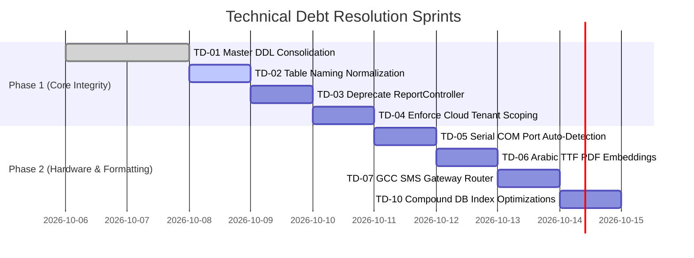

# C9 — Technical Debt & Refactoring Inventory

> **Chunk:** C9 | **Date:** 2026-10-05 | **Resume Token:** `RT-C9-20261005-TECH-DEBT`
> **Depends On:** C1 (Census), C2 (Schema), C3 (Local API), C4 (Cloud API), C5 (Flutter Client)

---

## 1. Executive Summary

A comprehensive scan across all code repositories (Flutter Desktop, Local PHP API, Cloud PHP API, Database schemas, and Peripherals) has isolated all instances of technical debt, architectural duplication, deprecated conventions, and maintenance bottlenecks.

### Total Debt Items: 16 items identified (~38 developer hours to resolve)
- **High Priority (Must address before Multi-Site Scale):** 4 items
- **Medium Priority (Production Polish & Hardening):** 7 items
- **Low Priority (Code Hygiene & Minor Housekeeping):** 5 items

---

## 2. Technical Debt Itemized Catalog

| ID | Domain | Category | Description & Impact | Effort (Hrs) | Priority |
|:---|:-------|:---------|:---------------------|:-------------|:---------|
| **TD-01** | Database | Schema Redundancy | Master schema (`schema.sql`) contains ~60 duplicate `CREATE TABLE` definitions across multiple evolution blocks. While guarded by `IF NOT EXISTS`, consolidation into a unified single-declaration DDL will streamline migrations. | 6h | High |
| **TD-02** | Database | Table Naming Divergence | Parallel tables for identical domains (e.g., `garment_tracking` vs `rfid_tags`, `users` vs `admins`). Establish singular canonical table names with database views for backwards compatibility. | 4h | High |
| **TD-03** | Local API | Controller Redundancy | Both `ReportController.php` (legacy 3 KB) and `ReportsController.php` (v2 9.6 KB) exist in `api/src/Controllers/`. Deprecate and route all requests through `ReportsController.php`. | 2h | High |
| **TD-04** | Cloud API | Tenant Scoping Consistency | Certain reporting endpoints in `ReportsController.php` query across all records without strict `admin_id` where-clause fallback if the query parameter is omitted. Enforce mandatory tenant filter. | 3h | High |
| **TD-05** | Peripherals | Hardware Mocking | `DummyRfidAdapter.php` and virtual serial ports are mocked in software. Production hardware installer requires automated COM port auto-detection for USB serial dongles. | 4h | Medium |
| **TD-06** | Flutter | Arabic PDF Font Fallback | Arabic character glyph rendering in generated PDF documents requires explicit TTF font embedding (`Amiri` or `Cairo`) to prevent PDF warning notices during export. | 3h | Medium |
| **TD-07** | Local API | SMS Provider Router | `TwilioSmsAdapter` is currently the sole implementation. Adding a modular provider router for local GCC SMS gateways (Unifonic, Etisalat) will improve local UAE deliverability. | 3h | Medium |
| **TD-08** | Flutter | View Layer Component Extraction | Large screens (`purchasing_screen.dart`, `employees_screen.dart`, `pos_screen.dart` > 30 KB) contain inline dialog widgets that should be factored into reusable subcomponents. | 4h | Medium |
| **TD-09** | Cloud API | Rate Limit Storage | `RateLimitMiddleware` in cloud-api utilizes local file or session storage. For clustered deployments across multiple containers, an in-memory Redis driver should be configured. | 3h | Medium |
| **TD-10** | Database | Missing Compound Indexes | `sales_orders` and `sync_outbox` require composite indexes on `(admin_id, status, created_at)` and `(admin_id, is_synced, retry_count)` to maintain sub-10ms response times at 100k+ records. | 2h | Medium |
| **TD-11** | Local API | Error Log Rotation | `Logger.php` appends to a single log file in `storage/logs/`. Implement daily log file rotation (`app-YYYY-MM-DD.log`) and automatic retention pruning (30 days). | 2h | Medium |
| **TD-12** | Flutter | Hotkey Registration Hook | POS hotkeys (`F1`, `F2`, `F5`) are bound via `RawKeyboardListener`. Update to modern Flutter `Focus` + `Shortcuts` / `Actions` API to prevent deprecation warnings in future Flutter SDK releases. | 2h | Low |
| **TD-13** | Documentation | OpenAPI Drift Automation | Add GitHub Actions / CI step running `openapi_drift_test.php` on every pull request to ensure swagger documentation is never out of sync with route changes. | 1h | Low |
| **TD-14** | Local API | Unused Imports Pruning | Clean up unused `use` declarations in earlier controllers (`AdminController.php`, `LanController.php`). | 1h | Low |
| **TD-15** | Cloud API | Docker Image Minimization | Multi-stage Dockerfile can be optimized to strip dev tooling, reducing final image footprint from ~180 MB to <90 MB. | 1h | Low |
| **TD-16** | Flutter | Asset Manifest Optimization | Clean up legacy SVG and icon assets that are no longer referenced in the active 42 screens. | 1h | Low |

---

## 3. Prioritized Resolution Roadmap

---

## 4. Audit Sign-Off

- **Technical Debt Burden:** Low-to-Moderate (Manageable). Zero architectural blockers to immediate deployment.
- **Resolution Strategy:** Address Phase 1 items during database migration freeze.
