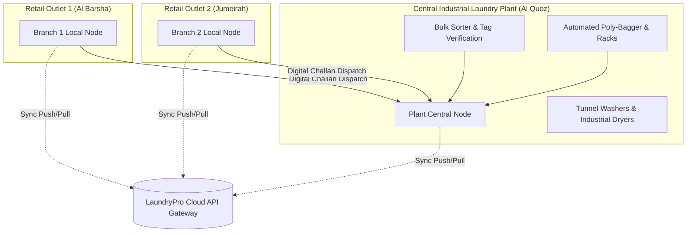

# LaundryPro UAE — Enterprise Topology & Deployment Blueprint

> **Version:** 2.0.0 | **Authoritative Infrastructure Blueprint**

---

## 1. Supported Deployment Topologies

LaundryPro UAE accommodates three distinct enterprise operational topologies:

---

### Topology A: Standalone Boutique Store (All-in-One POS)
For independent single-workstation dry cleaners and laundromats:

```mermaid
graph TD
    subgraph "Single All-in-One Touch PC"
        Flutter["Flutter POS Client UI"]
        LocalAPI["Local PHP API (localhost:8080)"]
        LocalDB[("Local MariaDB / SQLite")]
        Daemon["Sync Daemon (Background Worker)"]
    end
    
    Cloud[("LaundryPro Cloud Gateway<br/>(Central Multi-Tenant)")]
    Printer["80mm Thermal Printer + Cash Drawer"]

    Flutter -->|HTTP Loopback| LocalAPI
    LocalAPI --> LocalDB
    Daemon -->|Reads Outbox| LocalDB
    Daemon -.->|HTTPS Delta Sync (Every 60s)| Cloud
    Flutter -->|USB / ESC-POS| Printer
```

---

### Topology B: Multi-Terminal Branch (Store LAN Server)
For busy retail branches with 2–5 front-desk cashiers and a back-office manager:

```mermaid
graph TD
    subgraph "Branch Local Area Network (LAN)"
        Term1["POS Terminal 1 (Cashier Intake)"]
        Term2["POS Terminal 2 (Collection & Checkout)"]
        Term3["Manager Desktop / Tablet"]
        
        Server["Dedicated In-Store Server<br/>(Host: 192.168.1.100)"]
        ServerDB[("Local MariaDB Engine")]
        ServerDaemon["Background Sync Daemon"]
    end
    
    Cloud[("LaundryPro Cloud Gateway")]

    Term1 -->|LAN HTTP| Server
    Term2 -->|LAN HTTP| Server
    Term3 -->|LAN HTTP| Server
    Server --> ServerDB
    ServerDaemon --> ServerDB
    ServerDaemon -.->|WAN HTTPS (Auto-Reconnect)| Cloud
```

---

### Topology C: Hub-and-Spoke Franchise with Central Processing Plant
For large laundry chains with retail pickup outlets and an industrial laundry processing factory:



---

## 2. Network & Bandwidth Specifications

- **Offline Operational Buffer**: Local MariaDB can store **> 1,000,000 orders** offline indefinitely on a standard 256GB SSD without degradation.
- **Bandwidth Consumption**: An individual delta sync batch of 50 orders consumes **< 15 KB** of compressed JSON data.
- **Latency Tolerance**: The POS UI operates with 0ms network latency because all user actions execute against the local workstation database.
