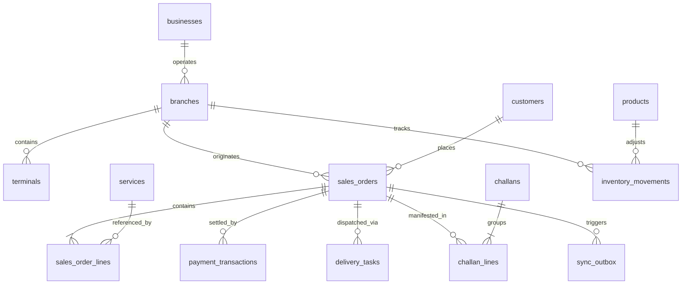

# LaundryPro UAE — Database Schema Data Dictionary

> **Version:** 2.0.0 | **Authoritative Data Architecture Reference**

---

## 1. Domain Entity Relationship Architecture

---

## 2. Core Table Definitions & Indexing Strategy

### 2.1 Sales & Financial Transaction Tables

#### `sales_orders` (Core Order Master)
- **Primary Key**: `id INT UNSIGNED AUTO_INCREMENT`
- **Identity UUID**: `uuid CHAR(36) NOT NULL UNIQUE` (Cross-database global identifier)
- **Indexes**:
  - `idx_order_customer (customer_id)`: Accelerates customer history lookup at POS.
  - `idx_order_status_date (status, created_at)`: Optimizes kitchen/rack status board queries.
  - `idx_order_number (order_number)`: Fast barcode scanner lookup.
- **Key Columns**:
  - `subtotal DECIMAL(18,2)`: Net taxable amount before tax.
  - `vat_amount DECIMAL(18,2)`: Exact 5% UAE VAT.
  - `total_amount DECIMAL(18,2)`: Gross payable amount including VAT.
  - `status ENUM('draft', 'confirmed', 'in_process', 'ready', 'delivered', 'cancelled')`.
  - `payment_status ENUM('unpaid', 'partially_paid', 'paid', 'refunded')`.
  - `sync_status ENUM('local', 'pending', 'synced', 'conflict')`.

#### `payment_transactions` (Ledger Entries)
- **Primary Key**: `id INT UNSIGNED AUTO_INCREMENT`
- **Foreign Keys**: `sales_order_id REFERENCES sales_orders(id)`
- **Key Columns**:
  - `tender_type ENUM('cash', 'card', 'store_credit', 'corporate_ledger')`.
  - `amount DECIMAL(18,2)`: Amount tendered.
  - `reference_no VARCHAR(100)`: Card authorization code or bank RRN.
  - `shift_session_id INT UNSIGNED`: Links transaction to cashier's active Z-Report shift.

---

### 2.2 Synchronization Engine Tables

#### `sync_outbox` (Local Outbound Queue)
- **Primary Key**: `id BIGINT UNSIGNED AUTO_INCREMENT`
- **Key Columns**:
  - `entity_type VARCHAR(100)`: Target entity (e.g., `sales_orders`, `customers`).
  - `entity_local_id INT UNSIGNED`: Local database auto-increment ID.
  - `operation ENUM('create', 'update', 'delete')`: Mutation type.
  - `payload JSON`: Full serialized snapshot of the entity at mutation time.
  - `synced_at TIMESTAMP NULL`: Set to current time once Cloud ACK is received.
  - `sync_attempts INT UNSIGNED`: Incremented on network failure; used for exponential backoff.

#### `sync_inbox` (Local Inbound Queue)
- **Primary Key**: `id BIGINT UNSIGNED AUTO_INCREMENT`
- **Key Columns**:
  - `entity_type VARCHAR(100)`, `entity_uuid CHAR(36)`.
  - `payload JSON`: Inbound data from Cloud pull.
  - `status ENUM('pending', 'applied', 'conflict', 'failed')`.
  - `applied_at TIMESTAMP NULL`: Timestamp when 3-way merge completed.

#### `sync_conflicts` (Dispute & Dead-Letter Log)
- **Primary Key**: `id BIGINT UNSIGNED AUTO_INCREMENT`
- **Key Columns**:
  - `local_payload JSON`, `cloud_payload JSON`, `resolved_payload JSON`.
  - `status ENUM('pending', 'auto_resolved', 'manual_resolved', 'discarded')`.
  - `resolution_notes TEXT`: Audit description of how the conflict was settled.
