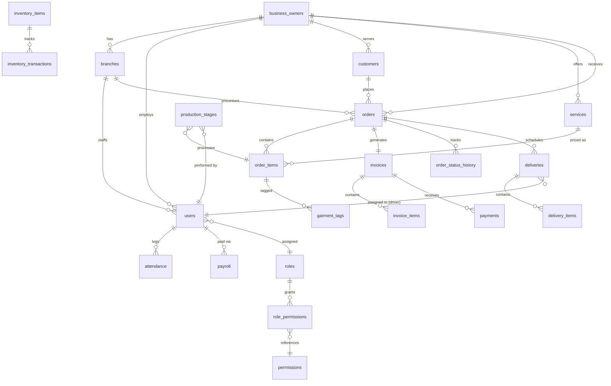

# ER Diagram - LaundryPro UAE
> **Version:** 1.0.0

## Core Entity Relationships

```mermaid
erDiagram
    business_owners ||--o{ branches : has
    business_owners ||--o{ users : employs
    business_owners ||--o{ customers : serves
    business_owners ||--o{ services : offers
    business_owners ||--o{ orders : receives

    branches ||--o{ users : staffs
    branches ||--o{ orders : processes

    customers ||--o{ orders : places
    orders ||--o{ order_items : contains
    orders ||--|| invoices : generates
    orders ||--o{ order_status_history : tracks
    orders ||--o{ deliveries : schedules

    services ||--o{ order_items : "priced as"
    order_items ||--o{ garment_tags : tagged

    invoices ||--o{ invoice_items : contains
    invoices ||--o{ payments : receives

    users ||--o{ attendance : logs
    users ||--o{ payroll : "paid via"
    users }o--|| roles : "assigned"

    roles ||--o{ role_permissions : grants
    role_permissions }o--|| permissions : references

    deliveries ||--o{ delivery_items : contains
    deliveries }o--|| users : "assigned to (driver)"

    production_stages }o--|| order_items : processes
    production_stages }o--|| users : "performed by"

    inventory_items ||--o{ inventory_transactions : tracks
```