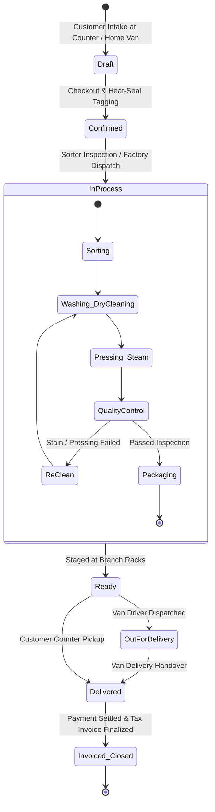

# LaundryPro UAE — Order Processing Lifecycle

> **Version:** 2.0.0 | **Authoritative Workflow Specification**

---

## 1. End-to-End Lifecycle State Machine

---

## 2. Stage Breakdown & Operational Gates

### Stage 1: Order Draft & Intake (`/sales/draft`)
- Cashier enters customer mobile number; system displays loyalty tier, garment preferences (e.g., "heavy starch on Kandora cuffs"), and outstanding ledger balance.
- Cashier adds garments (e.g., Suit 2-Piece, Abaya Silk, Curtains). Modifiers selected (perfume rinse, wooden hanger, express 4-hour turnaround).
- Real-time gross and VAT calculation displayed.

### Stage 2: Confirmation & Barcode Tagging (`/sales/orders`)
- Order is confirmed. The thermal POS printer immediately prints:
  1. **Customer Receipt** with order barcode, estimated ready date, and item breakdown.
  2. **Thermal Garment Tags** (polyester heat-seal labels) containing: Order Number, Garment Index (e.g., `1/4`), Service Code, and Unique Barcode.
- Tags are affixed to the internal care label of each garment.

### Stage 3: Factory Dispatch Manifest (`/challans/dispatch`)
- For hub-and-spoke laundry chains, garments are packed into nylon laundry bins and scanned into a **Factory Dispatch Challan**.
- Van driver signs the digital manifest on the mobile tablet before departing for the central cleaning factory.

### Stage 4: Central Processing & Quality Control
- **Sorting**: Garments sorted by color, fabric weight, and wash cycle requirements (hydrocarbon dry cleaning vs. aqueous wet cleaning).
- **Processing**: Garments washed, tumble dried, and steam-pressed.
- **QC Inspection**: Inspector scans garment barcode. If stain persists, garment is routed to `ReClean` without customer surcharge. If approved, garment is poly-bagged and tagged with a destination rack slot.

### Stage 5: Ready Notification & Delivery
- Garment arrives back at branch; cashier scans tag into `Ready` status.
- System automatically fires a bilingual WhatsApp/SMS notification to the customer:
  > *"Dear customer, your laundry order #DXB-2026-0042 is ready for pickup at our Al Barsha branch."*

### Stage 6: Counter Pickup & Payment Finalization
- Cashier scans receipt barcode; system brings up order balance.
- Customer tenders payment (Cash / Card / Store Credit).
- Official UAE VAT Tax Invoice is finalized and printed with TLV QR code.
