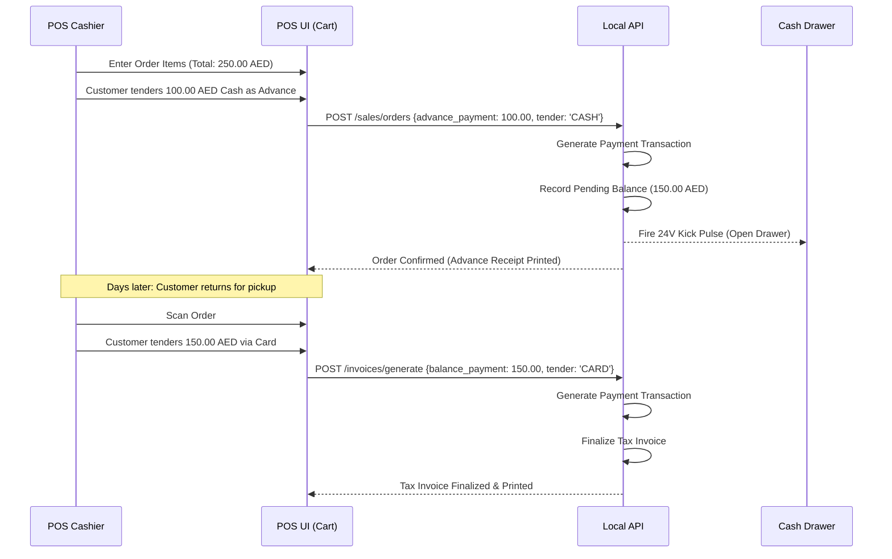

# LaundryPro UAE — Payment & Financial Reconciliation Flow

> **Version:** 2.0.0 | **Authoritative Financial Specification**

---

## 1. Supported Payment Tenders

LaundryPro UAE supports multi-currency and multi-tender settlement:

| Tender Code | Description | Hardware / Integration | Ledger Behavior |
|---|---|---|---|
| `CASH` | Emirati Dirham physical notes & coins | POS Cash Drawer pulse trigger (RJ11) | Credits Cash Drawer Till Account |
| `CARD` | Visa / Mastercard / UnionPay / Amex | External Card Terminal or Integrated IP PIN Pad | Credits Bank Clearing Account |
| `APPLE_PAY` / `SAMSUNG_PAY` | Mobile NFC contactless wallets | Contactless reader on card terminal | Credits Bank Clearing Account |
| `STORE_CREDIT` | Customer prepaid package or refund balance | Internal loyalty ledger verification | Debits Customer Liability Account |
| `CORPORATE_LEDGER` | B2B monthly credit terms (30 days net) | Credit limit authorization check | Debits Accounts Receivable (AR) |

---

## 2. Split Tenders & Advance Deposits

---

## 3. Refunds & FTA Credit Notes

Under UAE VAT regulations, when an order is cancelled or adjusted after a tax invoice has been issued:
1. The original tax invoice **cannot be modified or deleted**.
2. A formal **FTA Tax Credit Note** (`credit_memo`) must be issued referencing the original invoice number.
3. The credit memo specifies:
   - Original Tax Invoice Number and Date
   - Reason for refund (e.g., "Garment damaged during processing", "Customer cancellation")
   - Reversal of taxable amount and 5% VAT.
4. Refund payout tender must match initial payment method or be credited to Customer Store Credit.

---

## 4. Cashier Shift Balancing & Z-Report

At the end of each cashier's shift:
1. **Blind Close**: Cashier enters physical cash count in drawer without seeing the expected theoretical total.
2. System computes variance:
   $$\text{Variance} = \text{Actual Cash Count} - (\text{Opening Float} + \text{Total Cash Sales} - \text{Petty Cash Expenses})$$
3. A formal **Z-Report** is generated, signed, and locked. The drawer state is committed to `terminal_sessions`.
