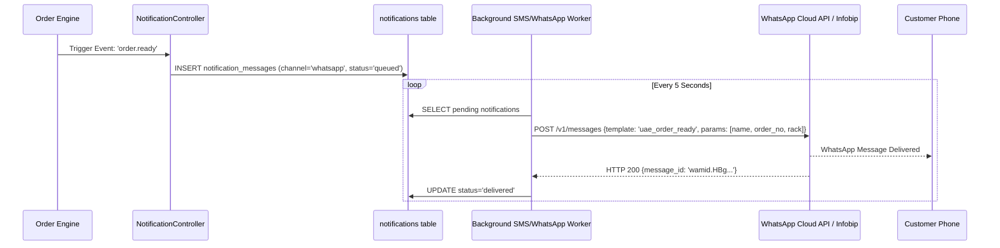

# LaundryPro UAE — External ERP & Gateway Integrations

> **Version:** 2.0.0 | **Authoritative Integration Architecture**

---

## 1. Accounting & ERP System Connectors

LaundryPro UAE provides native scheduled batch export and REST API webhooks for enterprise general ledgers:

### 1.1 Tally Prime XML Integration
The `AccountingController::export()` endpoint produces standard Tally XML Day-Book and Sales Journal files:
- Maps POS sales categories to Tally Sales Ledgers.
- Maps 5% Output VAT to "VAT on Sales (Output VAT 5%)" account.
- Maps cash, card, and customer receivables to their corresponding Tally Cash/Bank/Sundry Debtors accounts.

### 1.2 Zoho Books & QuickBooks Online
- Automated daily synchronization of sales invoices and expense vouchers via authenticated OAuth2 REST APIs.
- Generates summarized daily journal entries to prevent cluttering the main corporate general ledger with thousands of individual laundry tickets.

---

## 2. Payment Gateway & Card Terminal Integration

### 2.1 Semi-Integrated IP / USB PIN Pad (Nexo / Standalone)
- POS communicates with banking card terminals (Network International, Magnati, Mashreq) over TCP/IP or USB serial.
- The POS sends: `Amount in AED` + `Unique Transaction ID`.
- The customer taps their physical card or Apple Pay device on the bank terminal.
- The terminal returns: `Approval Code`, `Card Scheme (Visa/Mastercard)`, `Masked PAN (**** 1234)`, and `RRN (Retrieval Reference Number)`.
- Eliminates cashier manual entry errors on credit card machines.

---

## 3. Customer Messaging Channels (WhatsApp & SMS)

