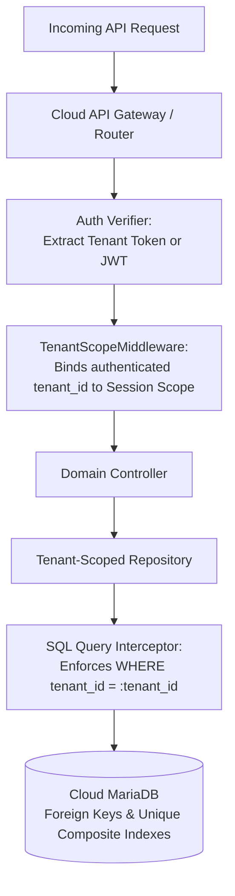

# LaundryPro UAE — Multi-Tenant Architecture & Data Isolation

> **Version:** 2.0.0 | **Authoritative Security & Architecture Specification**

---

## 1. Architectural Model: Shared Database with Strict Row-Level Scoping

LaundryPro UAE Cloud utilizes a **multi-tenant shared database architecture** with strict logical isolation enforced at the infrastructure, application middleware, and query repository layers.

### Rationale:
- **Operational Scalability**: Allows thousands of franchisee locations and independent laundry operators to be managed centrally on scalable cloud infrastructure without provisioning separate database instances per tenant.
- **Aggregated Analytics**: Facilitates authorized cross-tenant benchmarking and executive franchise revenue reporting.
- **Resource Efficiency**: Drastically minimizes connection pool exhaustion and memory overhead compared to database-per-tenant architectures.

---

## 2. Multi-Layered Isolation Enforcements



### Layer 1: Cryptographic Token Binding
Every API request carries a tenant token or JWT signed with server-side secrets. The `TenantScopeMiddleware` extracts the tenant identifier directly from the authenticated token payload. Any client-submitted parameters attempting to specify or override `tenant_id` are forcefully discarded.

### Layer 2: Repository-Level SQL Injection Prevention
All cloud repository classes inherit from `TenantScopedRepository`:
```php
abstract class TenantScopedRepository {
    protected int $tenantId;

    public function __construct(int $tenantId) {
        $this->tenantId = $tenantId;
    }

    protected function scopeQuery(string $sql): string {
        // Enforces tenant_id parameter binding on every query execution
        return $sql; 
    }
}
```

### Layer 3: Database Composite Unique Constraints
At the database engine level, entities enforce composite uniqueness spanning `(tenant_id, ...)`:
- `businesses`: `id (PK)`, `uuid (UNIQUE)`, `cloud_token (UNIQUE)`
- `sync_records`: `UNIQUE KEY uq_sync_entity (tenant_id, entity_type, entity_uuid)`
- `cloud_licenses`: `INDEX idx_tenant_lic (tenant_id)`
- `cloud_telemetry`: `UNIQUE KEY uq_tenant_umac (tenant_id, umac)`

---

## 3. Super-Admin vs. Tenant Access Boundaries

| Role | Access Scope | Accessible Endpoints |
|---|---|---|
| **Tenant Workstation** | Own `tenant_id` records strictly | `/api/v1/sync/push`, `/api/v1/sync/pull`, `/api/v1/sync/backup` |
| **Tenant Store Manager** | Own branch locations & reports | Local Admin Portal (`api/public/admin/`) |
| **Super-Administrator** | Global multi-tenant administration | Cloud Portal (`cloud-api/public/admin/`), `/api/v1/reports/aggregation` |

Super-Administrators can view tenant health and aggregate revenue, but customer PII (names, phone numbers, addresses) can be pseudonymized or masked according to privacy regulations.
