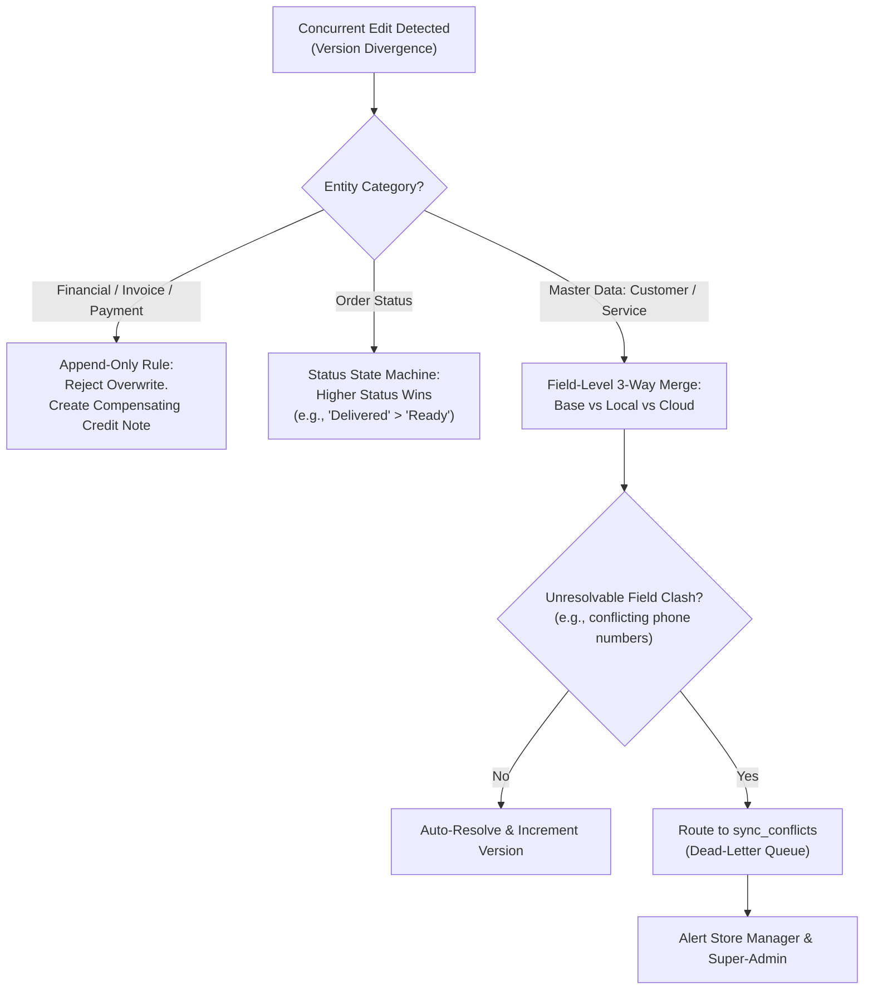

# LaundryPro UAE — Sync Conflict Resolution Specification

> **Version:** 2.0.0 | **Authoritative Specification** | **Engine:** Outbox/Inbox V2

---

## 1. Conflict Detection Philosophy

In an offline-first distributed architecture where multiple POS workstations and Cloud portals can mutate data simultaneously, conflicts are inevitable. LaundryPro UAE applies a **deterministic, zero-data-loss, rule-based 3-way merge algorithm**.

### Core Guarantees:
1. **Financial Immutability**: Invoices, payment transactions, cash drawer openings, and general ledger journal lines are **append-only**. They can never be overwritten by a conflict resolution. Any adjustment must produce a compensating transaction.
2. **Deterministic Convergence**: If two nodes process the same conflicting records, both nodes will reach the exact same state without human intervention for 99% of business scenarios.
3. **Audit Trail Preservation**: Whenever an automated resolution or manual override occurs, the previous local payload and cloud payload are permanently recorded in `sync_conflicts`.

---

## 2. Entity Versioning (Vector Clock Counter)

Every syncable entity maintains an `entity_version INT UNSIGNED` and a `uuid CHAR(36)`.
- On initial creation: `entity_version = 1`.
- On every local mutation: `entity_version = entity_version + 1`.
- When pushing to Cloud: Cloud validates `expected_version`.
  - If `cloud.entity_version == incoming.entity_version - 1`, the update is clean (no conflict).
  - If `cloud.entity_version >= incoming.entity_version`, a concurrent modification occurred $\rightarrow$ Trigger 3-Way Merge.

---

## 3. The 3-Way Merge Algorithm



### 3.1 Domain-Specific Resolution Rules

#### A. Sales Orders & Status Lifecycle
- **Rule:** Order status transitions follow a monotonic directed acyclic graph (DAG):
  `draft` $\rightarrow$ `confirmed` $\rightarrow$ `in_process` $\rightarrow$ `ready` $\rightarrow$ `delivered` $\rightarrow$ `closed`.
- If Node A marks order as `ready` and Node B marks order as `delivered`, `delivered` wins because it represents a later lifecycle milestone.
- If both nodes add garment lines offline: Lines are merged by unique `garment_tag_uuid`. If duplicate tag numbers exist, a duplicate warning flag is raised for cashier inspection.

#### B. Customer Records (CRM)
- **Rule:** Field-level granular merge:
  - If Node A updated `address` while Node B updated `credit_limit`, both updates are preserved.
  - If both nodes updated `outstanding_balance`: The delta $(\Delta A + \Delta B)$ is applied to the base balance rather than overwriting.

#### C. Stock & Inventory
- **Rule:** Absolute quantities are never synced directly; only **signed inventory movements** (`quantity_change: +5`, `-2`) are transmitted.
- Stock on hand is computed as the sum of all reconciled movement transactions.

---

## 4. Dead-Letter Queue (`sync_conflicts`)

When a conflict cannot be safely resolved by rule logic, it is placed in `sync_conflicts`:

```sql
SELECT 
    id, entity_type, entity_uuid, local_version, cloud_version, status, created_at 
FROM sync_conflicts 
WHERE status = 'pending';
```

### Portal Dispute Actions:
1. **Accept Local**: Overwrites Cloud state with Local payload; increments cloud entity version.
2. **Accept Cloud**: Overwrites Local state with Cloud payload during next sync pull.
3. **Custom Merge**: Portal user edits a JSON diff editor and commits the final unified state.
