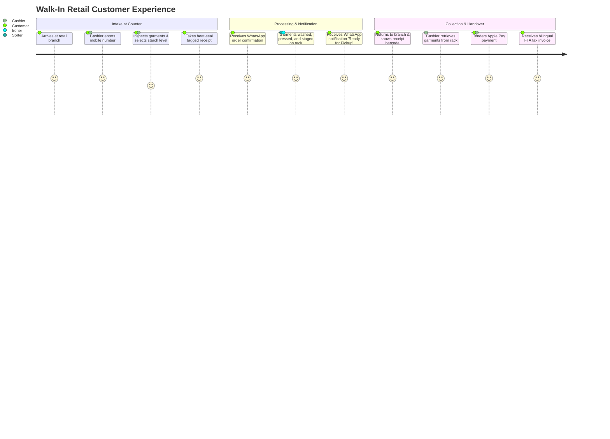

# LaundryPro UAE — Customer Journeys & Experience Maps

> **Version:** 2.0.0 | **Authoritative Service Blueprint**

---

## Journey 1: The Walk-In Retail Customer (Express Kandora & Suits)

---

## Journey 2: Home Pickup & Van Delivery Customer

1. **Order Initiation**: Customer requests home laundry pickup via telephone or online storefront portal.
2. **Driver Dispatch**: Store manager assigns the task to the neighborhood delivery driver; driver's tablet updates with customer location, building name, and apartment number.
3. **Doorstep Intake**: Driver arrives with branded laundry bags, inspects garments, enters items on the mobile POS interface, and issues a digital WhatsApp receipt.
4. **Processing**: Garments are transported to the store/plant, tagged, and processed through their respective wash cycles.
5. **Scheduled Delivery**: Customer receives an interactive notification allowing them to confirm their presence at home. Driver delivers clean, hung garments and collects payment via portable wireless card terminal.

---

## Journey 3: Corporate Contract Client (B2B Hotel & Clinic Linen)

1. **Scheduled Daily Collection**: Van arrives at hotel loading dock; logistics staff scans bulk linen hampers (bed sheets, pillowcases, duvet covers, towels).
2. **Gross Weight & Count Manifest**: Digital Challan manifest is co-signed by hotel housekeeper and van driver.
3. **Industrial Cleanroom Processing**: Central factory processes items through high-temperature thermal disinfection tunnel washers and automated flatwork ironers.
4. **Gate-Pass Return**: Clean linen bundles return to hotel wrapped in hygienic film with delivery gate-pass.
5. **Monthly Consolidated Invoicing**: At month-end, system compiles all daily challans into a consolidated corporate VAT tax invoice with 30-day payment credit terms.
