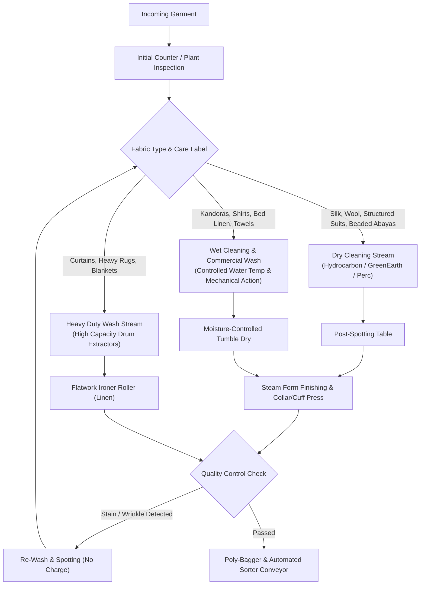

# LaundryPro UAE — Textile Care & Business Operations Workflows

> **Version:** 2.0.0 | **Authoritative Plant & Store Operational Manual**

---

## 1. Garment Classification & Sorting Matrix

Every garment intake is routed into a specific processing stream based on fabric composition and care label symbols:

---

## 2. Chemical Dosing & Controlled Wash Cycles

For industrial laundries and automated dosing pumps connected to washer-extractors:
1. **Pre-Wash**: Flush with cold water to remove water-soluble soils and protein stains.
2. **Main Wash**: Controlled alkali and detergent injection with automated temperature ramp:
   - Whites / Hospital Linen: $65^\circ\text{C} - 75^\circ\text{C}$ with oxygen-based bleach.
   - Colored Cottons / Kandoras: $40^\circ\text{C} - 50^\circ\text{C}$ with optical brighteners.
   - Delicates / Silks: Cold wash ($30^\circ\text{C}$) with neutral pH surfactant.
3. **Rinse & Neutralization**: Sour / acid neutralizing agent injected to restore fabric pH to skin-friendly level ($\text{pH } 5.5 - 6.5$).
4. **Starch & Fragrance Finishing**: Automated starch sizing injected for crisp collars and traditional Kandoras.

---

## 3. Garment Damage & Loss Claim Workflow

In the rare event of garment damage, shrinkage, or loss:
1. Store Manager opens a **Garment Claim Record** in the Local Admin Portal referencing the Order and Garment Tag Barcode.
2. Standard textile depreciation guidelines are applied:
   $$\text{Settlement Value} = \text{Original Garment Value} \times (1 - \text{Depreciation Rate}) \quad (\text{Cap: } 10\times \text{ Cleaning Charge})$$
3. Upon customer agreement, the Manager clicks **"Authorize Settlement"**:
   - Payout via Store Credit Voucher (added to customer balance), or
   - Cash Refund with accompanying FTA Credit Note.
