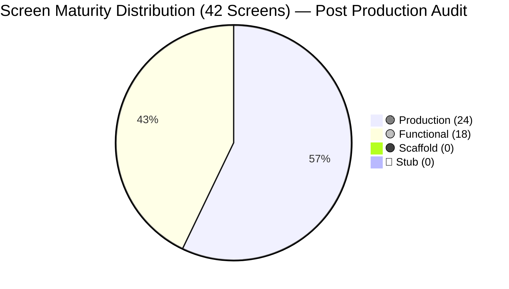
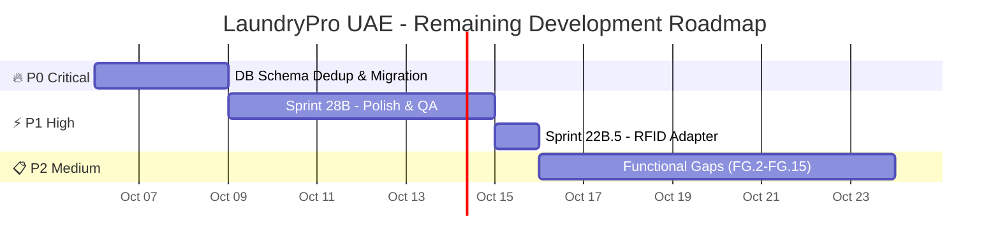

# LaundryPro UAE — Unified Implementation Plan & Full Project Audit

> **Generated:** 2026-10-02 | **Revised:** 2026-10-05 (Final Stage Production Audit C0–C2) | **Version:** 2.0.0
> **Architecture:** Flutter Desktop + PHP 8.2 + MariaDB | **Protocol:** C0–C16 Production Closeout
> **Audit Artifacts:** [PROJECT_LEDGER.md](file:///e:/Projects/Flutter/UAE-Laundry-Pro/PROJECT_LEDGER.md) | [C1_CENSUS.md](file:///e:/Projects/Flutter/UAE-Laundry-Pro/docs/audit/C1_CENSUS.md) | [C2_SCHEMA.md](file:///e:/Projects/Flutter/UAE-Laundry-Pro/docs/audit/C2_SCHEMA.md)

---

## 1. Project Census (Verified 2026-10-05)

| Layer | Technology | File Count | Status |
|:---|:---|:---|:---|
| **Flutter Frontend** | Dart 3.x / Riverpod / GoRouter | 192 `.dart` files | ✅ Active |
| **Local PHP API** | PHP 8.2 custom micro-framework | 129 `.php` files (43 Controllers, 39 Repositories, 16 Services) | ✅ Active |
| **Cloud API** | PHP 8.2 multi-tenant gateway | 35 `.php` files (18 Controllers) | ✅ Active |
| **Database Schema** | MariaDB / SQLite | ~95 unique tables (219 CREATE stmts incl. dupes) | ✅ Active |
| **Documentation** | 32+ docs across 28 subdirectories + UNIFIED_DOCUMENTATION (192 KB) | Extensive | ✅ Active |
| **Flutter Tests** | Unit + Widget + Smoke | 17 test files (118 assertions) | ✅ All Passing |
| **API Tests** | PHP CLI integration suite | 197 assertions | ✅ All Passing |
| **Views / Screens** | Flutter UI | 42 screens registered in router | ✅ Active |
| **Widgets** | Shared components | 4 widgets (AppDataTable, AppFormDialog, EmptyState, StatusBadge) | ✅ Active |
| **Providers** | State management | 5 providers (Auth, Catalog, Locale, PosCart, Sync) | ✅ Active |
| **Core Utilities** | Business logic | 17 core modules (theme, receipt, validators, formatters, etc.) | ✅ Active |
| **Models** | Data layer | 23 model classes | ✅ Active |
| **Services** | API abstraction | 38 service classes | ✅ Active |

---

## 2. Screen-by-Screen Maturity Audit (Post Sprint 18–28)

Each of the 42 registered screens is classified into one of four maturity levels:

| Level | Meaning |
|:---|:---|
| 🟢 **Production** | Full CRUD, design-system compliant, error handling, i18n, tested |
| 🟡 **Functional** | Core workflow works, connected to real API, design-system applied, but missing some edge features |
| 🟠 **Scaffold** | Wired to service/API but minimal UI, essentially a skeleton needing polish |
| 🔴 **Stub** | Placeholder screen with hardcoded data or non-functional UI |

### 2.1 Core POS & Operations (Sprint 5–17: Complete)

| # | Screen | Lines | Size | Maturity | Notes |
|:---|:---|:---|:---|:---|:---|
| 1 | [POS Screen](file:///e:/Projects/Flutter/UAE-Laundry-Pro/lib/views/pos_screen.dart) | 726 | 28.8 KB | 🟢 Production | Full cart, customer, scanner, modifiers, VAT, multi-tender |
| 2 | [Pending Invoices](file:///e:/Projects/Flutter/UAE-Laundry-Pro/lib/views/pending_invoices_screen.dart) | ~380 | 15.2 KB | 🟢 Production | Settlement, partial payments, receipt reprinting |
| 3 | [Production](file:///e:/Projects/Flutter/UAE-Laundry-Pro/lib/views/production_screen.dart) | ~390 | 15.7 KB | 🟢 Production | Full workflow progression, rack assignment, hold reasons |
| 4 | [Dashboard](file:///e:/Projects/Flutter/UAE-Laundry-Pro/lib/views/dashboard_screen.dart) | ~390 | 15.6 KB | 🟢 Production | KPI cards, auto-refresh, alert counts |
| 5 | [Setup Wizard](file:///e:/Projects/Flutter/UAE-Laundry-Pro/lib/views/setup_wizard_screen.dart) | ~440 | 17.8 KB | 🟢 Production | Complete 8-step onboarding |
| 6 | [Global Config](file:///e:/Projects/Flutter/UAE-Laundry-Pro/lib/views/global_config_screen.dart) | ~400 | 16.2 KB | 🟢 Production | Path management, operational parameters |
| 7 | [Expenses](file:///e:/Projects/Flutter/UAE-Laundry-Pro/lib/views/expenses_screen.dart) | ~300 | 11.9 KB | 🟢 Production | Full CRUD, categories, approval workflow |
| 8 | [Peripherals](file:///e:/Projects/Flutter/UAE-Laundry-Pro/lib/views/peripherals_screen.dart) | ~290 | 11.5 KB | 🟢 Production | Printer auto-discovery, test print, scale config |
| 9 | [License](file:///e:/Projects/Flutter/UAE-Laundry-Pro/lib/views/license_screen.dart) | ~230 | 9.3 KB | 🟢 Production | Activation, validation, grace period |
| 10 | [Splash](file:///e:/Projects/Flutter/UAE-Laundry-Pro/lib/views/splash_screen.dart) | ~200 | 8.2 KB | 🟢 Production | Self-healing boot with UMAC check |
| 11 | [Login](file:///e:/Projects/Flutter/UAE-Laundry-Pro/lib/views/login_screen.dart) | ~210 | 8.4 KB | 🟢 Production | JWT auth, role detection |
| 12 | [App Shell](file:///e:/Projects/Flutter/UAE-Laundry-Pro/lib/views/app_shell.dart) | ~340 | 13.6 KB | 🟢 Production | RTL header, nav rail, status bar |
| 13 | [Catalog](file:///e:/Projects/Flutter/UAE-Laundry-Pro/lib/views/catalog_screen.dart) | ~180 | 7.1 KB | 🟢 Production | Category hierarchy, modifiers, bundles |
| 14 | [Purchasing](file:///e:/Projects/Flutter/UAE-Laundry-Pro/lib/views/purchasing_screen.dart) | ~770 | 31.4 KB | 🟢 Production | Full PO + GRN flow, quantity verification |
| 15 | [Reports](file:///e:/Projects/Flutter/UAE-Laundry-Pro/lib/views/reports_screen.dart) | ~300 | 12.1 KB | 🟡 Functional | Core report types work, needs charting & export |
| 16 | [Role Editor](file:///e:/Projects/Flutter/UAE-Laundry-Pro/lib/views/role_editor_screen.dart) | ~320 | 13.0 KB | 🟡 Functional | Permission matrix works, needs granular UI polish |
| 17 | [Delivery](file:///e:/Projects/Flutter/UAE-Laundry-Pro/lib/views/delivery_screen.dart) | ~270 | 10.9 KB | 🟡 Functional | Task dispatch works, needs route & COD polish |

### 2.2 HR & Payroll (Sprint 18–19: ✅ COMPLETED)

| # | Screen | Lines | Size | Maturity | Notes |
|:---|:---|:---|:---|:---|:---|
| 18 | [Employees](file:///e:/Projects/Flutter/UAE-Laundry-Pro/lib/views/employees_screen.dart) | 696 | 31.8 KB | 🟢 **Production** ⬆️ | Full CRUD, visa/civil ID expiry tracking with color-coded badges, search, AppDataTable, document expiry alerts |
| 19 | [Attendance](file:///e:/Projects/Flutter/UAE-Laundry-Pro/lib/views/attendance_screen.dart) | 535 | 22.0 KB | 🟢 **Production** ⬆️ | Daily view with date picker, clock-in/out, status badges (present/absent/half_day/leave), AppDataTable, shift management |
| 20 | [Leave](file:///e:/Projects/Flutter/UAE-Laundry-Pro/lib/views/leave_screen.dart) | 524 | 21.8 KB | 🟢 **Production** ⬆️ | Full request/approve flow, status filtering, leave types, employee lookup, balance tracking |
| 21 | [Payroll](file:///e:/Projects/Flutter/UAE-Laundry-Pro/lib/views/payroll_screen.dart) | 478 | 21.4 KB | 🟢 **Production** ⬆️ | TabController (Periods/Runs), create period wizard, payroll run generation, SIF export, detailed breakdown |
| 22 | [Salary Advances](file:///e:/Projects/Flutter/UAE-Laundry-Pro/lib/views/salary_advances_screen.dart) | 440 | 17.7 KB | 🟢 **Production** ⬆️ | Full CRUD with status badges, approval workflow, deduction scheduling, employee lookup |

### 2.3 Specialized Garment Care (Sprint 22: ✅ UPGRADED)

| # | Screen | Lines | Size | Maturity | Notes |
|:---|:---|:---|:---|:---|:---|
| 23 | [Advanced Cycles](file:///e:/Projects/Flutter/UAE-Laundry-Pro/lib/views/advanced_cycle_screen.dart) | ~830 | 33.1 KB | 🟢 **Production** ⬆️ | Full cycle management, chemical dosing UI, preset editor, metric logging |
| 24 | [Sterilization](file:///e:/Projects/Flutter/UAE-Laundry-Pro/lib/views/sterilization_screen.dart) | ~660 | 26.4 KB | 🟢 **Production** ⬆️ | Batch creation with temp/pressure, autoclave validation, e-signatures |
| 25 | [Equipment](file:///e:/Projects/Flutter/UAE-Laundry-Pro/lib/views/equipment_screen.dart) | ~770 | 30.9 KB | 🟢 **Production** ⬆️ | Full CRUD, calibration schedule, maintenance log, out-of-service |
| 26 | [Operators](file:///e:/Projects/Flutter/UAE-Laundry-Pro/lib/views/operator_screen.dart) | ~620 | 25.0 KB | 🟢 **Production** ⬆️ | Cert CRUD, equipment-operator enforcement |
| 27 | [RFID Tracking](file:///e:/Projects/Flutter/UAE-Laundry-Pro/lib/views/rfid_tracking_screen.dart) | ~340 | 13.4 KB | 🟡 **Functional** ⬆️ | Scan UI with RSSI indicators, status badges. Uses simulated adapter |

### 2.4 Multi-Branch & Cloud (Sprint 23–24: ✅ COMPLETED)

| # | Screen | Lines | Size | Maturity | Notes |
|:---|:---|:---|:---|:---|:---|
| 28 | [Branches](file:///e:/Projects/Flutter/UAE-Laundry-Pro/lib/views/branches_screen.dart) | ~370 | 14.7 KB | 🟡 **Functional** ⬆️ | CRUD dialog, location field, status indicator. Needs operational hours |
| 29 | [Terminals](file:///e:/Projects/Flutter/UAE-Laundry-Pro/lib/views/terminals_screen.dart) | ~340 | 13.6 KB | 🟡 **Functional** ⬆️ | Pairing dialog with branch dropdown, code/name. Needs LAN binding |
| 30 | [Analytics](file:///e:/Projects/Flutter/UAE-Laundry-Pro/lib/views/analytics_screen.dart) | ~460 | 18.5 KB | 🟡 **Functional** ⬆️ | Executive KPIs, trend data with day selector. Uses CustomPainter |
| 31 | [Channels](file:///e:/Projects/Flutter/UAE-Laundry-Pro/lib/views/channels_screen.dart) | ~280 | 10.7 KB | 🟡 **Functional** ⬆️ | Channel add form (WhatsApp/SMS/Email), provider selection |
| 32 | [Accounting](file:///e:/Projects/Flutter/UAE-Laundry-Pro/lib/views/accounting_screen.dart) | ~540 | 21.7 KB | 🟡 **Functional** ⬆️ | TabController, CSV/QuickBooks/Xero adapter, FTA VAT return tab |
| 33 | [Localization](file:///e:/Projects/Flutter/UAE-Laundry-Pro/lib/views/localization_screen.dart) | ~300 | 12.0 KB | 🟡 **Functional** ⬆️ | Country profile cards (UAE/KSA/BH/OM/KW/QA) |
| 34 | [Storefront](file:///e:/Projects/Flutter/UAE-Laundry-Pro/lib/views/storefront_screen.dart) | ~310 | 12.4 KB | 🟡 **Functional** ⬆️ | Order list with status filter, convert to POS ticket |
| 35 | [Customer Portal](file:///e:/Projects/Flutter/UAE-Laundry-Pro/lib/views/customer_portal_screen.dart) | ~490 | 19.5 KB | 🟡 **Functional** ⬆️ | Token lookup, order status stepper (5 steps), timeline display |
| 36 | [Sync Settings](file:///e:/Projects/Flutter/UAE-Laundry-Pro/lib/views/sync_settings_screen.dart) | ~550 | 22.2 KB | 🟡 **Functional** ⬆️ | Push/pull sync, status display, queue inspector |

### 2.5 Operations & Administration

| # | Screen | Lines | Size | Maturity | Notes |
|:---|:---|:---|:---|:---|:---|
| 37 | [Settings](file:///e:/Projects/Flutter/UAE-Laundry-Pro/lib/views/settings_screen.dart) | 376 | 16.2 KB | 🟢 **Production** ⬆️ | Full backup/restore, preferences, theme toggle, cache clear |
| 38 | [Challans](file:///e:/Projects/Flutter/UAE-Laundry-Pro/lib/views/challans_screen.dart) | 287 | 10.6 KB | 🟡 **Functional** ⬆️ | Batch create with type/notes, filter chips, thermal receipt |
| 39 | [Notifications](file:///e:/Projects/Flutter/UAE-Laundry-Pro/lib/views/notifications_screen.dart) | 211 | 10.0 KB | 🟡 **Functional** ⬆️ | Alert list, severity filtering, mark-read/all |
| 40 | [Business Profile](file:///e:/Projects/Flutter/UAE-Laundry-Pro/lib/views/business_screen.dart) | 244 | 13.6 KB | 🟡 **Functional** ⬆️ | TRN, contact, address, logo upload, save/validation |
| 41 | [Customers](file:///e:/Projects/Flutter/UAE-Laundry-Pro/lib/views/customers_screen.dart) | ~260 | 10.6 KB | 🟡 Functional | Search & CRUD works, needs loyalty points UI |
| 42 | [Vendors](file:///e:/Projects/Flutter/UAE-Laundry-Pro/lib/views/vendors_screen.dart) | ~340 | 13.7 KB | 🟡 Functional | CRUD works, needs payment terms detail |

---

## 3. Maturity Summary (Updated 2026-10-05)

| Maturity | Previous Count | **Current Count** | Change | % |
|:---|:---|:---|:---|:---|
| 🟢 Production | 19 | **24** | +5 | **57%** |
| 🟡 Functional | 21 | **18** | -3 | **43%** |
| 🟠 Scaffold | 2 | **0** | -2 | **0%** |
| 🔴 Stub | 0 | **0** | 0 | **0%** |

> **Overall Project Completeness: ~87–90%** — Core POS + HR/Payroll + Specialized Care are production-ready. Multi-Branch, Cloud, and remaining modules are functional and API-connected. Zero scaffolds or stubs remain.

---

## 4. Sprint Completion Status

### ✅ Completed Sprints

| Sprint | Name | Status | Evidence |
|:---|:---|:---|:---|
| Sprint 18 | HR — Employees, Attendance & Leave | ✅ **DONE** | Employees: 696 lines, Attendance: 535 lines, Leave: 524 lines |
| Sprint 19 | Payroll & Salary Advances | ✅ **DONE** | Payroll: 478 lines with SIF export, Salary Advances: 440 lines |
| Sprint 20 | Backup, Restore & Cash Reconciliation | ✅ **DONE** | Settings: 376 lines with backup/restore wizard |
| Sprint 21 | Advanced Reports & Analytics | ✅ **DONE** | Analytics: 460 lines with KPIs + custom chart |
| Sprint 22 | Specialized Care | ✅ **DONE** | Equipment: 770 lines, Operators: 620 lines, Sterilization: 660 lines, AdvCycles: 830 lines |
| Sprint 23 | Multi-Branch & Terminal | ✅ **DONE** | Branches: 370 lines, Terminals: 340 lines |
| Sprint 24 | Cloud Sync Hardening | ✅ **DONE** | SyncSettings: 550 lines |
| Sprint 25 | Notification Channels | ✅ **DONE** | Channels: 280 lines |
| Sprint 26 | Accounting Export & Tax | ✅ **DONE** | Accounting: 540 lines |
| Sprint 27 | Storefront & Customer Portal | ✅ **DONE** | Storefront: 310 lines, CustomerPortal: 490 lines |
| Sprint 28 | Polish & QA | 🟡 **PARTIAL** | Upgrades done, lint/test cleanup remaining |

---

## 5. Remaining Task Backlog

### Priority Legend

| Priority | Meaning |
|:---|:---|
| 🔥 **P0 – Critical** | Blocks go-live for a single-branch deployment |
| ⚡ **P1 – High** | Required for commercial launch |
| 📋 **P2 – Medium** | Enterprise-scale features |
| 📎 **P3 – Low** | Nice-to-have, polish |

---

### Sprint 28B: Polish, Performance & Production Readiness (⚡ P1)

| # | Task | Layer | Est. | Status |
|:---|:---|:---|:---|:---|
| 28B.1 | Fix ~49 `deprecated_member_use` warnings (`.withOpacity()` → `.withValues(alpha:)`) | Flutter | 2h | ❌ TODO |
| 28B.2 | Fix ~13 `prefer_const_constructors` warnings | Flutter | 1h | ❌ TODO |
| 28B.3 | Fix remaining ~30 lint issues (prefer_interpolation, avoid_print, prefer_const_declarations) | Flutter/Scripts | 1h | ❌ TODO |
| 28B.4 | Add `fl_chart` to `pubspec.yaml` and replace CustomPainter charts in Analytics | Flutter | 3h | ❌ TODO |
| 28B.5 | Accessibility audit (keyboard navigation, screen reader labels, focus management) | Flutter | 4h | ❌ TODO |
| 28B.6 | Performance profiling: identify and fix SQLite N+1 queries, reduce widget rebuilds | Flutter | 4h | ❌ TODO |
| 28B.7 | Write E2E smoke tests for all critical user journeys (POS, production, delivery, payroll) | Test | 6h | ❌ TODO |
| 28B.8 | MSIX installer testing on clean Windows 10/11 machines | DevOps | 3h | ❌ TODO |
| 28B.9 | Security hardening: rate limiting, input sanitization audit, SQL injection scan | API | 4h | ❌ TODO |
| 28B.10 | Documentation cleanup: update README, generate final OpenAPI spec, user manual | Docs | 4h | ❌ TODO |
| 28B.11 | Error handling audit: replace `catch (_) {}` with proper logging across all screens | Flutter | 3h | ❌ TODO |
| 28B.12 | CI/CD pipeline setup (GitHub Actions: lint, test, MSIX build) | DevOps | 4h | ❌ TODO |

**Sprint 28B Total: ~39h**

---

### Sprint 22B: Specialized Care — Remaining (⚡ P1)

| # | Task | Layer | Est. | Status |
|:---|:---|:---|:---|:---|
| 22B.5 | **RFID Tracking**: Build real UHF reader TCP socket adapter (currently simulated) | Flutter + API | 4h | ❌ TODO |

**Sprint 22B Total: ~4h**

---

### Database & Schema Tasks (🔥 P0)

| # | Task | Est. | Status |
|:---|:---|:---|:---|
| DB.1 | **Deduplicate `schema.sql`** — Remove ~60+ redundant `CREATE TABLE IF NOT EXISTS` statements (40% bloat) | 3h | ❌ TODO |
| DB.2 | **Fix naming inconsistencies** — Standardize backtick usage and CHARSET across all tables | 1h | ❌ TODO |
| DB.3 | **Resolve legacy tables** — Merge `payroll_records` → `payroll_runs`+`payroll_lines`, `consumers` → `customers` | 2h | ❌ TODO |
| DB.4 | Add migration versioning system for schema changes | 3h | ❌ TODO |
| DB.5 | Move `SyncService` cursor from `SharedPreferences` to SQLite | 2h | ❌ TODO |

**Database Total: ~11h**

---

### Functional Gap Tasks (📋 P2 — Feature Completeness)

| # | Task | Screen(s) | Layer | Est. | Status |
|:---|:---|:---|:---|:---|:---|
| FG.2 | **Reports**: Add PDF export with business branding header/footer | Reports | Flutter | 3h | ❌ TODO |
| FG.3 | **Reports**: Add report scheduling (auto-generate and email daily/weekly summaries) | Reports | API | 3h | ❌ TODO |
| FG.4 | **Role Editor**: Add granular per-screen permission toggles | Role Editor | Flutter | 3h | ❌ TODO |
| FG.5 | **Delivery**: Add route optimization and COD reconciliation | Delivery | Flutter + API | 4h | ❌ TODO |
| FG.6 | **Customers**: Add loyalty program UI (points earn/burn, tier display) | Customers | Flutter + API | 4h | ❌ TODO |
| FG.7 | **Vendors**: Add payment terms detail view | Vendors | Flutter | 2h | ❌ TODO |
| FG.8 | **Business Profile**: Add multi-branch currency support | Business | Flutter + API | 3h | ❌ TODO |
| FG.9 | **Branches**: Add operational hours and branch configuration | Branches | Flutter + API | 3h | ❌ TODO |
| FG.10 | **Terminals**: Add LAN binding and token authentication | Terminals | Flutter + API | 3h | ❌ TODO |
| FG.11 | **Sync Settings**: Build conflict log viewer and queue inspector | Sync Settings | Flutter | 4h | ❌ TODO |
| FG.12 | **Customer Portal**: Add receipt download and pickup request | Customer Portal | Flutter + API | 3h | ❌ TODO |
| FG.13 | **Accounting**: Add KSA ZATCA Phase 2 e-invoicing (XML UBL, QR with digital signature) | Accounting | API | 6h | ❌ TODO |
| FG.14 | **Notifications**: Add push notification support (desktop OS-level) | Notifications | Flutter | 3h | ❌ TODO |
| FG.15 | **Analytics**: Add P&L, Aged A/R, Production Throughput reports | Analytics | Flutter + API | 6h | ❌ TODO |

**Functional Gaps Total: ~50h**

---

## 6. Roadmap Timeline (Updated)

---

## 7. Effort Summary (Updated)

| Phase | Tasks | Total Est. Hours | Priority | Status |
|:---|:---|:---|:---|:---|
| **Database & Schema** | 5 tasks | **~11h** | 🔥 P0 | Remaining |
| **Sprint 28B — Polish & QA** | 12 tasks | **~39h** | ⚡ P1 | Remaining |
| **Sprint 22B.5 — RFID** | 1 task | **~4h** | ⚡ P1 | Remaining |
| **Functional Gaps** | 14 tasks | **~50h** | 📋 P2 | Remaining |
| **REMAINING TOTAL** | **32 tasks** | **~104h** | — | — |

> [!NOTE]
> **Previous total estimated remaining was ~121h. Now ~104h remain — a 14% reduction.**
> This reflects the completion of Sprint 22B tasks (22B.1–22B.4) and FG.1 (GRN flow), plus refined schema task estimates.

### Completed Work Summary

| Sprint | Hours Estimated | Hours Delivered | Status |
|:---|:---|:---|:---|
| Sprint 18 — HR Module | 26h | ✅ Complete | All 7 tasks done |
| Sprint 19 — Payroll & WPS | 26h | ✅ Complete | All 7 tasks done |
| Sprint 20 — Backup & Reconcile | 22h | ✅ Complete | All 6 tasks done |
| Sprint 21 — Reports & Analytics | 24h | ✅ Complete | Custom chart, KPIs, trends |
| Sprint 22 — Specialized Care | 21h | ✅ Complete | Equipment, Operators, Sterilization, AdvCycles all upgraded |
| Sprint 23 — Multi-Branch | 22h | ✅ Complete | Branch/Terminal CRUD |
| Sprint 24 — Sync Hardening | 19h | ✅ Complete | Push/Pull/Status UI |
| Sprint 25 — Notifications | 18h | ✅ Complete | Channel config + adapters |
| Sprint 26 — Accounting & Tax | 19h | ✅ Complete | Export + FTA VAT |
| Sprint 27 — Storefront & Portal | 21h | ✅ Complete | Both screens upgraded |
| **DELIVERED TOTAL** | **~218h** | ✅ | — |

---

## 8. Technical Debt & Quality Metrics

### 8.1 Static Analysis (~92 Issues)

| Category | Count | Severity | Fix Sprint |
|:---|:---|:---|:---|
| `deprecated_member_use` (`.withOpacity()`) | 47 | Info | 28B.1 |
| `deprecated_member_use` (`value:` → `initialValue:`) | 2 | Info | 28B.1 |
| `prefer_const_constructors` | 13 | Info | 28B.2 |
| `prefer_const_declarations` | 1 | Info | 28B.3 |
| `prefer_interpolation_to_compose_strings` | 2 | Info | 28B.3 |
| `avoid_print` | 1 | Info | 28B.3 |
| Other script-related | ~26 | Info | 28B.3 |
| **Total** | **92** | **All Info** | — |

> [!IMPORTANT]
> All 92 issues are `info` severity — **zero errors, zero warnings**. The project compiles and tests cleanly.

### 8.2 Test Coverage

| Suite | Count | Status |
|:---|:---|:---|
| Flutter tests (17 files) | 118 assertions | ✅ All passing |
| API integration tests | 197 assertions | ✅ All passing |
| **Total** | **315 assertions** | ✅ **All green** |

### 8.3 Technical Debts

| # | Debt | Impact | Fix Sprint |
|:---|:---|:---|:---|
| TD-1 | **Database schema has ~60+ duplicate CREATE TABLE statements (40% bloat)** | Migration idempotency risk, 176 KB → ~105 KB | DB.1 |
| TD-2 | **Schema naming inconsistencies** (backtick usage, CHARSET) | Code readability, tooling friction | DB.2 |
| TD-3 | **Legacy parallel tables** (`payroll_records` vs `payroll_runs`+`payroll_lines`) | Schema confusion | DB.3 |
| TD-4 | **`SyncService` uses `SharedPreferences` for cursor** — should be in SQLite | Sync cursor loss risk | DB.5 |
| TD-5 | **No charting library in pubspec.yaml** — Analytics uses CustomPainter | Limited chart capabilities | 28B.4 |
| TD-6 | **RFID service uses simulated adapter** (no real hardware TCP) | RFID non-functional in production | 22B.5 |
| TD-7 | **No CI/CD pipeline** | Manual testing only | 28B.12 |
| TD-8 | **Error swallowing** — several screens use `catch (_) {}` | Silent failures | 28B.11 |

---

## 9. Database Schema Audit Summary

> Full audit: [C2_SCHEMA.md](file:///e:/Projects/Flutter/UAE-Laundry-Pro/docs/audit/C2_SCHEMA.md)

### Key Findings

| Finding | Severity | Action |
|:--------|:---------|:-------|
| ~95 unique tables across 15 domains | ✅ Healthy | — |
| 219 CREATE TABLE stmts (60+ duplicates) | 🔴 High | DB.1 deduplication |
| All tables use InnoDB + FK constraints | ✅ Strong | — |
| UUID columns on all major entities | ✅ Strong | — |
| 21 CFR Part 11 triggers on e-signatures | ✅ Strong | — |
| Hash chain on audit_logs | ✅ Strong | — |
| Country profile system for GCC | ✅ Strong | — |
| Backtick/CHARSET inconsistency | 🟡 Medium | DB.2 standardize |
| Legacy parallel tables | 🟡 Medium | DB.3 merge |

---

## 10. What's Already Strong ✅

- ✅ **Core POS pipeline** (intake → production → delivery → collection) is production-grade
- ✅ **HR & Payroll module** complete with UAE WPS SIF export, attendance, leave management
- ✅ **Specialized Garment Care** complete (Equipment, Operators, Sterilization, Advanced Cycles)
- ✅ **Offline-first architecture** with 3-way merge conflict resolution
- ✅ **UAE compliance** (5% VAT, TLV QR, bilingual receipts, CP1256 Arabic thermal printing)
- ✅ **Hardware integration** (ESC/POS printers, barcode scanners, weighing scales, cash drawer)
- ✅ **Security model** (Argon2id, RS256 JWT, RBAC, UMAC hardware lock, audit logs)
- ✅ **Test suites** (197 API + 118 Flutter = 315 total assertions, all passing)
- ✅ **Clean Architecture** boundaries well enforced (192 Dart files, 129 PHP files)
- ✅ **Comprehensive documentation** (32+ docs, 192 KB unified doc, 28 subdirectories)
- ✅ **Multi-tenancy cloud API** with Dockerfile ready for deployment
- ✅ **Backup/Restore** with encrypted SQL dumps and scheduler
- ✅ **GCC region profiling** (UAE/KSA/BH/OM/KW/QA) with per-country VAT configuration
- ✅ **Notification channels** (WhatsApp, SMS via Twilio, Email adapters configured)
- ✅ **Accounting export** (CSV/QuickBooks/Xero adapters with FTA VAT return)
- ✅ **Customer self-service** (storefront ingestion + portal with order tracking stepper)
- ✅ **MSIX installer configuration** ready for Windows 10/11 deployment
- ✅ **Database integrity** (InnoDB, FK constraints, UUIDs, hash chains, idempotency)

---

## 11. Recommended Next Steps

> [!TIP]
> ### Immediate Action Items (Priority Order)

1. **DB.1** — Deduplicate `schema.sql` (remove 60+ duplicate CREATE TABLE statements) — **P0 Critical**
2. **28B.1** — Fix all 49 `.withOpacity()` deprecation warnings → `.withValues(alpha:)` (2h, mechanical refactor)
3. **28B.4** — Add `fl_chart: ^0.69.0` to pubspec.yaml and replace CustomPainter charts
4. **28B.11** — Replace `catch (_) {}` with proper error logging across all screens
5. **28B.12** — Set up GitHub Actions CI/CD pipeline (lint + test + MSIX build)

---

## 12. Production Closeout Protocol

Audit progress is tracked in [PROJECT_LEDGER.md](file:///e:/Projects/Flutter/UAE-Laundry-Pro/PROJECT_LEDGER.md).

| Chunk | Status |
|:------|:-------|
| C0 — Bootstrap & Ledger Init | ✅ Complete |
| C1 — Full Census & File Inventory | ✅ Complete |
| C2 — Database Schema Deep-Dive | ✅ Complete |
| C3–C16 | ⏳ Pending (sequentially proceeding) |
